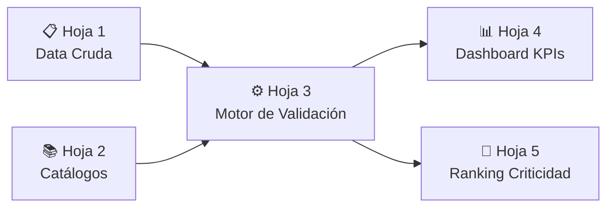

# 📊 Entregable 1.1 — Estructura de Excel de Formulación
## Plantilla de Validación de Calidad de Datos — Canal DTT Heinz Venezuela

---

## Visión General de la Arquitectura

La plantilla se compone de **5 hojas** interconectadas que forman un motor de validación automático. Al pegar la data cruda en la Hoja 1, las demás hojas calculan automáticamente todos los indicadores de calidad.

---

## Hoja 1: `DATA_CRUDA`

### Propósito
Recibe la descarga directa del archivo de ventas de distribuidores sin modificaciones.

### Estructura de columnas (espejo del archivo `safi 2.xlsx`)

| Col | Campo | Tipo | Ejemplo |
|-----|-------|------|---------|
| A | Column1 | Numérico | 45931 |
| B | COD. DIST | Numérico | 218809 |
| C | Dir. de Entrega | Numérico | 218809 |
| D | DISTRIBUIDOR | Texto | COMERCIALIZADORA 3B GROUP. C.A |
| E | VENDEDOR HEINZ | Texto | DTT SALES CARACAS #1 |
| F | Código Vendedor | Texto | — |
| G | Nombre Vendedor | Texto | 3B |
| H | Código Cliente | Texto | — |
| I | CLIENTE | Texto | COMERCIAL LUCKY WUINY, C.A |
| J | RIF | Texto | J500522657 |
| **K** | **Canal/Tipo de Cliente** | **Texto** | **BODEGA** *(campo crítico)* |
| L | Ciudad | Texto | MARACAIBO |
| M | Municipio | Texto | MARACAIBO |
| **N** | **Estado** | **Texto** | **ZULIA** *(campo crítico)* |
| O | Tipo Documento | Texto | NO IDENTIFICADO |
| P | Nro. Documento | Texto | — |
| Q | FECHA | Fecha | — |
| R | Cod. Sku | Numérico | 15765 |
| S | Descripción de Producto | Texto | HZ HEINZ COMP. 186GX24... |
| T | CAJAS | Numérico | 2 |
| U | Bs | Numérico | — |
| V | TERRITORIO | Texto | GRAN CARACAS |
| W | CANAL | Texto | 013 (MAY) |
| X | CATEGORY | Texto | Infant Wet Food (Ambient) |
| Y | LINEA | Texto | 01V |
| Z | DESCRIPCION | Texto | COL. FRUTAS MIXTAS 186G |
| AA | TON | Numérico | 0.008928 |
| AB | SUBCATEGORIA | Texto | COLADOS |
| AC | REG | Texto | ORIENTE |
| AD | REGION | Texto | ORIENTE |
| AE | DISTRIBUIDOR JDE | Texto | — |
| AF | COD. SKU2 | Numérico | 15765 |
| AG | Categoria3 | Texto | WBF |
| AH | SUBCATEGORIA+ | Texto | COLADO VIDRIO |
| AI | Segment 1 | Texto | WHOLESALERS |
| AJ | Segment 2 | Texto | Other DTT |
| AK | Marca | Texto | Heinz |
| AL | VALIDACIÓN | Texto | VALIDO |
| AM | UNIDADES | Numérico | 48 |

> [!IMPORTANT]
> Los campos sombreados en **negrita** (K: Canal/Tipo de Cliente y N: Estado) son las **dos variables cualitativas críticas** del proyecto según el Brief.

### Instrucciones de Carga
1. Copiar/pegar data completa desde fila 2 (la fila 1 contiene encabezados fijos con validación de nombres).
2. No modificar, limpiar ni reordenar columnas antes de pegar.
3. La hoja acepta hasta 1,048,576 filas (límite de Excel).

---

## Hoja 2: `CATALOGOS`

### Propósito
Contiene las listas maestras contra las cuales se valida la data. Permite actualización independiente sin tocar fórmulas.

### Tablas de Catálogo

#### Tabla `Cat_Estados` (Rango: `A2:A25`)

| # | Estado Válido |
|---|--------------|
| 1 | AMAZONAS |
| 2 | ANZOATEGUI |
| 3 | APURE |
| 4 | ARAGUA |
| 5 | BARINAS |
| 6 | BOLIVAR |
| 7 | CARABOBO |
| 8 | COJEDES |
| 9 | DELTA AMACURO |
| 10 | DISTRITO CAPITAL |
| 11 | FALCON |
| 12 | GUARICO |
| 13 | LARA |
| 14 | MERIDA |
| 15 | MIRANDA |
| 16 | MONAGAS |
| 17 | NUEVA ESPARTA |
| 18 | PORTUGUESA |
| 19 | SUCRE |
| 20 | TACHIRA |
| 21 | TRUJILLO |
| 22 | VARGAS |
| 23 | YARACUY |
| 24 | ZULIA |

#### Tabla `Cat_Segmentos` (Rango: `C2:C20`) — Homologación Nielsen

| # | Segmento Estándar |
|---|------------------|
| 1 | BODEGA |
| 2 | MINI MERCADO |
| 3 | AUTOMERCADO |
| 4 | SUPERMERCADO |
| 5 | HIPERMERCADO |
| 6 | PANADERIA |
| 7 | LICORERIA |
| 8 | FARMACIA |
| 9 | KIOSCO |
| 10 | MAYORISTA |
| 11 | CADENA REGIONAL |
| 12 | BODEGON |
| 13 | CONFITERIA |
| 14 | CARNICERIA/FRIGORIFICO |
| 15 | FUENTE DE SODA/LUNCHERIA |
| 16 | FAST FOOD |
| 17 | HOTEL/RESTAURANTE |
| 18 | OTROS CANAL |
| 19 | TIENDA DE CONVENIENCIA |

#### Tabla `Cat_Distribuidores` (Rango: `E2:E66`)
Lista de los 65 distribuidores activos detectados en la data.

#### Tabla `Cat_Regiones` (Rango: `G2:G6`)

| # | Región |
|---|--------|
| 1 | ANDES OCCIDENTE |
| 2 | CENTRO OCCIDENTE |
| 3 | ORIENTE |
| 4 | CAPITAL |

> [!TIP]
> Nombrar cada columna como **Tabla de Excel** (`Ctrl+T`) permite que las fórmulas de validación se expandan automáticamente al agregar valores al catálogo.

---

## Hoja 3: `MOTOR_VALIDACION`

### Propósito
Columnas auxiliares que se añaden a la derecha de la data cruda (o en hoja paralela referenciando la Hoja 1) para clasificar cada registro.

### Columnas de Validación (se calculan por fila, desde fila 2)

| Col | Campo Calculado | Fórmula Excel |
|-----|----------------|---------------|
| **AN** | `Estado_EsNulo` | `=SI(O(DATA_CRUDA!N2="",DATA_CRUDA!N2=0),1,0)` |
| **AO** | `Estado_EsNoIdentificado` | `=SI(MAYUSC(ESPACIOS(DATA_CRUDA!N2))="NO IDENTIFICADO",1,0)` |
| **AP** | `Estado_FueraCatalogo` | `=SI(Y(AN2=0,AO2=0,ESERROR(COINCIDIR(MAYUSC(ESPACIOS(DATA_CRUDA!N2)),CATALOGOS!$A$2:$A$25,0))),1,0)` |
| **AQ** | `Estado_Calidad` | `=SI(AN2=1,"NULO",SI(AO2=1,"NO IDENTIFICADO",SI(AP2=1,"FUERA CATALOGO","OK")))` |
| **AR** | `Canal_EsNulo` | `=SI(O(DATA_CRUDA!K2="",DATA_CRUDA!K2=0),1,0)` |
| **AS** | `Canal_EsNoIdentificado` | `=SI(MAYUSC(ESPACIOS(DATA_CRUDA!K2))="NO IDENTIFICADO",1,0)` |
| **AT** | `Canal_FueraCatalogo` | `=SI(Y(AR2=0,AS2=0,ESERROR(COINCIDIR(MAYUSC(ESPACIOS(DATA_CRUDA!K2)),CATALOGOS!$C$2:$C$20,0))),1,0)` |
| **AU** | `Canal_Calidad` | `=SI(AR2=1,"NULO",SI(AS2=1,"NO IDENTIFICADO",SI(AT2=1,"FUERA CATALOGO","OK")))` |
| **AV** | `Distribuidor` | `=DATA_CRUDA!D2` |
| **AW** | `Registro_Critico` | `=SI(O(AQ2<>"OK",AU2<>"OK"),1,0)` |

> [!NOTE]
> Las fórmulas usan `MAYUSC(ESPACIOS(...))` para normalizar antes de comparar. Esto previene falsos negativos por mayúsculas/espacios inconsistentes.

---

## Hoja 4: `DASHBOARD_KPIs`

### Propósito
Resumen ejecutivo con indicadores automáticos. Diseño de tabla dinámica manual con `CONTAR.SI.CONJUNTO`.

### Sección A — KPIs Globales (fila 3 a 12)

| Celda | KPI | Fórmula |
|-------|-----|---------|
| B3 | Total Registros | `=CONTARA(MOTOR_VALIDACION!AV:AV)-1` |
| B5 | **% Estado Nulo** | `=SUMAR.SI(MOTOR_VALIDACION!AN:AN,1)/B3` |
| B6 | **% Estado "No Identificado"** | `=SUMAR.SI(MOTOR_VALIDACION!AO:AO,1)/B3` |
| B7 | **% Estado Fuera de Catálogo** | `=SUMAR.SI(MOTOR_VALIDACION!AP:AP,1)/B3` |
| B8 | **% Estado OK** | `=1-B5-B6-B7` |
| B10 | **% Canal/Segmento Nulo** | `=SUMAR.SI(MOTOR_VALIDACION!AR:AR,1)/B3` |
| B11 | **% Canal/Segmento "No Identificado"** | `=SUMAR.SI(MOTOR_VALIDACION!AS:AS,1)/B3` |
| B12 | **% Canal/Segmento Fuera de Catálogo** | `=SUMAR.SI(MOTOR_VALIDACION!AT:AT,1)/B3` |

> **Formato**: Celdas B5:B12 con formato `0.0%`. Formato condicional:
> - 🟢 Verde: ≤ 2%
> - 🟡 Amarillo: > 2% y ≤ 10%
> - 🔴 Rojo: > 10%

### Sección B — Desglose por Distribuidor (fila 16 en adelante)

| Col | Campo | Fórmula (ejemplo fila 17, distribuidor en A17) |
|-----|-------|------------------------------------------------|
| A | Distribuidor | (valor del catálogo) |
| B | Total Registros | `=CONTAR.SI(MOTOR_VALIDACION!AV:AV,A17)` |
| C | Estado Nulo | `=CONTAR.SI.CONJUNTO(MOTOR_VALIDACION!AV:AV,A17,MOTOR_VALIDACION!AN:AN,1)` |
| D | Estado NoID | `=CONTAR.SI.CONJUNTO(MOTOR_VALIDACION!AV:AV,A17,MOTOR_VALIDACION!AO:AO,1)` |
| E | Estado Fuera Cat. | `=CONTAR.SI.CONJUNTO(MOTOR_VALIDACION!AV:AV,A17,MOTOR_VALIDACION!AP:AP,1)` |
| F | **% Completitud Estado** | `=1-(C17+D17+E17)/B17` |
| G | Canal Nulo | `=CONTAR.SI.CONJUNTO(MOTOR_VALIDACION!AV:AV,A17,MOTOR_VALIDACION!AR:AR,1)` |
| H | Canal NoID | `=CONTAR.SI.CONJUNTO(MOTOR_VALIDACION!AV:AV,A17,MOTOR_VALIDACION!AS:AS,1)` |
| I | Canal Fuera Cat. | `=CONTAR.SI.CONJUNTO(MOTOR_VALIDACION!AV:AV,A17,MOTOR_VALIDACION!AT:AT,1)` |
| J | **% Completitud Canal** | `=1-(G17+H17+I17)/B17` |
| K | **Score Calidad** | `=(F17+J17)/2` |
| L | **Semáforo** | `=SI(K17>=0.95,"🟢",SI(K17>=0.80,"🟡","🔴"))` |

### Sección C — Resumen Visual

Gráfico de barras horizontales apiladas por distribuidor mostrando:
- Barra 1 (Estado): % OK vs. % Nulo vs. % NoID vs. % Fuera Cat.
- Barra 2 (Canal): % OK vs. % Nulo vs. % NoID vs. % Fuera Cat.

Ordenados de peor a mejor `Score Calidad`.

---

## Hoja 5: `RANKING_CRITICIDAD`

### Propósito
Ranking automático de distribuidores por nivel de criticidad, con clasificación en tiers.

### Estructura

| Col | Campo | Fórmula |
|-----|-------|---------|
| A | Ranking | `=FILA()-1` |
| B | Distribuidor | `=INDICE(DASHBOARD_KPIs!A$17:A$81,COINCIDIR(JERARQUIA(FILA()-1,DASHBOARD_KPIs!K$17:K$81,1),DASHBOARD_KPIs!K$17:K$81,0))` |
| C | Score Calidad | (referencia a Dashboard) |
| D | Tier | `=SI(C2<0.5,"CRÍTICO",SI(C2<0.8,"ALTO",SI(C2<0.95,"MEDIO","BAJO")))` |
| E | Acción Requerida | `=SI(D2="CRÍTICO","Intervención inmediata: reunión con distribuidor",SI(D2="ALTO","Plan correctivo en 30 días",SI(D2="MEDIO","Monitoreo mensual","Mantenimiento")))` |
| F | Vol. TON afectadas | `=SUMAR.SI.CONJUNTO(DATA_CRUDA!AA:AA,DATA_CRUDA!D:D,B2,MOTOR_VALIDACION!AW:AW,1)` |

### Clasificación de Tiers

| Tier | Score Calidad | Color | Acción |
|------|--------------|-------|--------|
| 🔴 CRÍTICO | < 50% | Rojo | Intervención inmediata |
| 🟠 ALTO | 50% – 79% | Naranja | Plan correctivo 30 días |
| 🟡 MEDIO | 80% – 94% | Amarillo | Monitoreo mensual |
| 🟢 BAJO | ≥ 95% | Verde | Mantenimiento |

---

## Resultado Esperado con Data Actual (`safi 2.xlsx`)

Basado en el análisis de los **743,225 registros** y **65 distribuidores**:

### KPIs Globales Esperados

| Indicador | Resultado |
|-----------|-----------|
| % Estado "NO IDENTIFICADO" | **6.3%** (46,955 registros) 🟡 |
| % Estado Nulo | **0.0%** 🟢 |
| % Canal/Tipo Nulo | **10.8%** (80,616 registros) 🔴 |
| % Canal/Tipo Fuera de Catálogo | ~**78%** (nombres de clientes en lugar de segmentos) 🔴 |

### Top 5 Distribuidores Críticos Esperados

| # | Distribuidor | Score Est. | Tier |
|---|-------------|-----------|------|
| 1 | COMERCIALIZADORA 3B GROUP | ~9% | 🔴 CRÍTICO |
| 2 | MAYORISTA EXITOSO | ~14% | 🔴 CRÍTICO |
| 3 | DISTRIBUCIONES FRANCIS | ~24% | 🔴 CRÍTICO |
| 4 | DISTRIBUIDORA ALICAR | ~45% | 🔴 CRÍTICO |
| 5 | VIVERES EL FUTURO | ~46% | 🔴 CRÍTICO |

---

## Instrucciones de Implementación

1. **Crear libro nuevo** → nombrar `SAFI_Validacion_DTT_v1.xlsx`
2. **Hoja DATA_CRUDA**: Pegar encabezados fijos en fila 1 → pegar data desde fila 2
3. **Hoja CATALOGOS**: Crear tablas con `Ctrl+T`, nombrarlas `Cat_Estados`, `Cat_Segmentos`, etc.
4. **Hoja MOTOR_VALIDACION**: Copiar fórmulas en fila 2 → arrastrar hasta última fila con datos
5. **Hoja DASHBOARD_KPIs**: Insertar fórmulas de resumen → aplicar formato condicional
6. **Hoja RANKING_CRITICIDAD**: Las fórmulas se calculan automáticamente

> [!WARNING]
> **Rendimiento**: Con ~743K registros, las fórmulas `CONTAR.SI.CONJUNTO` pueden tardar en recalcular. Recomendación: Activar cálculo manual (`Fórmulas > Opciones de cálculo > Manual`) y recalcular con `F9` solo cuando se necesite actualizar.
