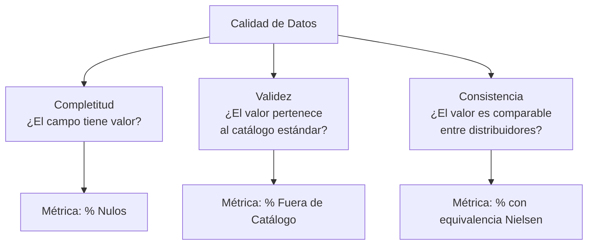
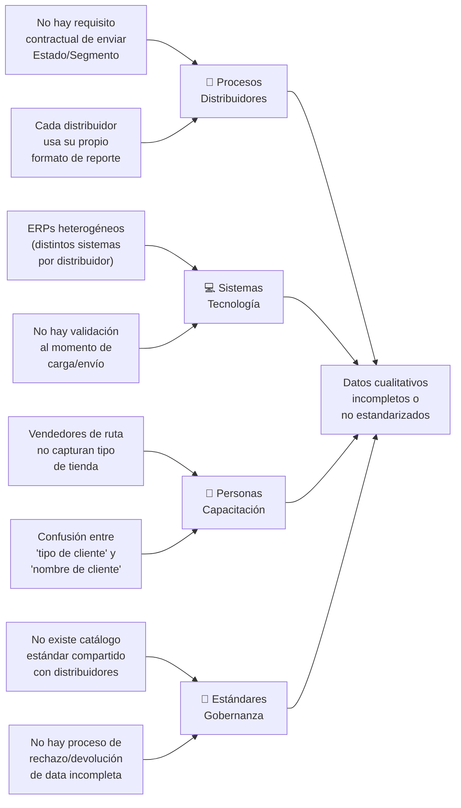
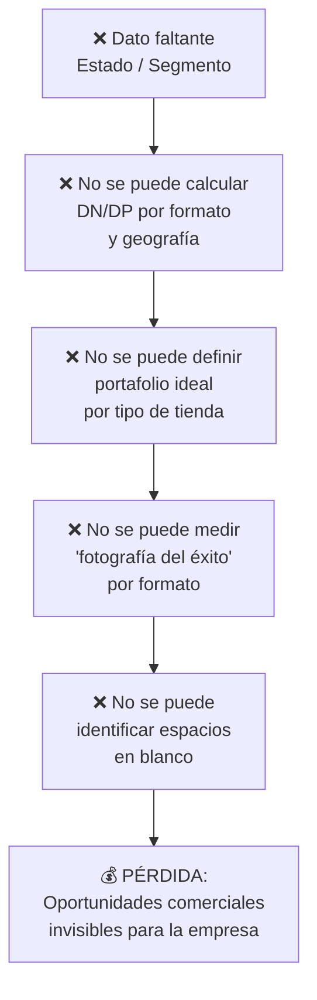

# 📋 Entregable 1.2 — Documento de Desarrollo
## Informe Técnico: Diagnóstico de Calidad de Datos — Canal DTT
### Proyecto de Estandarización de Variables Cualitativas · Heinz Venezuela

---

**Preparado para:** Trade Marketing — Kraft Heinz Venezuela  
**Fuente de datos:** Base de ventas distribuidores (`safi 2.xlsx`)  
**Volumen analizado:** 743,225 registros transaccionales · 65 distribuidores  
**Fecha de análisis:** Mayo 2026  

---

## 1. Resumen Ejecutivo

El análisis de la base de ventas del Canal DTT revela **dos brechas estructurales** en las variables cualitativas críticas que comprometen la capacidad de Trade Marketing para ejecutar análisis de distribución, cobertura y portafolio:

| Variable | Registros Problemáticos | % del Total | Impacto |
|----------|------------------------|-------------|---------|
| **Estado** | 46,955 como "NO IDENTIFICADO" | **6.3%** | Imposibilita análisis geográfico y espacios en blanco |
| **Canal/Tipo de Cliente** | 80,616 nulos + ~520K sin segmentación estándar | **~80.8%** | Destruye cálculo de DN/DP por formato de tienda |

> [!CAUTION]
> El campo `Canal/Tipo de Cliente` contiene **nombres de clientes** (personas naturales o razones sociales) en lugar de la segmentación de tipo de tienda. Esto representa un **error conceptual** en la captura, no simplemente un problema de cobertura. Solo ~8% de los registros tienen un segmento funcional en este campo.

---

## 2. Metodología de Diagnóstico

### 2.1 Marco de Evaluación

Se aplicó un framework de **3 dimensiones de calidad** alineado a estándares de Data Governance para FMCG:



### 2.2 Catálogos de Referencia

- **Estado:** 24 entidades federales de Venezuela (fuente: INE + división político-territorial)
- **Segmento/Canal:** Nomenclatura homologada a Nielsen (19 categorías base para canal tradicional y supermercados independientes)

### 2.3 Criterios de Clasificación

| Categoría | Definición |
|-----------|-----------|
| **Nulo** | Celda vacía, en blanco, o con valor 0 |
| **No Identificado** | Texto literal "NO IDENTIFICADO" en el campo |
| **Fuera de Catálogo** | Valor presente pero que no corresponde a ninguna entrada del catálogo estándar |
| **Válido** | Valor que coincide exactamente con una entrada del catálogo |

---

## 3. Diagnóstico por Variable Crítica

### 3.1 Variable: ESTADO

#### Hallazgos Cuantitativos

| Métrica | Valor | Calificación |
|---------|-------|-------------|
| Total registros | 743,225 | — |
| Registros con Estado válido | 696,270 | 🟢 93.7% |
| Registros "NO IDENTIFICADO" | 46,955 | 🟡 6.3% |
| Registros nulos | 0 | 🟢 0.0% |
| Registros fuera de catálogo | 0 | 🟢 0.0% |
| **Score de completitud Estado** | — | **🟡 93.7%** |

#### Distribución Geográfica Detectada

Los 24 estados de Venezuela están representados en la data:

| Estado | Registros | % | Estado | Registros | % |
|--------|-----------|---|--------|-----------|---|
| ZULIA | 120,348 | 16.2% | PORTUGUESA | 21,356 | 2.9% |
| TACHIRA | 66,892 | 9.0% | APURE | 19,619 | 2.6% |
| MERIDA | 49,611 | 6.7% | MONAGAS | 17,611 | 2.4% |
| BOLIVAR | 46,914 | 6.3% | MIRANDA | 16,831 | 2.3% |
| SUCRE | 42,086 | 5.7% | ARAGUA | 16,269 | 2.2% |
| TRUJILLO | 40,561 | 5.5% | DISTRITO CAPITAL | 15,194 | 2.0% |
| BARINAS | 39,798 | 5.4% | YARACUY | 11,624 | 1.6% |
| FALCON | 35,707 | 4.8% | VARGAS | 7,896 | 1.1% |
| LARA | 32,720 | 4.4% | NUEVA ESPARTA | 6,057 | 0.8% |
| ANZOATEGUI | 32,159 | 4.3% | DELTA AMACURO | 4,108 | 0.6% |
| GUARICO | 24,382 | 3.3% | COJEDES | 3,259 | 0.4% |
| CARABOBO | 24,094 | 3.2% | AMAZONAS | 1,174 | 0.2% |

#### Valoración

- **Fortaleza:** No hay errores de tipeo ni valores fuera de catálogo en Estado. Los distribuidores que reportan esta variable lo hacen correctamente.
- **Debilidad:** 46,955 registros marcados como "NO IDENTIFICADO" se concentran en **12 distribuidores específicos** (ver Sección 5).

---

### 3.2 Variable: CANAL / TIPO DE CLIENTE

#### Hallazgos Cuantitativos

| Métrica | Valor | Calificación |
|---------|-------|-------------|
| Total registros | 743,225 | — |
| Registros con algún valor | 662,609 | — |
| Registros nulos/vacíos | 80,616 | 🔴 10.8% |
| Valores distintos encontrados | ~600+ | 🔴 Heterogéneo |
| **Score de completitud Canal** | — | **🔴 ~8-11%** |

> [!WARNING]
> **Hallazgo crítico:** El campo `Canal/Tipo de Cliente` NO contiene segmentación de tipo de tienda en la gran mayoría de distribuidores. En su lugar contiene:
> - **Razones sociales de clientes** (ej: "COMERCIAL LUCKY WUINY, C.A", "INVERSIONES MUNDO PLATINIUM, C.A")
> - **Nombres de personas naturales** (ej: "BLANCA MILENA CAMACHO AROS", "ANDERSON JOEL GONZALEZ ORTIZ")
> - **Valores mixtos inconsistentes** (ej: "BODEGA", "MAYORISTA", "PREPAGO", "12", "verificar")

#### Tipología de Valores Encontrados

| Tipo de valor | Ejemplos | Estimación % |
|---------------|----------|-------------|
| Nombres de clientes (razón social) | COMERCIAL LUCKY WUINY, INVERSIONES MC 0814 | ~55% |
| Nombres de personas naturales | BLANCA PELAYO, JOSE ROBLES | ~20% |
| Segmentos válidos (parcial) | BODEGA, SUPERMERCADO, MAYORISTA, PANADERIA | ~8% |
| Valores ambiguos | "12", "verificar", "MINI ABASTO", "PREPAGO" | ~3% |
| Vacíos/Nulos | — | ~10.8% |
| Duplicados de ubicación | "EL PALITO - CARABOBO", "TURMERO - ARAGUA" | ~1% |

#### Valoración

Este campo presenta **contaminación semántica**: los distribuidores interpretan "Tipo de Cliente" como "nombre del cliente" en lugar de "segmento/formato de tienda". Esto invalida completamente cualquier análisis de distribución numérica o ponderada por formato.

---

### 3.3 Variables Complementarias con Problemas

| Variable | Nulos | "NO IDENTIFICADO" | Fuera Cat. | Observación |
|----------|-------|--------------------|-----------|-------------|
| **Municipio** | 109,957 (14.8%) | — | — | Impacta granularidad geográfica |
| **Ciudad** | 17,851 (2.4%) | — | — | Menor impacto |
| **REG** | — | — | 73,430 `#N/A` (9.9%) | Fórmula rota, no dato de origen |
| **VALIDACIÓN** | — | — | 58,552 "NO VALIDO" (7.9%) | Ya marcados internamente |
| **Segment 1** | — | — | 28,788 `#N/A` (3.9%) | Derivado, no campo primario |

---

## 4. Análisis de Causas Raíz

### 4.1 Mapa de Ishikawa — Causas de la Brecha de Datos



### 4.2 Causas Detalladas

#### Causa 1: Desconexión Sistémica en la Cadena de Datos

**Descripción:** El flujo de datos entre el vendedor de ruta → sistema del distribuidor → reporte a Heinz no contempla la captura obligatoria de "tipo de tienda". El campo existe en la plantilla de reporte pero **no es obligatorio** y los ERPs de los distribuidores no lo tienen como campo maestro del cliente.

**Evidencia:** Los distribuidores con redes CEC (Centros de Excelencia Comercial) tienen 0% de problemas en Estado, lo que sugiere que donde hay procesos estandarizados internos, la calidad mejora. Sin embargo, incluso estos distribuidores no reportan segmento de canal.

#### Causa 2: Confusión Semántica en "Canal/Tipo de Cliente"

**Descripción:** Los distribuidores interpretan el campo `Canal/Tipo de Cliente` como "nombre del cliente final" en lugar de "formato/segmento de tienda". Esto explica que ~75% de los valores sean razones sociales o nombres personales.

**Evidencia:** Valores como "COMERCIAL LUCKY WUINY, C.A", "INVERSIONES MUNDO PLATINIUM, C.A" y nombres de personas naturales ("BLANCA MILENA CAMACHO AROS") son claramente datos de identificación del cliente, no una clasificación de formato.

#### Causa 3: Ausencia de Validación en el Punto de Entrada

**Descripción:** No existe un mecanismo de validación (lista desplegable, regla de negocio, o proceso de rechazo) que impida cargar data con campos vacíos o fuera de catálogo.

**Evidencia:** El campo "Estado" tiene exactamente 24 valores válidos + "NO IDENTIFICADO", sin errores tipográficos. Esto sugiere que *algún* proceso de normalización existe para Estado, pero no para Canal.

#### Causa 4: Heterogeneidad de Sistemas ERP

**Descripción:** Los 65 distribuidores operan con sistemas diferentes. No todos tienen la capacidad de agregar campos personalizados o listas de valores para segmentación.

**Evidencia:** La correlación entre distribuidores con 0% de problemas (redes CEC, F&S) y aquellos con >50% de problemas (3B Group, Mayorista Exitoso) sugiere diferencias en la madurez tecnológica y de procesos internos.

---

## 5. Ranking de Criticidad por Distribuidor

### 5.1 Tier 🔴 CRÍTICO (Score < 50%) — 9 distribuidores

Estos distribuidores requieren **intervención inmediata** y representan la prioridad #1 del proyecto.

| # | Distribuidor | Registros | Estado NoID | Canal Nulo | Score Calidad | Vol. Impactada |
|---|-------------|-----------|-------------|------------|--------------|----------------|
| 1 | COMERCIALIZADORA 3B GROUP | 4,317 | 4,317 (100%) | 3,558 (82.4%) | **~9%** | Alta |
| 2 | MAYORISTA EXITOSO | 7,291 | 5,221 (71.6%) | 7,291 (100%) | **~14%** | Alta |
| 3 | DISTRIBUCIONES FRANCIS | 4,519 | 4,512 (99.8%) | 2,332 (51.6%) | **~24%** | Media |
| 4 | DISTRIBUIDORA ALICAR | 1,831 | 185 (10.1%) | 1,831 (100%) | **~45%** | Baja |
| 5 | VIVERES EL FUTURO | 6,628 | 567 (8.6%) | 6,628 (100%) | **~46%** | Media |
| 6 | EXCELSIOR DISTRIBUCIONES RK | 52,003 | 0 (0%) | 52,003 (100%) | **~50%** | Muy Alta |
| 7 | LA TRINIDAD DISTRIBUCIONES | 4,803 | 0 (0%) | 4,803 (100%) | **~50%** | Media |
| 8 | INVERSIONES LOARI | 1,020 | 1,020 (100%) | 0 (0%) | **~50%** | Baja |
| 9 | ALIMENTOS GLOBAL | 22,275 | 21,576 (96.9%) | 0 (0%) | **~48%** | Alta |

> [!IMPORTANT]
> **EXCELSIOR DISTRIBUCIONES RK** merece atención especial: tiene **52,003 registros** (7% del total) con Canal 100% nulo. Es el distribuidor con mayor volumen en este tier y, por su peso en toneladas, su corrección tendría el **mayor impacto en la precisión de la distribución ponderada**.

### 5.2 Tier 🟠 ALTO (Score 50%–79%) — 3 distribuidores

| # | Distribuidor | Registros | Estado NoID | Canal Nulo | Score Calidad |
|---|-------------|-----------|-------------|------------|--------------|
| 10 | INVERSIONES SATORNO | 2,682 | 1,924 (71.7%) | 2 (0.1%) | ~64% |
| 11 | CAMACHO CARACAS | 7,454 | 4,124 (55.3%) | 15 (0.2%) | ~72% |
| 12 | SAN JUAN GROUP | 54 | 0 (0%) | 25 (46.3%) | ~77% |

### 5.3 Tier 🟡 MEDIO (Score 80%–94%) — 8 distribuidores

| # | Distribuidor | Registros | Problema Principal | Score Calidad |
|---|-------------|-----------|-------------------|--------------|
| 13 | COMERCIAL TINITO PUERTO ORDAZ | 3,639 | Estado NoID: 982 | ~87% |
| 14 | DIGILCA BARINAS | 169 | Estado NoID: 42 | ~88% |
| 15 | DOVENCA DISTRIBUCIONES | 3,194 | Mixto | ~91% |
| 16 | DELI DISTRIBUCIONES | 2,343 | Mixto | ~91% |
| 17 | DISTRIBUIDORA NEW CENTURY | 2,722 | Estado NoID: 472 | ~91% |
| 18 | SUMINISTROS FVR | 10,205 | Canal Nulo: 1,453 | ~93% |
| 19 | CARNICERIA LAS CHIMENEAS | 411 | Estado NoID: 49 | ~94% |
| 20 | COMERCIAL TINITO EL TIGRE | 11,744 | Estado NoID: 1,201 | ~95% |

### 5.4 Tier 🟢 BAJO (Score ≥ 95%) — 45 distribuidores

Distribuidores con data de Estado completa y Canal presente. Incluye toda la red CEC (Caracas, Lara, Mérida, Barinas, Táchira, Aragua), la red Comercial Tinito (6 entidades), SUDIALCA, GRUPO MULTIEXPRESS, CONFITERÍA LA GUACAMAYA, SUPROAL, entre otros.

> [!NOTE]
> Que estos distribuidores estén en Tier 🟢 para Estado **no significa** que su campo Canal/Tipo de Cliente contenga segmentación válida. El problema de confusión semántica (nombre de cliente vs. tipo de tienda) es transversal a toda la base.

---

## 6. Impacto en Indicadores Comerciales

### 6.1 Impacto en Distribución Numérica (DN)

La **Distribución Numérica** mide: *"¿En cuántos puntos de venta de un universo determinado está presente mi producto?"*

```
DN = (# PDV que compran SKU X en el período / # Total PDV del universo) × 100
```

**Impacto de la brecha de datos:**

| Escenario | Efecto en DN | Magnitud |
|-----------|-------------|----------|
| Estado = "NO IDENTIFICADO" (46,955 reg.) | No se puede asignar PDV a geografía → DN por estado indefinida | Se pierden ~6.3% de transacciones del cálculo geográfico |
| Canal/Segmento ausente (~80% registros) | No se puede segmentar PDV por formato → DN por formato de tienda incalculable | **Incapacidad total** de medir DN por tipo de tienda |
| Múltiples registros sin segmento válido | Inflación artificial de "Otros" o exclusión del cálculo | Sesgo sistemático en DN por canal |

**Ejemplo concreto:**
- Si Heinz quiere saber: *"¿Cuál es la DN de Ketchup en Bodegas del estado Zulia?"*
- **Hoy no puede responder** porque no sabe cuántos de los 120,348 registros de Zulia corresponden a Bodegas vs. Supermercados vs. Mayoristas.

### 6.2 Impacto en Distribución Ponderada (DP)

La **Distribución Ponderada** mide: *"¿Qué % del volumen total de la categoría representan los PDV donde mi producto está presente?"*

```
DP = (Σ Ventas categoría en PDV con mi SKU / Σ Ventas totales de la categoría en el universo) × 100
```

**Impacto de la brecha de datos:**

| Factor | Consecuencia |
|--------|-------------|
| Sin segmento, la DP se calcula solo a nivel total | Se pierde la lectura de **concentración de volumen por formato**, que es donde Trade Marketing decide portafolio y "fotografía del éxito" |
| Sin Estado en ~6.3% de registros | La DP regional puede estar **subvaluada** en estados donde operan los distribuidores críticos (ej: Caracas/Capital) |
| Sin comparabilidad entre distribuidores | Imposible identificar si un distribuidor tiene DP baja por falta de cobertura real o por falta de dato |

### 6.3 Impacto en Decisiones Comerciales



### 6.4 Cuantificación del Riesgo

| Métrica | Sin corrección | Con corrección estimada |
|---------|---------------|----------------------|
| Registros utilizables para análisis geográfico | 696,270 (93.7%) | 743,225 (100%) |
| Registros utilizables para análisis por formato | ~59,700 (~8%) | 743,225 (100%) |
| Distribuidores comparables | ~45 de 65 (69%) | 65 de 65 (100%) |
| Capacidad de definir portafolio por formato | **NO** | **SÍ** |
| Capacidad de medir espacios en blanco | **Parcial** (solo geográfica) | **Completa** |

---

## 7. Recomendaciones

### 7.1 Acciones Inmediatas (Semana 1-2)

1. **Renombrar el campo** `Canal/Tipo de Cliente` a `Segmento de Tienda` en la plantilla estándar para eliminar la ambigüedad semántica.
2. **Comunicar la definición** exacta a los 9 distribuidores del Tier Crítico con ejemplos visuales.
3. **Crear lista cerrada** (dropdown) de valores válidos de segmento en la plantilla de carga.

### 7.2 Acciones de Corto Plazo (Semana 3-6)

4. **Piloto con 2 distribuidores** del Tier Crítico: EXCELSIOR (por volumen) y COMERCIALIZADORA 3B (por gravedad).
5. **Cruzar data de Estado** con códigos postales o direcciones de entrega para recuperar los 46,955 registros "NO IDENTIFICADO".
6. **Diseñar checklist de recepción** que rechace data sin Estado o sin Segmento válido.

### 7.3 Acciones Estructurales (Mes 2-3)

7. **Implementar validación en plantilla de envío** (Excel con macros o formulario web) que no permita enviar sin campos completos.
8. **Crear tabla de equivalencias** para traducir segmentaciones locales de distribuidores al catálogo Nielsen estándar.
9. **Definir SLA de calidad de datos** en acuerdos con distribuidores: mínimo 95% de completitud.

---

## 8. Conclusión

La base de datos del Canal DTT presenta una **dicotomía clara**: la variable Estado tiene buena cobertura (93.7%) con problemas concentrados en distribuidores específicos y corregibles, mientras que la variable Canal/Segmento presenta un **problema sistémico** de interpretación que afecta a toda la base y requiere una intervención de rediseño del proceso de captura.

El impacto directo es la **incapacidad de calcular distribución numérica y ponderada por formato de tienda**, lo cual limita fundamentalmente la estrategia de portafolio, la definición de fotografía del éxito y la identificación de oportunidades de crecimiento en el canal DTT.

La corrección de estos problemas, empezando por los 9 distribuidores del Tier Crítico que concentran ~100,000 registros problemáticos, permitiría desbloquear análisis que hoy son imposibles y alinear la lectura del canal DTT con los estándares de medición de Nielsen.
