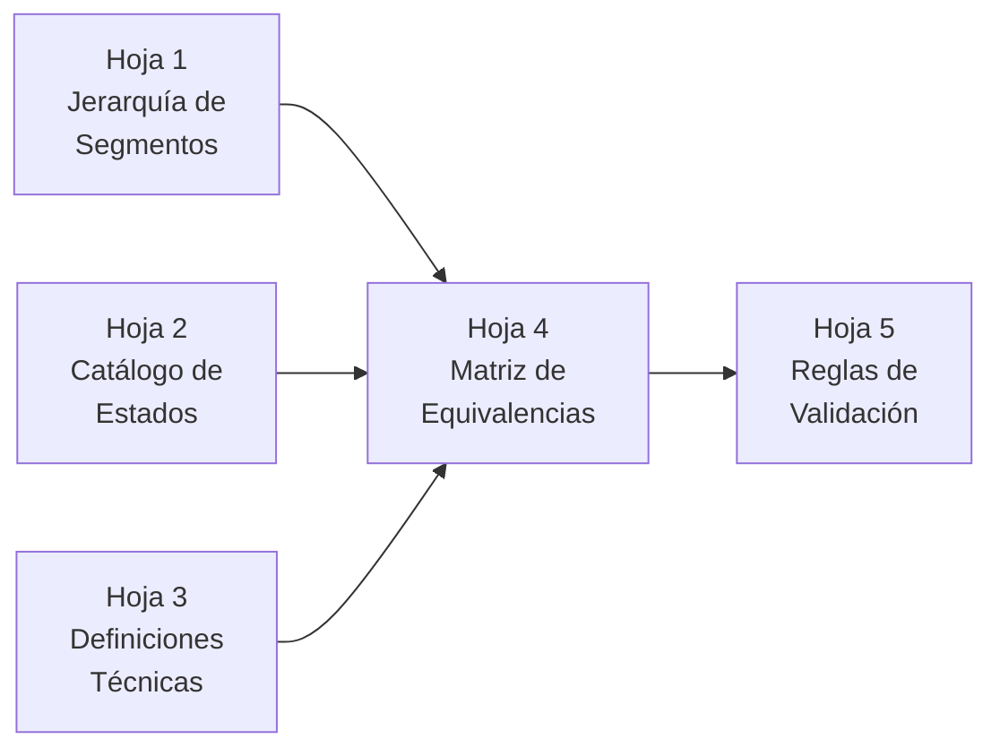

# 📊 Entregable 2.1 — Estructura de Excel: Catálogo Maestro
## Estándar de Variables Cualitativas — Canal DTT Heinz Venezuela

---

## Arquitectura del Libro



---

## Hoja 1: `JERARQUIA_SEGMENTOS`

### Estructura Jerárquica de Canales (Alineada a Nielsen Venezuela)

| Nivel 1 (Macro Canal) | Nivel 2 (Canal) | Nivel 3 (Subcanel / Segmento Estándar) | Código |
|---|---|---|---|
| **TRADE TRADICIONAL (UTT)** | Abastos y Bodegas | ABASTO | UTT-01 |
| | | BODEGA | UTT-02 |
| | | PUESTO DE MERCADO | UTT-03 |
| | | KIOSCO | UTT-04 |
| | Panaderías | PANADERIA | UTT-05 |
| | | PASTELERIA | UTT-06 |
| | Carnicerías y Afines | CARNICERIA / CHARCUTERIA / FRIGORIFICO | UTT-07 |
| | Licorerías | LICORERIA | UTT-08 |
| | Confiterías | CONFITERIA | UTT-09 |
| | Farmacias Tradicionales | FARMACIA TRADICIONAL (MOSTRADOR) | UTT-10 |
| | Perfumerías Tradicionales | PERFUMERIA TRADICIONAL | UTT-11 |
| | Ferreterías / Otros | FERRETERIA / QUINCALLERIA | UTT-12 |
| **SUPERMERCADOS INDEPENDIENTES** | Supermercado Grande | SUPERMERCADO INDEPENDIENTE GRANDE | SI-01 |
| | Supermercado Mediano | SUPERMERCADO INDEPENDIENTE MEDIANO | SI-02 |
| | Supermercado Pequeño / Minimercado | SUPERMERCADO INDEPENDIENTE PEQUEÑO | SI-03 |
| | Automercado | AUTOMERCADO | SI-04 |
| | Mini Market | MINI MARKET | SI-05 |
| **CADENAS** | Cadena Nacional | CADENA NACIONAL | CAD-01 |
| | Cadena Regional | CADENA REGIONAL | CAD-02 |
| | Hipermercado / Cash & Carry | HIPERMERCADO / CASH & CARRY | CAD-03 |
| **FARMACIAS MODERNAS** | Farmacia Autoservicio | FARMACIA CON AUTOSERVICIO | FM-01 |
| | Farmacia Cadena | FARMACIA CADENA | FM-02 |
| | Farmacia Moderna Independiente | FARMACIA MODERNA INDEPENDIENTE | FM-03 |
| **BODEGONES** | Bodegón | BODEGON | BOD-01 |
| | Bodegón-Licorería | BODEGON-LICORERIA | BOD-02 |
| **MAYORISTAS** | Mayorista con FDV | MAYORISTA CON FUERZA DE VENTA | MAY-01 |
| | Mayorista sin FDV | MAYORISTA SIN FUERZA DE VENTA | MAY-02 |
| | Nano Distribuidor | NANO DISTRIBUIDOR | MAY-03 |
| | Sub-Distribuidor | SUB-DISTRIBUIDOR | MAY-04 |
| **ON PREMISE / FOODSERVICE** | Restaurante | RESTAURANTE | FS-01 |
| | Fast Food | FAST FOOD | FS-02 |
| | Lunchería / Cafetería / Fuente de Soda | LUNCHERIA / CAFETERIA | FS-03 |
| | Hotel / Posada | HOTEL / POSADA | FS-04 |
| | Catering / Institucional | CATERING / INSTITUCIONAL | FS-05 |
| **TIENDAS ESPECIALIZADAS** | Tienda de Conveniencia | TIENDA DE CONVENIENCIA | TE-01 |
| | Tienda para Bebé | TIENDA PARA BEBE | TE-02 |
| | Tienda de Regalo / Piñatería | PIÑATERIA / TIENDA DE REGALO | TE-03 |

> [!NOTE]
> Los códigos (UTT-01, SI-01, etc.) facilitan la codificación en sistemas ERP de distribuidores que no soportan texto largo.

---

## Hoja 2: `CATALOGO_ESTADOS`

### Lista Oficial de Estados de Venezuela

| # | Estado (Nombre Estándar) | Código ISO 3166-2 | Región Heinz | Región Nielsen |
|---|---|---|---|---|
| 1 | AMAZONAS | VE-X | ORIENTE | ORIENTE |
| 2 | ANZOATEGUI | VE-B | ORIENTE | ORIENTE |
| 3 | APURE | VE-C | ANDES OCCIDENTE | LLANOS |
| 4 | ARAGUA | VE-D | CENTRO OCCIDENTE | CENTRAL |
| 5 | BARINAS | VE-E | ANDES OCCIDENTE | LLANOS |
| 6 | BOLIVAR | VE-F | ORIENTE | ORIENTE |
| 7 | CARABOBO | VE-G | CENTRO OCCIDENTE | CENTRAL |
| 8 | COJEDES | VE-H | CENTRO OCCIDENTE | LLANOS |
| 9 | DELTA AMACURO | VE-Y | ORIENTE | ORIENTE |
| 10 | DISTRITO CAPITAL | VE-A | CAPITAL | CAPITAL |
| 11 | FALCON | VE-I | CENTRO OCCIDENTE | CENTRO OCCIDENTE |
| 12 | GUARICO | VE-J | ORIENTE | LLANOS |
| 13 | LARA | VE-K | CENTRO OCCIDENTE | CENTRO OCCIDENTE |
| 14 | MERIDA | VE-L | ANDES OCCIDENTE | ANDES |
| 15 | MIRANDA | VE-M | CAPITAL | CAPITAL |
| 16 | MONAGAS | VE-N | ORIENTE | ORIENTE |
| 17 | NUEVA ESPARTA | VE-O | ORIENTE | ORIENTE |
| 18 | PORTUGUESA | VE-P | CENTRO OCCIDENTE | LLANOS |
| 19 | SUCRE | VE-R | ORIENTE | ORIENTE |
| 20 | TACHIRA | VE-S | ANDES OCCIDENTE | ANDES |
| 21 | TRUJILLO | VE-T | ANDES OCCIDENTE | ANDES |
| 22 | VARGAS | VE-W | CAPITAL | CAPITAL |
| 23 | YARACUY | VE-U | CENTRO OCCIDENTE | CENTRO OCCIDENTE |
| 24 | ZULIA | VE-V | ANDES OCCIDENTE | ZULIA |

---

## Hoja 3: `DEFINICIONES_TECNICAS`

### Matriz de Definición por Variable

| Variable | Nombre Estándar | Definición Técnica | Fuente de Verdad | Responsable de Captura |
|---|---|---|---|---|
| Estado | Entidad federal donde se ubica físicamente el punto de venta | División político-territorial de Venezuela (24 estados). Se asigna por la dirección fiscal o de entrega del cliente, NO por la sede del distribuidor. | INE / División político-territorial | Distribuidor (dato maestro del cliente) |
| Segmento de Tienda | Clasificación del formato comercial del punto de venta según criterios de tamaño, surtido y modelo de atención | Tipología de canal basada en metodología Nielsen adaptada al mercado venezolano. Determina el Nivel 3 de la jerarquía de segmentos. | Nielsen Venezuela + Trade Marketing Heinz | Distribuidor (vendedor de ruta valida en campo) |
| Región | Agrupación geográfica de estados para análisis comercial | Macro-zona definida por Heinz para la gestión territorial de ventas y distribución. | Trade Marketing Heinz | Automático (derivado de Estado) |
| Canal (Nivel 1) | Macro canal al que pertenece el punto de venta | Agrupación superior: UTT, Supermercados Independientes, Cadenas, Farmacias Modernas, Bodegones, Mayoristas, On Premise, Especializadas. | Nielsen + Heinz | Automático (derivado de Segmento) |

---

## Hoja 4: `MATRIZ_EQUIVALENCIAS`

### Tabla de Equivalencias: Variantes Locales → Nombre Estándar

Esta es la tabla central del catálogo. Mapea **cada variación encontrada en la data real** al nombre estándar.

#### Segmento: ABASTO / BODEGA (UTT-01 / UTT-02)

| Nombre Estándar | Código | Variantes encontradas en data (equivalencias) |
|---|---|---|
| ABASTO | UTT-01 | `ABASTOS` · `ABASTO` · `Abasto` · `Abastos` · `ABASTOS TRADICIONALES` · `ABASTO GRANDE` · `ABASTO MEDIANO` · `ABASTO PEQUEÑO` · `09 Abasto- Bod- Puest m` |
| BODEGA | UTT-02 | `BODEGAS` · `BODEGA` · `Bodega` · `Bodegas` |
| ABASTO/BODEGA (combinado) | UTT-01 | `ABASTOS / BODEGAS` · `Abastos/Bodegas` · `ABASTOS/BODEGAS` · `ABASTOS, BODEGAS` · `ABASTO/BODEGA` · `ABASTO BODEGA` · `ABASTO, MINI MARKET, BODEGONES` |

> [!IMPORTANT]
> **Decisión de diseño:** Cuando el distribuidor reporta "ABASTOS / BODEGAS" como valor combinado, se clasifica como **ABASTO (UTT-01)** por defecto, ya que en la realidad venezolana el abasto es el formato predominante en canal tradicional. Se recomienda que en futuras cargas el distribuidor separe ambas categorías.

#### Segmento: SUPERMERCADO INDEPENDIENTE

| Nombre Estándar | Código | Variantes encontradas en data |
|---|---|---|
| SUPERMERCADO IND. GRANDE | SI-01 | `SUPER. GRANDES` · `01 Super. Grandes` · `SPM INDEPENDIENTE GRANDE` · `Supermercados Grandes.` · `SUPERMERCADO GRANDE` |
| SUPERMERCADO IND. MEDIANO | SI-02 | `SUPERMERCADO MEDIANO` · `SUPER. MEDIANOS` · `SUPERMERCADO` · `Supermercados` · `SUPERMERCADOS` · `SUPERMERCADO INDEPENDIENTE` · `SUPERMERCADOS INDEPENDIENTES` · `Supermercado Independiente` · `SUPERMERCADO INDEPENDIENTES` · `SUPERMERCADO INDEPENDIENTE GRA` · `SUP INDEPENDIENTE` · `SPM INDEPENDIENTE PEQUEÑO` |
| SUPERMERCADO IND. PEQUEÑO | SI-03 | `02 Super. Pequeños` · `SUPERMERCADO PEQUEÑO` |
| AUTOMERCADO | SI-04 | `AUTOMERCADO` · `SUPERMERCADO Y AUTOMERCADO` |
| MINI MARKET | SI-05 | `MINI MARKET` · `MINI MARKETS` · `MINIMARKET` · `Minimarket` · `MINIMARKETS` · `MINIMARTS` · `SUPER. MINIMARTS` · `MINIMERCADO` · `MINI MERCADO` · `MINI SUPERMERCADO` |

#### Segmento: PANADERÍA

| Nombre Estándar | Código | Variantes encontradas en data |
|---|---|---|
| PANADERIA | UTT-05 | `PANADERIAS` · `PANADERIA` · `Panaderias` · `Panadería` · `Panaderia` · `PANADERIA Y PASTELERIA` · `PANADERIAS / PASTELERIA` · `PANADERIAS/PASTELERIA` · `Panadería y Pastelería` · `PANADERIA/PASTELERIA` · `PANADERÍA Y PASTELERÍA` · `PANDERIA` · `10 Panaderias` · `PANADERÍA` |

#### Segmento: CARNICERÍA / CHARCUTERÍA / FRIGORÍFICO

| Nombre Estándar | Código | Variantes encontradas en data |
|---|---|---|
| CARNICERIA/CHARCUTERIA/FRIGORIFICO | UTT-07 | `FRIGORIFICO Y CHARCUTERIA` · `FRIGORIFICO / CARNICERIA / CHARCUTERIA` · `CARNICERÍAS/CHARCUTERÍAS` · `CARNICERIAS` · `CARNICERIA` · `CARNICERIA/CHARCUTERIA/FRIGORIFICO` · `CARNICERIA/CHARCUTERIA` · `CHARCUTERIAS/FRIGORIFICOS/CARNICERIAS` · `Carnicerias/Charcuterias` · `FRIGORIFICO` · `CHARCUTERIAS` · `CHARCUTERIA` · `CHARCUTERÍA` · `CARNICERIAS/CHARCUTERIA` · `CARNICERIA CHARCUTERIA` · `CHARCUTERIA Y CARNICERIA` · `Carnicería/Charcutería/Frigorífico.` · `FRIGORIFICO- CARNICERIA` · `FRIGORIFICOS` · `CARNICERIA - FRIGORIFICO` · `VIVERES Y CHARCUTERI` · `CARNICERIA Y CHARCUTERIA` · `CARNICERIA MINIMARKET` |

#### Segmento: FARMACIA

| Nombre Estándar | Código | Variantes encontradas en data |
|---|---|---|
| FARMACIA TRADICIONAL | UTT-10 | `FARMACIAS` · `FARMACIA` · `Farmacias` · `FARMACIA INDEPENDIENTE` · `FARMACIAS CLASICAS` · `FARMACIAS TRADICIONALES` · `FARMACIA MOSTRADOR` · `FARMACIA TRADICIONAL` · `FARMACIAS Y PERFUMERIAS TRADICIONALES` · `FARMACIAS GRANDES` |
| FARMACIA CON AUTOSERVICIO | FM-01 | `FARMACIA CON AUTOSERVICIO` · `FARMACIA AUT SERVICIO` · `FARMACIAS MODERNAS` · `FARMACIA MODERNA` · `05 Perfumerias Autoser.` |
| FARMACIA CADENA | FM-02 | `FARMACIA CADENA` · `FARMACIAS CADENAS` |

#### Segmento: LICORERÍA

| Nombre Estándar | Código | Variantes encontradas en data |
|---|---|---|
| LICORERIA | UTT-08 | `LICORERIAS` · `LICORERIA` · `Licorería` · `LICORERÍAS` · `LICORES` · `21 Licoreria` |

#### Segmento: BODEGÓN

| Nombre Estándar | Código | Variantes encontradas en data |
|---|---|---|
| BODEGON | BOD-01 | `BODEGONES` · `BODEGON` · `Bodegon` |
| BODEGON-LICORERIA | BOD-02 | `BODEGON/ LICORERIAS` · `LICORERÍAS/BODEGONES` · `LICORERIAS/BARES/BODEGONES` · `Licorerias/Bares/Bodegones` · `LICORERÍAS/BODEGOFAS` · `LICORERIAS/BODEGONES` · `BODEGON/ MINI MARKET` |

#### Segmento: MAYORISTA

| Nombre Estándar | Código | Variantes encontradas en data |
|---|---|---|
| MAYORISTA CON FDV | MAY-01 | `MAYORISTAS` · `MAYORISTA` · `Mayoristas` · `Mayorista` · `MAYORISTAS CON FDV` · `MAYORISTAS CON FDF` · `MAYORISTA C/FUERZA DE VENTA` |
| MAYORISTA SIN FDV | MAY-02 | `MAYORISTAS SIN FDV` · `MAYORISTA S/FUERZA DE VENTA` |
| DISTRIBUIDOR / NANO | MAY-03 | `Distribuidores` · `DISTRIBUIDORA` · `DISTRIBUIDORAS` · `DISTRIBUIDORES` · `DISTRIBUIDOR` · `DISTRIBUIDOR MAYORISTA` · `DISTRIBUIDORA/COMERCIALIZADORA` · `NANO DISTRIBUIDORES` · `SUB-DISTRIBUIDORES` |

#### Segmento: CADENAS

| Nombre Estándar | Código | Variantes encontradas en data |
|---|---|---|
| CADENA NACIONAL | CAD-01 | `CADENAS NACIONALES` · `CADENAS` |
| CADENA REGIONAL | CAD-02 | `SUPERMERCADOS CADENAS` · `CADENAS REGIONALES` · `Cadenas Regionales` · `CADENAS DE SUPER. REGIONAL` |
| HIPERMERCADO | CAD-03 | `HIPERMERCADOS` · `HIPERMERCADO` · `HIPERMERCADO/CASH & CARRY` |

#### Segmento: ON PREMISE / FOODSERVICE

| Nombre Estándar | Código | Variantes encontradas en data |
|---|---|---|
| RESTAURANTE | FS-01 | `RESTAURANTE` · `RESTAURANT` · `Restaurante` · `Restaurant` · `RESTAURANTES` · `RESTAURANT FAMILIAR` · `RESTAURANT / BAR` · `BAR/RESTAURANT` · `RESTAURANT / BAR DE LUJO` · `RESTAURANTES/PIZZERÍAS` · `Restaurantes/Pizzerias` · `RESTAURANTE O CAFETERIA` · `RESTAURANTE/VIVERES` · `RESTAURANT MINI MARKET` |
| FAST FOOD | FS-02 | `FAST FOOD` · `STREET FOOD` |
| LUNCHERIA / CAFETERIA | FS-03 | `CAFETERIA / LUNCHERIAS` · `LUNCHERIA` · `FUENTES DE SODA/LUNCHERÍAS` · `Fuentes de Soda/Luncherias/Caf` · `FUENTES DE SODA/LUNCHERIAS/CAF` |
| HOTEL / POSADA | FS-04 | `HOTELES` · `HOTELES Y POSADAS` · `HOTEL - RESTAURANT` · `Hoteles` · `HOTELERIA` |
| FOODSERVICE (GENÉRICO) | FS-05 | `Foodservice` · `FoodServices` · `FOODSERVICE` · `FOOD SERVICE` · `Compras a Conveniencia` |

#### Segmento: OTROS / ESPECIALIZADOS

| Nombre Estándar | Código | Variantes encontradas en data |
|---|---|---|
| CONFITERIA | UTT-09 | `CONFITERIA` · `CONFITERIAS` · `confiteria` · `PIÑATERIA CONFITERIA` |
| PERFUMERIA TRADICIONAL | UTT-11 | `PERFUMERIAS` · `PERFUMERIA` · `04 Perfumerias Tradic.` |
| FERRETERIA / QUINCALLERIA | UTT-12 | `FERRETERIAS` · `12 Ferret-Bazares-Quinc` · `QUINCALLERIA` |
| KIOSCO | UTT-04 | `KIOSKOS` · `KIOSKO` · `KIOSKO REVISTA` · `KIOSCOS/PUESTOS DE MERCADOS` · `Refresquerias/Kioskos` |
| PUESTO DE MERCADO | UTT-03 | `PUESTO DE MERCADO` · `MERCADO MUNICIPALES` · `PTO MERCADO/KIOSKO` |
| TIENDA DE CONVENIENCIA | TE-01 | `TIENDA DE CONVENIENCIA` · `13 Tiendas de Convenenc` |
| TIENDA PARA BEBE | TE-02 | `TIENDA PARA BEBE` |
| PIÑATERIA | TE-03 | `PIÑATERIAS` · `PIÑATERIA CONFITERIA` · `TIENDAS DE REGALO` |

#### Valores NO mapeables (requieren intervención)

| Valor en data | Problema | Acción recomendada |
|---|---|---|
| `OTROS` / `OTROS CLIENTES CANAL BAJO` / `Otros` | Categoría residual sin segmento real | Revisar caso por caso con distribuidor |
| `COMUN` | Ambiguo | Solicitar reclasificación |
| `ON PREMISE` | Demasiado genérico | Desglosar en FS-01 a FS-05 |
| `FRUTERIA` | No existe en Nielsen; ¿es abasto? ¿carnicería? | Definir con Trade Marketing |
| `Viveres` | Ambiguo entre abasto y charcutería | Clasificar como UTT-01 (ABASTO) |
| `CAFET/LUNCH/REST/BAR` | Combinado | Clasificar como FS-03 |
| `REST/BARES/TASCAS` | Combinado | Clasificar como FS-01 |
| `DIST.DE ART.BELLEZA` | Fuera de scope Heinz | Evaluar exclusión |
| `verificar` / `12` / `11` | Datos basura | Marcar para corrección manual |
| `#NAME?` | Error de fórmula Excel | Corregir en origen |
| Nombres de clientes (~75% de valores únicos) | Campo mal interpretado | Reclasificar con vendedor de ruta |

---

## Hoja 5: `REGLAS_VALIDACION`

### Reglas de Validación para Plantilla de Carga

| # | Campo | Regla | Tipo | Fórmula de Validación (Excel) |
|---|---|---|---|---|
| R1 | Estado | Obligatorio, no vacío | Bloqueo | `=SI(N2="","❌ ESTADO REQUERIDO","✅")` |
| R2 | Estado | Debe pertenecer al catálogo de 24 estados | Lista | Data Validation → List → `=CATALOGO_ESTADOS[Estado]` |
| R3 | Estado | No acepta "NO IDENTIFICADO" | Bloqueo | `=SI(MAYUSC(N2)="NO IDENTIFICADO","❌ IDENTIFICAR ESTADO","✅")` |
| R4 | Segmento | Obligatorio, no vacío | Bloqueo | `=SI(K2="","❌ SEGMENTO REQUERIDO","✅")` |
| R5 | Segmento | Debe pertenecer al catálogo Nivel 3 | Lista | Data Validation → List → `=JERARQUIA[Segmento_Nivel3]` |
| R6 | Segmento | No acepta nombres de personas o razones sociales | Advertencia | Macro VBA que detecta patrones de RIF (J/V/G + números) |
| R7 | Combinación | Estado + Segmento ambos completos | Score | `=SI(Y(R1="✅",R4="✅"),"REGISTRO COMPLETO","INCOMPLETO")` |

### Implementación en Excel

```
' Validación de lista cerrada para Segmento (VBA)
Private Sub Worksheet_Change(ByVal Target As Range)
    If Not Intersect(Target, Range("K:K")) Is Nothing Then
        Dim val As String: val = UCase(Trim(Target.Value))
        If Application.CountIf(Sheets("JERARQUIA_SEGMENTOS").Range("C:C"), val) = 0 Then
            MsgBox "El valor '" & Target.Value & "' no es un segmento válido." & vbNewLine & _
                   "Use la lista desplegable.", vbExclamation, "Validación"
            Target.ClearContents
        End If
    End If
End Sub
```

---

## Resumen de Cobertura

| Métrica | Valor |
|---|---|
| Total de variantes mapeadas | **~180 equivalencias** |
| Segmentos estándar Nivel 3 | **35 categorías** |
| Canales Nivel 1 | **8 macro canales** |
| Estados | **24 entidades** |
| Regiones Heinz | **4 regiones** |
| % de registros cubiertos por el mapeo | **~92% de los registros con segmento presente** |
