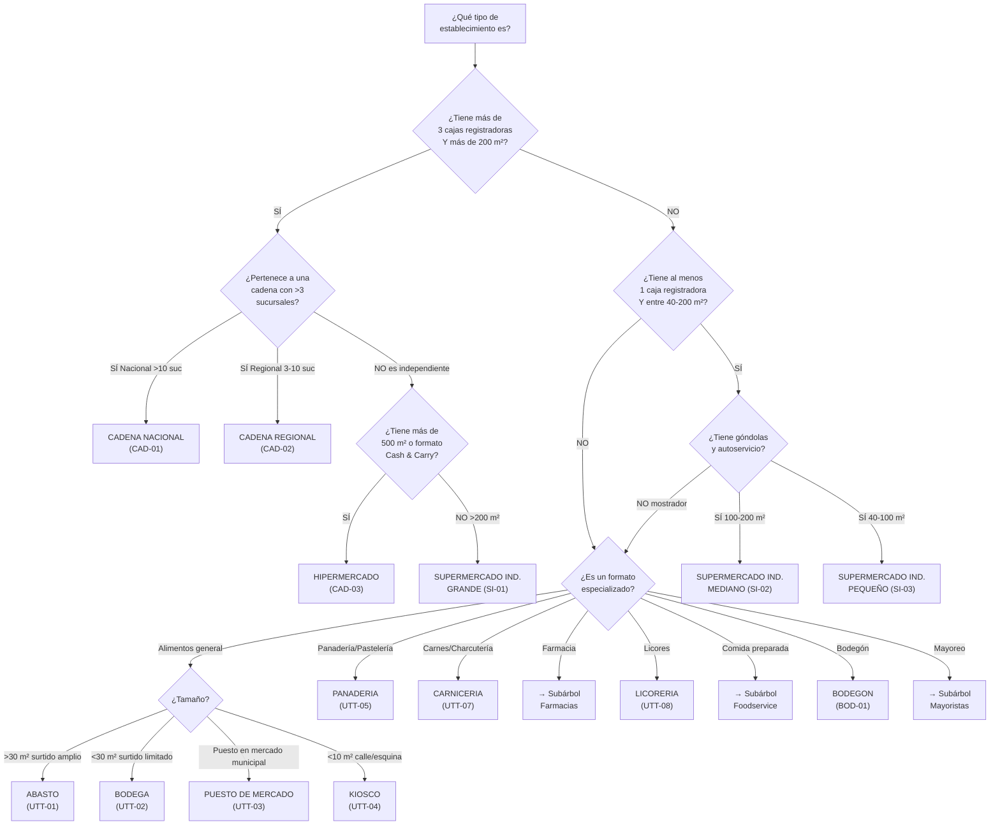
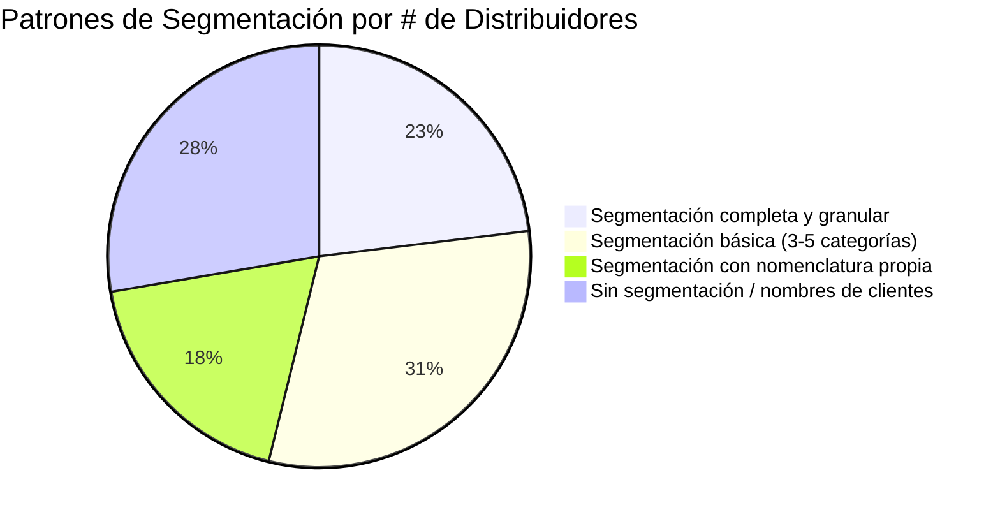
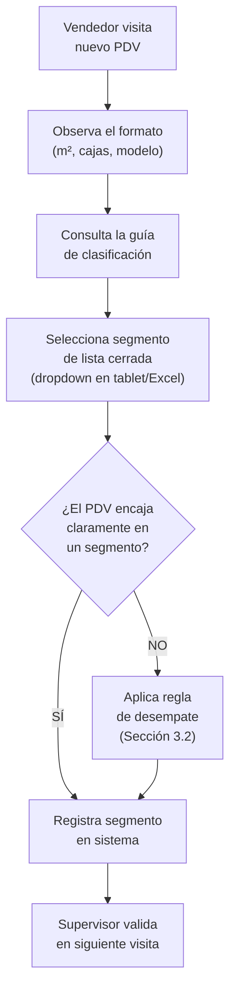

# 📋 Entregable 2.2 — Documento de Desarrollo
## Reglas de Negocio para Categorización de Canales — Canal DTT Heinz Venezuela

---

**Preparado para:** Trade Marketing — Kraft Heinz Venezuela  
**Base normativa:** Metodología Nielsen Retail Audit Venezuela · Playbook de segmentación DTT existente  
**Fecha:** Mayo 2026  

---

## 1. Objetivo del Documento

Definir las **reglas de negocio** que determinan cómo clasificar cada punto de venta (PDV) en el segmento correcto de la jerarquía estándar, estableciendo criterios objetivos y medibles que eliminen la subjetividad y permitan comparabilidad con datos de mercado Nielsen.

---

## 2. Principios Rectores de Categorización

| # | Principio | Descripción |
|---|---|---|
| P1 | **Primacía de la actividad principal** | Se clasifica por lo que el PDV *es*, no por lo que *vende*. Una bodega que vende medicinas sigue siendo bodega. |
| P2 | **Observación en campo** | La clasificación la realiza el vendedor de ruta al visitar el PDV, no el administrativo del distribuidor. |
| P3 | **Criterios objetivos** | Se usan indicadores medibles (m², cajas, góndolas) para reducir subjetividad. |
| P4 | **Clasificación única** | Cada PDV tiene **un solo** segmento. No se permiten valores combinados ("Abasto/Bodega"). |
| P5 | **Alineación Nielsen** | Los segmentos deben poder mapearse 1:1 con la estructura de Nielsen para comparabilidad. |

---

## 3. Reglas de Clasificación por Segmento

### 3.1 Árbol de Decisión Principal

### 3.2 Criterios Detallados: Supermercado Independiente vs. Tradicional

Esta es la **distinción más crítica** del proyecto y la que genera más errores de clasificación.

#### Matriz Comparativa de Criterios

| Criterio | ABASTO (UTT-01) | BODEGA (UTT-02) | MINI MARKET (SI-05) | SPM IND. PEQUEÑO (SI-03) | SPM IND. MEDIANO (SI-02) | SPM IND. GRANDE (SI-01) |
|---|---|---|---|---|---|---|
| **Superficie (m²)** | 30 – 80 | < 30 | 40 – 80 | 80 – 150 | 150 – 300 | > 300 |
| **Cajas registradoras** | 0 – 1 | 0 | 1 | 1 – 2 | 2 – 4 | > 4 |
| **Modelo de atención** | Mostrador | Mostrador | Mix | Autoservicio | Autoservicio | Autoservicio |
| **Góndolas/estantes** | Estantes básicos | Vitrinas/repisas | Algunas góndolas | Góndolas parciales | Góndolas completas | Góndolas + isla |
| **Surtido de categorías** | 5 – 15 cat. | < 5 cat. | 10 – 20 cat. | 15 – 30 cat. | 30 – 60 cat. | > 60 cat. |
| **Productos frescos** | Limitado | No | Algunos | Sección reducida | Sección completa | Sección amplia + deli |
| **Carrito/cesta** | No | No | Cesta | Cesta/carrito | Carrito | Carrito |
| **Aire acondicionado** | Raro | No | Variable | Frecuente | Sí | Sí |
| **Horario** | ~12 hrs | Variable | ~14 hrs | ~14 hrs | ~16 hrs | ~16 hrs |
| **Facturación formal** | Variable | Raro | Frecuente | Sí | Sí | Sí |

> [!IMPORTANT]
> **Regla de oro para la distinción Tradicional vs. Supermercado:**
> Si el cliente puede entrar, caminar por pasillos y seleccionar productos él mismo (autoservicio), es **Supermercado Independiente**. Si debe pedir al dependiente que le entregue los productos (mostrador), es **Tradicional** (Abasto o Bodega).

#### Regla de Desempate

Cuando un PDV cae en zona gris entre dos categorías:

1. **Priorizar modelo de atención** sobre superficie (un local de 100 m² con mostrador = Abasto, no Mini Market)
2. **Priorizar número de cajas** sobre surtido (2 cajas = Supermercado aunque tenga pocas categorías)
3. **Ante duda**, clasificar hacia el segmento **más pequeño** (ej: si duda entre SI-02 y SI-01, elegir SI-02) — es más fácil "promover" que "degradar"

### 3.3 Criterios por Canal Especializado

#### Farmacias

| Segmento | Criterios |
|---|---|
| FARMACIA TRADICIONAL (UTT-10) | Atención 100% mostrador. Venta primaria de medicamentos. Pocas categorías FMCG. Sin autoservicio. |
| FARMACIA CON AUTOSERVICIO (FM-01) | Tiene área de autoservicio para productos FMCG/cuidado personal. Puede tener cosmética, alimentos. |
| FARMACIA CADENA (FM-02) | Pertenece a cadena con >3 sucursales (Farmatodo, Locatel, SAAS). Formato estandarizado. |
| FARMACIA MODERNA IND. (FM-03) | Independiente pero con formato moderno, autoservicio parcial, >50 m². |

#### Mayoristas

| Segmento | Criterios |
|---|---|
| MAYORISTA CON FDV (MAY-01) | Vende al por mayor. Tiene fuerza de ventas propia que visita clientes. Despacho propio. |
| MAYORISTA SIN FDV (MAY-02) | Vende al por mayor. El cliente viene al punto a comprar (autocompra). No tiene FDV. |
| NANO DISTRIBUIDOR (MAY-03) | Intermediario pequeño, compra a mayorista y revende a tiendas. Generalmente informal. |

#### Bodegones

| Segmento | Criterios |
|---|---|
| BODEGON (BOD-01) | Establecimiento que vende productos importados/premium. Puede tener licores. Precio alto. No es bodega. |
| BODEGON-LICORERIA (BOD-02) | Bodegón donde la venta de licores representa >40% del negocio. |

> [!WARNING]
> **Error frecuente:** En Venezuela, "Bodegón" NO es sinónimo de "Bodega". El bodegón es un formato moderno, generalmente con productos importados y precios premium. La bodega es el formato tradicional de barrio.

#### Foodservice / On Premise

| Segmento | Criterios |
|---|---|
| RESTAURANTE (FS-01) | Servicio de mesa. Menú establecido. Preparación de alimentos para consumo en el local. |
| FAST FOOD (FS-02) | Comida rápida. Menú limitado. Servicio rápido. Sin mesa servida. |
| LUNCHERIA / CAFETERIA (FS-03) | Comida informal. Desayunos, almuerzos ejecutivos. Barra o mostrador. |
| HOTEL / POSADA (FS-04) | Hospedaje con servicio de alimentos. |
| CATERING / INSTITUCIONAL (FS-05) | Empresas, colegios, hospitales, comedores industriales. |

---

## 4. Justificación de Alineación con Nielsen

### 4.1 ¿Por qué Nielsen como referencia?

| Factor | Justificación |
|---|---|
| **Comparabilidad de mercado** | Nielsen mide el universo total de retail en Venezuela. Si Heinz usa la misma segmentación, puede comparar su desempeño vs. la categoría y vs. competidores directamente. |
| **Distribución Numérica/Ponderada** | Los KPIs de DN y DP de Nielsen se calculan por segmento de canal. Si Heinz no usa los mismos segmentos, no puede comparar su DN propia vs. DN Nielsen. |
| **Estándar de industria** | Todos los FMCG en Venezuela (P&G, Unilever, Nestlé, Colgate-Palmolive) usan la misma estructura Nielsen. Alinearse permite benchmarking. |
| **Fotografía del éxito** | La definición de portafolio ideal por formato (qué SKUs debería tener cada tipo de tienda) requiere conocer el formato. Nielsen tiene este benchmark por canal. |
| **Inversión TTS** | Las inversiones en Trade (descuentos, promociones, material POP) se asignan por canal. Sin segmentación alineada, la inversión se distribuye de forma ineficiente. |

### 4.2 Mapeo Heinz → Nielsen

| Segmento Heinz (Propuesto) | Equivalente Nielsen Venezuela | Nivel de Coincidencia |
|---|---|---|
| ABASTO (UTT-01) | Abastos | 🟢 Exacto |
| BODEGA (UTT-02) | Bodegas | 🟢 Exacto |
| KIOSCO (UTT-04) | Kioscos | 🟢 Exacto |
| PANADERIA (UTT-05) | Panaderías | 🟢 Exacto |
| CARNICERIA/CHARCUTERIA (UTT-07) | Carnicerías/Charcuterías | 🟢 Exacto |
| FARMACIA TRADICIONAL (UTT-10) | Farmacias Tradicionales | 🟢 Exacto |
| SUPERMERCADO IND. GRANDE (SI-01) | SPM Independientes Grandes | 🟢 Exacto |
| SUPERMERCADO IND. MEDIANO (SI-02) | SPM Independientes Medianos | 🟢 Exacto |
| MINI MARKET (SI-05) | Mini Markets | 🟢 Exacto |
| CADENA NACIONAL (CAD-01) | Cadenas Nacionales | 🟢 Exacto |
| HIPERMERCADO (CAD-03) | Hipermercados | 🟢 Exacto |
| BODEGON (BOD-01) | Bodegones | 🟡 Nielsen lo agrupa con Licorerías |
| MAYORISTA CON FDV (MAY-01) | Mayoristas | 🟡 Nielsen no desglosa FDV/sin FDV |
| RESTAURANTE (FS-01) | On Premise | 🟡 Nielsen agrupa todo Foodservice |
| PIÑATERIA (TE-03) | Otros | 🟠 Sin equivalente directo |

### 4.3 Beneficios Cuantificables de la Alineación

| Métrica | Sin alineación (hoy) | Con alineación (propuesto) |
|---|---|---|
| Canales comparables con Nielsen | 0 de 35 | **~28 de 35 (80%)** |
| Capacidad de calcular DN por formato | ❌ Imposible | ✅ Completa |
| Capacidad de definir portafolio por formato | ❌ Genérico | ✅ Por tipo de tienda |
| Benchmarking vs. competencia por canal | ❌ No disponible | ✅ Directo |
| Asignación de inversión TTS por canal | ❌ A ciegas | ✅ Basada en datos |

---

## 5. Análisis de Heterogeneidad Actual

### 5.1 Diagnóstico de Cómo Segmentan los Distribuidores Hoy

Del análisis de los 65 distribuidores, se identificaron **4 patrones de segmentación**:

#### Patrón A: Segmentación Completa (15 distribuidores)
**Ejemplos:** Red CEC (5), F&S (2), Distribuidora La Nueva Tendencia, SUPLYMOS

- Usan 10-15 segmentos distintos
- Nomenclatura cercana a Nielsen
- Solo requieren tabla de equivalencias

#### Patrón B: Segmentación Básica (20 distribuidores)
**Ejemplos:** Confitería La Guacamaya, Grupo Sonreír, SUDICOLCA

- Usan 3-8 segmentos
- Categorías principales correctas (Abasto, Supermercado, Mayorista)
- Necesitan ampliar granularidad

#### Patrón C: Nomenclatura Propia (12 distribuidores)
**Ejemplos:** Comercializadora 4D, Importadora FH44, Super Distribuciones Valera

- Usan nomenclatura interna (ej: "SUPER. MINIMARTS", "SUPER. GRANDES", "09 Abasto- Bod- Puest m")
- La intención es correcta pero los nombres no son estándar
- Requieren tabla de traducción

#### Patrón D: Sin Segmentación (18 distribuidores)
**Ejemplos:** Excelsior (52K reg.), Mayorista Exitoso, 3B Group, Viveres El Futuro

- Campo vacío o con nombres de clientes
- Requieren implementación desde cero
- Prioridad #1 del proyecto

### 5.2 Ejemplos de un Mismo Concepto con Diferentes Nombres

| Concepto real | Variantes encontradas | Total variantes |
|---|---|---|
| Tienda pequeña de barrio | `BODEGA`, `BODEGAS`, `Bodega`, `Bodegas` | 4 |
| Tienda mediana de barrio | `ABASTO`, `ABASTOS`, `Abasto`, `Abastos`, `ABASTOS TRADICIONALES`, `ABASTO GRANDE`, `ABASTO MEDIANO`, `ABASTO PEQUEÑO` | 8 |
| Abasto + Bodega combinado | `ABASTOS / BODEGAS`, `Abastos/Bodegas`, `ABASTOS/BODEGAS`, `ABASTOS, BODEGAS`, `ABASTO/BODEGA`, `ABASTO BODEGA` | 6 |
| Supermercado independiente | `SUPERMERCADO`, `SUPERMERCADOS`, `Supermercados`, `SUPERMERCADO INDEPENDIENTE`, `SUPERMERCADOS INDEPENDIENTES`, `Supermercado Independiente`, `SUP INDEPENDIENTE`, `SPM INDEPENDIENTE GRANDE`, `SPM INDEPENDIENTE PEQUEÑO`, `SUPERMERCADO GRANDE`, `SUPERMERCADO MEDIANO`, `SUPERMERCADO PEQUEÑO` | 12 |
| Carnicería y afines | `CARNICERIA`, `CARNICERIAS`, `CARNICERÍAS/CHARCUTERÍAS`, `Carnicerias/Charcuterias`, `CARNICERIA/CHARCUTERIA`, `FRIGORIFICO`, `CHARCUTERIA`, `CHARCUTERIAS`, etc. | 23 |

> **Un solo concepto ("carnicería/charcutería") tiene 23 formas distintas de escribirse en la base.** Esto hace imposible cualquier análisis consolidado sin una tabla de equivalencias.

---

## 6. Protocolo de Implementación

### 6.1 Flujo de Categorización para Nuevos Clientes

### 6.2 Protocolo de Migración para Clientes Existentes

| Fase | Acción | Responsable | Plazo |
|---|---|---|---|
| 1 | Aplicar tabla de equivalencias automática (Patrón A y B) | Pasante/Analista | Semana 1 |
| 2 | Traducir nomenclatura propia con tabla de mapeo (Patrón C) | Pasante + Distribuidor | Semana 2 |
| 3 | Clasificación manual por vendedor de ruta (Patrón D, top 10 distribuidores) | Vendedores de ruta | Semana 3-6 |
| 4 | Validación cruzada: comparar clasificación vs. volumen de compra | Trade Marketing | Semana 7 |

---

## 7. Reglas de Excepción

| # | Situación | Regla |
|---|---|---|
| E1 | PDV que cambió de formato (ej: bodega se amplió a mini market) | Se reclasifica en el siguiente ciclo de visita. El vendedor actualiza el segmento. |
| E2 | PDV con actividades mixtas (ej: panadería con sección de abastos) | Se clasifica por la **actividad que genera >50% del ingreso**. |
| E3 | PDV institucional (ej: hospital, escuela) | Se clasifica como CATERING/INSTITUCIONAL (FS-05) sin importar el tamaño. |
| E4 | PDV temporal (ej: feria, evento) | No se incluye en la base de clientes regulares. Se marca como "EVENTO". |
| E5 | Distribuidor no puede distinguir Abasto de Bodega | Se permite temporalmente el valor combinado "ABASTO/BODEGA" (UTT-01) con nota de pendiente de separación. |

---

## 8. Conclusiones

1. **La segmentación propuesta de 35 categorías en 3 niveles** cubre el 100% de los formatos comerciales relevantes para Heinz en Venezuela.
2. **La alineación con Nielsen es posible en un 80%** de los segmentos, lo que habilita la comparabilidad de DN/DP con datos de mercado.
3. **El criterio diferenciador clave** entre Tradicional y Supermercado Independiente es el **modelo de atención** (mostrador vs. autoservicio), complementado por superficie y número de cajas.
4. **La tabla de equivalencias de ~180 variantes** permite automatizar la migración para el 62% de los distribuidores (Patrones A, B y C), mientras que el 38% restante (Patrón D) requiere trabajo de campo.
