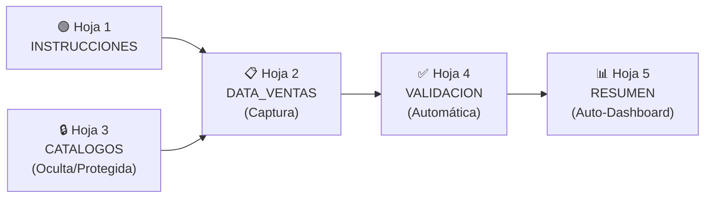

# 📊 Entregable 3.1 — Estructura de Excel: Template de Reporte de Ventas
## Plantilla Única de Reporte de Ventas DTT — Heinz Venezuela

---

## Arquitectura del Libro



| Hoja | Nombre | Visible | Protegida | Editable por distribuidor |
|---|---|---|---|---|
| 1 | INSTRUCCIONES | ✅ Sí | 🔒 Sí (total) | ❌ No |
| 2 | DATA_VENTAS | ✅ Sí | 🔒 Parcial (encabezados) | ✅ Sí (filas de datos) |
| 3 | CATALOGOS | ❌ Oculta | 🔒 Sí (total) | ❌ No |
| 4 | VALIDACION | ✅ Sí | 🔒 Sí (total) | ❌ No (solo lectura) |
| 5 | RESUMEN | ✅ Sí | 🔒 Sí (total) | ❌ No (solo lectura) |

---

## Hoja 1: `INSTRUCCIONES`

### Contenido (texto fijo, celdas combinadas, formato visual)

```
╔══════════════════════════════════════════════════════════════════╗
║  PLANTILLA DE REPORTE DE VENTAS — CANAL DTT                    ║
║  Kraft Heinz Venezuela · Trade Marketing                        ║
║  Versión: 1.0 · Vigencia: Mayo 2026                             ║
╚══════════════════════════════════════════════════════════════════╝

📌 PROPÓSITO
   Esta plantilla estandariza el reporte de ventas de los
   distribuidores del Canal DTT. Los campos con lista desplegable
   NO pueden ser modificados manualmente.

📋 PASOS PARA EL LLENADO
   1. Ir a la hoja "DATA_VENTAS"
   2. Comenzar a llenar desde la fila 5 (las filas 1-4 son encabezados)
   3. Los campos en AZUL son de texto libre
   4. Los campos en VERDE tienen lista desplegable → hacer clic en ▼
   5. Los campos en NARANJA son numéricos → solo números
   6. NO insertar ni eliminar columnas
   7. NO cambiar nombres de encabezados
   8. NO copiar datos de otro archivo con "Pegado especial" → formato
      Usar siempre "Pegar solo valores"

⚠️ REGLAS CRÍTICAS
   • ESTADO: Seleccionar de la lista. No escribir manualmente.
   • SEGMENTO: Seleccionar de la lista. No poner nombre del cliente.
   • FECHA: Formato DD/MM/AAAA. No escribir texto.
   • CAJAS: Solo números enteros positivos.
   • RIF: Formato J123456789 o V12345678 (sin guiones ni puntos).

📞 SOPORTE
   Contacto Trade Marketing: [email / teléfono]
   Fecha límite de envío: [día] de cada mes
```

### Diseño Visual

| Elemento | Formato |
|---|---|
| Banner superior | Fondo rojo Heinz (#C8102E), texto blanco, fuente Calibri 18pt |
| Iconos | Emojis como texto (📌📋⚠️📞) |
| Secciones | Bordes gruesos, fondo gris claro (#F2F2F2) |
| Reglas críticas | Fondo amarillo (#FFF3CD), borde rojo |
| Versión/fecha | Celda A1 con formato condicional para resaltar si está vencida |

---

## Hoja 2: `DATA_VENTAS` — Diseño de Columnas

### Encabezados (Filas 1-4)

| Fila | Contenido | Formato |
|---|---|---|
| 1 | Título: "REPORTE DE VENTAS DTT — [NOMBRE DISTRIBUIDOR]" | Combinada A1:AM1, fondo rojo |
| 2 | Período: "MES: [lista] AÑO: [lista]" | Celdas B2 y D2 con dropdown |
| 3 | Distribuidor: "[Nombre]" COD: "[Código]" | Celdas B3 y D3, validadas vs catálogo |
| 4 | **ENCABEZADOS DE COLUMNAS** | Fondo azul oscuro (#003366), texto blanco, congelado |

### Columnas de Datos (Fila 5 en adelante)

| Col | Encabezado | Color | Tipo de Dato | Validación | Obligatorio |
|---|---|---|---|---|---|
| A | Nro. Fila | ⬜ Gris | Auto-numérico | `=FILA()-4` (fórmula protegida) | Auto |
| **B** | **COD. DISTRIBUIDOR** | 🟢 Verde | Texto | Lista: `CATALOGOS!Distribuidores` | ✅ |
| C | DIR. DE ENTREGA | 🔵 Azul | Texto | Libre, max 100 chars | ✅ |
| **D** | **DISTRIBUIDOR** | 🟢 Verde | Texto | Lista: `CATALOGOS!Distribuidores_Nombre` | ✅ |
| E | VENDEDOR HEINZ | 🔵 Azul | Texto | Libre | ❌ |
| F | CODIGO VENDEDOR | 🔵 Azul | Texto | Libre | ❌ |
| G | NOMBRE VENDEDOR | 🔵 Azul | Texto | Libre | ❌ |
| H | CODIGO CLIENTE | 🔵 Azul | Texto | Libre, alfanumérico | ✅ |
| I | CLIENTE | 🔵 Azul | Texto | Libre, max 150 chars | ✅ |
| J | RIF | 🔵 Azul | Texto | Regex: `^[JVGEP]\d{8,9}$` | ✅ |
| **K** | **SEGMENTO DE TIENDA** | 🟢 Verde | Texto | **Lista: `CATALOGOS!Segmentos_N3`** | **✅ CRÍTICO** |
| L | CIUDAD | 🔵 Azul | Texto | Libre (MAYÚSCULAS auto) | ✅ |
| M | MUNICIPIO | 🔵 Azul | Texto | Libre (MAYÚSCULAS auto) | ✅ |
| **N** | **ESTADO** | 🟢 Verde | Texto | **Lista: `CATALOGOS!Estados`** | **✅ CRÍTICO** |
| O | TIPO DOCUMENTO | 🟢 Verde | Texto | Lista: `Factura,Nota de Crédito,Nota de Débito` | ✅ |
| P | NRO. DOCUMENTO | 🔵 Azul | Texto | Alfanumérico, max 20 chars | ✅ |
| Q | FECHA | 🟠 Naranja | Fecha | Formato `DD/MM/AAAA`, rango: 01/01/2024 – hoy | ✅ |
| R | COD. SKU | 🟠 Naranja | Número | Entero > 0 | ✅ |
| S | DESCRIPCION PRODUCTO | 🟢 Verde | Texto | Lista: `CATALOGOS!SKUs` (opcional) | ✅ |
| T | CAJAS | 🟠 Naranja | Número | Decimal ≥ 0, max 2 decimales | ✅ |
| U | MONTO (Bs) | 🟠 Naranja | Número | Decimal ≥ 0, formato `#,##0.00` | ✅ |
| V | TERRITORIO | 🔵 Azul | Texto | Libre | ❌ |
| W | UNIDADES | 🟠 Naranja | Número | Entero ≥ 0 | ✅ |

> [!IMPORTANT]
> **Las columnas K (Segmento) y N (Estado)** son las columnas críticas del proyecto. Funcionan **únicamente** con lista desplegable. Si el usuario intenta escribir un valor que no está en la lista, Excel mostrará un error y no lo permitirá.

### Configuración de Data Validation por Columna

#### Columna K: SEGMENTO DE TIENDA

```
Tipo: Lista
Fuente: =CATALOGOS!$C$2:$C$36
Alerta de error: Detener
Título: "Segmento inválido"
Mensaje: "Seleccione un segmento de la lista desplegable.
No escriba el nombre del cliente aquí.
Este campo indica el TIPO de tienda (ej: ABASTO, BODEGA, SUPERMERCADO)."

Mensaje de entrada:
Título: "Segmento de Tienda"
Mensaje: "Seleccione el tipo de tienda del cliente.
Use la flecha ▼ para ver la lista completa.
Si tiene dudas, consulte la hoja INSTRUCCIONES."
```

#### Columna N: ESTADO

```
Tipo: Lista
Fuente: =CATALOGOS!$A$2:$A$25
Alerta de error: Detener
Título: "Estado inválido"
Mensaje: "Seleccione un estado de Venezuela de la lista.
No escriba 'NO IDENTIFICADO'.
Si no conoce el estado, consulte la dirección del cliente."

Mensaje de entrada:
Título: "Estado"
Mensaje: "Seleccione el estado donde se ubica el punto de venta.
Es la entidad federal (ej: ZULIA, TACHIRA, MERIDA)."
```

#### Columna Q: FECHA

```
Tipo: Fecha
Mínimo: =FECHA(2024,1,1)
Máximo: =HOY()
Alerta de error: Detener
Título: "Fecha inválida"
Mensaje: "La fecha debe estar entre 01/01/2024 y hoy.
Formato: DD/MM/AAAA"
```

#### Columnas T, U, W: NUMÉRICOS

```
Tipo: Decimal (T, U) / Número entero (W)
Mínimo: 0
Máximo: 999999
Alerta de error: Detener
Título: "Valor inválido"
Mensaje: "Ingrese un número positivo."
```

### Formato Condicional por Fila

| Regla | Condición | Formato |
|---|---|---|
| Fila incompleta (Estado) | `=N5=""` | Fondo rosa (#FFD7D7) en toda la fila |
| Fila incompleta (Segmento) | `=K5=""` | Fondo rosa (#FFD7D7) en toda la fila |
| Fila completa | `=Y(K5<>"",N5<>"",Q5<>"",T5<>"")` | Fondo verde claro (#D4EDDA) en col A |
| Fecha futura | `=Q5>HOY()` | Texto rojo, fondo amarillo |
| Cajas = 0 | `=T5=0` | Texto naranja (advertencia, no error) |

---

## Hoja 3: `CATALOGOS` (Oculta y Protegida)

### Estructura de Rangos Nombrados

| Rango Nombrado | Ubicación | Contenido | Registros |
|---|---|---|---|
| `Estados` | A2:A25 | 24 estados de Venezuela | 24 |
| `Segmentos_N3` | C2:C36 | 35 segmentos Nivel 3 del catálogo maestro | 35 |
| `Segmentos_N1` | E2:E9 | 8 macro canales | 8 |
| `Distribuidores` | G2:G66 | 65 códigos de distribuidores | 65 |
| `Distribuidores_Nombre` | H2:H66 | 65 nombres de distribuidores | 65 |
| `Regiones` | J2:J5 | 4 regiones Heinz | 4 |
| `TipoDocumento` | L2:L4 | Factura, Nota de Crédito, Nota de Débito | 3 |
| `Meses` | N2:N13 | Enero a Diciembre | 12 |
| `Anios` | P2:P5 | 2024, 2025, 2026, 2027 | 4 |

### Lista de Segmentos (C2:C36)

```
ABASTO
BODEGA
PUESTO DE MERCADO
KIOSCO
PANADERIA
PASTELERIA
CARNICERIA / CHARCUTERIA / FRIGORIFICO
LICORERIA
CONFITERIA
FARMACIA TRADICIONAL
PERFUMERIA TRADICIONAL
FERRETERIA / QUINCALLERIA
SUPERMERCADO IND. GRANDE
SUPERMERCADO IND. MEDIANO
SUPERMERCADO IND. PEQUEÑO
AUTOMERCADO
MINI MARKET
CADENA NACIONAL
CADENA REGIONAL
HIPERMERCADO / CASH & CARRY
FARMACIA CON AUTOSERVICIO
FARMACIA CADENA
FARMACIA MODERNA INDEPENDIENTE
BODEGON
BODEGON-LICORERIA
MAYORISTA CON FUERZA DE VENTA
MAYORISTA SIN FUERZA DE VENTA
NANO DISTRIBUIDOR
SUB-DISTRIBUIDOR
RESTAURANTE
FAST FOOD
LUNCHERIA / CAFETERIA
HOTEL / POSADA
CATERING / INSTITUCIONAL
TIENDA DE CONVENIENCIA
```

### Tabla de Derivación Automática (para Hoja VALIDACION)

| Segmento N3 | → Canal N1 (auto) | → Código (auto) |
|---|---|---|
| ABASTO | TRADE TRADICIONAL (UTT) | UTT-01 |
| BODEGA | TRADE TRADICIONAL (UTT) | UTT-02 |
| SUPERMERCADO IND. GRANDE | SUPERMERCADOS INDEPENDIENTES | SI-01 |
| *(etc. — los 35 segmentos con su macro canal y código)* | | |

> [!NOTE]
> Esta hoja se oculta con `Formato > Hoja > Ocultar` y se protege con contraseña para evitar manipulación accidental por parte del distribuidor.

---

## Hoja 4: `VALIDACION` (Solo lectura, cálculo automático)

### Columnas de Validación (espejo de DATA_VENTAS)

| Col | Campo | Fórmula | Resultado |
|---|---|---|---|
| A | Nro. Fila | `=DATA_VENTAS!A5` | Referencia |
| B | Estado_OK | `=SI(DATA_VENTAS!N5="","❌ VACÍO",SI(ESERROR(COINCIDIR(DATA_VENTAS!N5,Estados,0)),"❌ INVÁLIDO","✅"))` | ✅ o ❌ |
| C | Segmento_OK | `=SI(DATA_VENTAS!K5="","❌ VACÍO",SI(ESERROR(COINCIDIR(DATA_VENTAS!K5,Segmentos_N3,0)),"❌ INVÁLIDO","✅"))` | ✅ o ❌ |
| D | Fecha_OK | `=SI(DATA_VENTAS!Q5="","❌ VACÍO",SI(Y(ESNUMERO(DATA_VENTAS!Q5),DATA_VENTAS!Q5>=FECHA(2024,1,1),DATA_VENTAS!Q5<=HOY()),"✅","❌ FORMATO"))` | ✅ o ❌ |
| E | Cajas_OK | `=SI(DATA_VENTAS!T5="","❌ VACÍO",SI(Y(ESNUMERO(DATA_VENTAS!T5),DATA_VENTAS!T5>=0),"✅","❌ NO NUMÉRICO"))` | ✅ o ❌ |
| F | RIF_OK | `=SI(DATA_VENTAS!J5="","❌ VACÍO",SI(O(IZQUIERDA(DATA_VENTAS!J5,1)="J",IZQUIERDA(DATA_VENTAS!J5,1)="V",IZQUIERDA(DATA_VENTAS!J5,1)="G"),"✅","⚠️ REVISAR"))` | ✅ o ⚠️ |
| G | Registro_Completo | `=SI(Y(B5="✅",C5="✅",D5="✅",E5="✅"),"✅ COMPLETO","❌ INCOMPLETO")` | ✅ o ❌ |
| H | Canal_Auto | `=SI(C5="✅",BUSCARV(DATA_VENTAS!K5,CATALOGOS!$C$2:$E$36,3,0),"—")` | Canal Nivel 1 derivado |
| I | Region_Auto | `=SI(B5="✅",BUSCARV(DATA_VENTAS!N5,CATALOGOS!$A$2:$D$25,4,0),"—")` | Región derivada del Estado |

### Resumen de Validación (parte superior de la hoja)

| Celda | KPI | Fórmula |
|---|---|---|
| B1 | Total filas con datos | `=CONTAR.SI(A:A,">0")` |
| B2 | Filas completas | `=CONTAR.SI(G:G,"✅ COMPLETO")` |
| B3 | **% Completitud** | `=B2/B1` (formato %) |
| B4 | Filas con Estado vacío | `=CONTAR.SI(B:B,"❌ VACÍO")` |
| B5 | Filas con Segmento vacío | `=CONTAR.SI(C:C,"❌ VACÍO")` |
| D1 | Semáforo | `=SI(B3>=0.95,"🟢 LISTO PARA ENVIAR",SI(B3>=0.8,"🟡 REVISAR","🔴 NO ENVIAR"))` |

---

## Hoja 5: `RESUMEN` (Auto-Dashboard)

### Indicadores Automáticos

| Sección | Contenido | Visualización |
|---|---|---|
| **Encabezado** | Distribuidor, Período, Fecha de generación | Texto |
| **Semáforo de envío** | 🟢🟡🔴 basado en % completitud | Formato condicional grande |
| **KPIs de llenado** | % Estado OK, % Segmento OK, % Fecha OK, % Numéricos OK | 4 celdas con % |
| **Distribución por Estado** | Tabla dinámica: Estado → # registros, TON, Bs | Tabla + Gráfico barras |
| **Distribución por Segmento** | Tabla dinámica: Segmento → # registros, # clientes únicos | Tabla + Gráfico pie |
| **Registros con errores** | Lista filtrada de filas con algún ❌ | Tabla condicional |

### Fórmulas Clave del Resumen

```excel
' Distribución por Estado (ejemplo para fila de ZULIA en celda A10)
=CONTAR.SI(DATA_VENTAS!N:N,"ZULIA")                           ' # Registros
=SUMAR.SI(DATA_VENTAS!N:N,"ZULIA",DATA_VENTAS!T:T)           ' Total Cajas
=SUMAR.SI(DATA_VENTAS!N:N,"ZULIA",DATA_VENTAS!U:U)           ' Total Bs

' Distribución por Segmento (ejemplo para ABASTO en celda A30)
=CONTAR.SI(DATA_VENTAS!K:K,"ABASTO")                          ' # Registros
```

---

## Protección y Seguridad

| Elemento | Protección | Contraseña |
|---|---|---|
| Hoja INSTRUCCIONES | Protegida completa | `HeinzTM2026!` |
| Hoja DATA_VENTAS | Protegida excepto rango B5:W1048576 | `HeinzTM2026!` |
| Hoja CATALOGOS | Oculta + Protegida completa | `HeinzAdmin!` |
| Hoja VALIDACION | Protegida completa | `HeinzTM2026!` |
| Hoja RESUMEN | Protegida completa | `HeinzTM2026!` |
| Estructura del libro | Protegida (no mover/eliminar hojas) | `HeinzAdmin!` |

> [!WARNING]
> La contraseña de CATALOGOS es diferente a las demás. Solo Trade Marketing debe poder modificar los catálogos. Los distribuidores solo necesitan la contraseña de DATA_VENTAS (si alguna vez requieren desproteger para ajustes menores).
