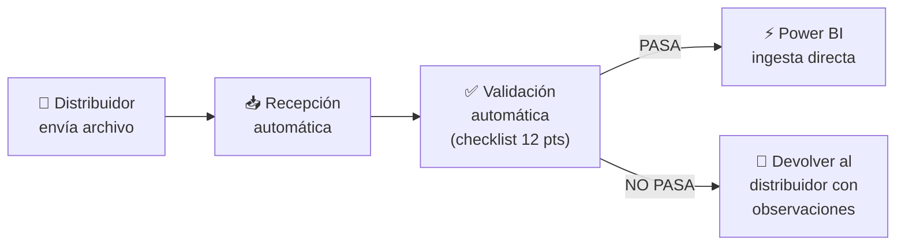
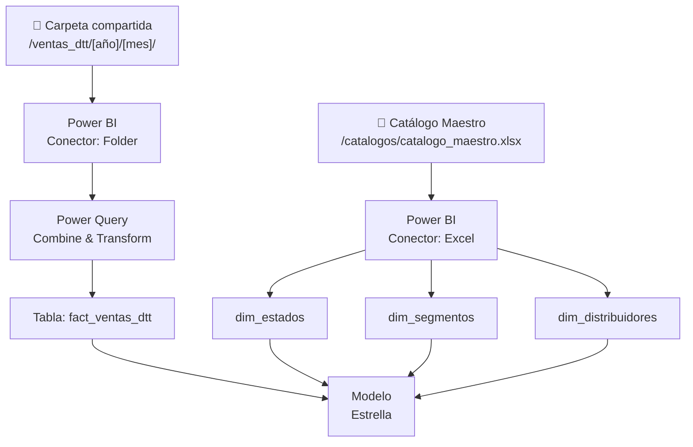

# 📋 Entregable 3.2 — Documento de Desarrollo (Senior)
## Requerimientos Técnicos: Plantilla Procesable por Power BI sin Limpieza

---

**Audiencia:** Analistas de datos, equipo de BI, administrador de la plantilla  
**Objetivo:** Garantizar que cada archivo recibido de distribuidores sea directamente ingestable en Power BI / sistema BI sin transformaciones manuales de limpieza  

---

## 1. Principio de Diseño: "Zero-Touch Ingestion"

La plantilla debe producir un archivo que cumpla con la regla **Zero-Touch**: desde la descarga del correo hasta la carga en Power BI, **no se requiere intervención manual** para limpiar, reformatear o corregir datos.



---

## 2. Especificación de Tipos de Datos por Columna

### Tabla de Tipado Estricto

| Columna Excel | Nombre Técnico (Power BI) | Tipo Power BI | Formato Excel | Restricción | Ejemplo Válido | Ejemplo Inválido |
|---|---|---|---|---|---|---|
| A: Nro. Fila | `row_id` | Int64 | `0` (sin decimales) | Entero > 0, auto | `1` | `1.5`, `uno` |
| B: COD. DISTRIBUIDOR | `distributor_code` | Text | `@` (texto) | Alfanumérico, max 10 | `218809` | (vacío) |
| D: DISTRIBUIDOR | `distributor_name` | Text | `@` | Catálogo cerrado | `CEC MERIDA` | `cec merida` |
| H: CODIGO CLIENTE | `client_code` | Text | `@` | Alfanumérico, max 20 | `CLI-001` | (vacío) |
| I: CLIENTE | `client_name` | Text | `@` | Max 150 chars | `BODEGA EL SOL` | (vacío) |
| J: RIF | `client_rif` | Text | `@` | Patrón `[JVGEP]\d{8,9}` | `J123456789` | `J-12.345.678-9` |
| **K: SEGMENTO** | **`store_segment`** | **Text** | `@` | **Catálogo cerrado (35 vals)** | `ABASTO` | `abastos`, `Juan Pérez` |
| L: CIUDAD | `city` | Text | `@` | MAYÚSCULAS, max 50 | `MARACAIBO` | `maracaibo` |
| M: MUNICIPIO | `municipality` | Text | `@` | MAYÚSCULAS, max 50 | `MARACAIBO` | `Mcpio. Maracaibo` |
| **N: ESTADO** | **`state`** | **Text** | `@` | **Catálogo cerrado (24 vals)** | `ZULIA` | `Edo. Zulia`, `NO IDENTIFICADO` |
| O: TIPO DOCUMENTO | `document_type` | Text | `@` | Catálogo cerrado (3 vals) | `Factura` | `F`, `FAC` |
| P: NRO. DOCUMENTO | `document_number` | Text | `@` | Alfanumérico, max 20 | `FAC-00123` | (vacío) |
| **Q: FECHA** | **`transaction_date`** | **Date** | `DD/MM/AAAA` | ≥ 01/01/2024, ≤ HOY() | `15/03/2026` | `15-mar-2026`, `marzo` |
| R: COD. SKU | `sku_code` | Int64 | `0` | Entero > 0 | `15765` | `SKU-15765` |
| S: DESCRIPCION | `product_description` | Text | `@` | Max 200 chars | `HZ KETCHUP 397G` | (vacío) |
| T: CAJAS | `cases` | Decimal | `0.00` | ≥ 0, max 2 decimales | `2.50` | `-1`, `dos` |
| U: MONTO (Bs) | `amount_bs` | Decimal | `#,##0.00` | ≥ 0 | `1250.00` | `1.250,00` (coma) |
| W: UNIDADES | `units` | Int64 | `0` | Entero ≥ 0 | `48` | `48.5` |

> [!IMPORTANT]
> **Separador decimal:** La plantilla DEBE estar configurada con **punto (.)** como separador decimal y **coma (,)** como separador de miles, alineado a Power BI. Esto se fuerza desde la configuración regional de Excel en la plantilla.

---

## 3. Convenciones de Nombres para BI

### Reglas de Naming

| Regla | Aplicación | Ejemplo |
|---|---|---|
| Nombres de hoja: MAYÚSCULAS con guión bajo | `DATA_VENTAS`, `CATALOGOS` | ❌ `Data Ventas`, `Hoja1` |
| Encabezados internos Power BI: `snake_case` | `store_segment`, `transaction_date` | ❌ `Store Segment`, `FECHA` |
| Sin tildes ni caracteres especiales en encabezados | `DESCRIPCION`, `CODIGO` | ❌ `DESCRIPCIÓN`, `CÓDIGO` |
| Nombres de rango: PascalCase | `Segmentos_N3`, `Estados` | ❌ `segmentos n3` |
| Nombre del archivo | `VENTAS_DTT_[CODDIST]_[AAAAMM].xlsx` | `VENTAS_DTT_218809_202605.xlsx` |

### Fila de Encabezados Técnicos (Fila 4 — visible)

La fila 4 de `DATA_VENTAS` contiene los nombres legibles. Para Power BI se usa una transformación en Power Query que renombra automáticamente:

```m
// Power Query M — Renombrado automático
let
    Source = Excel.Workbook(File.Contents(filePath), null, true),
    DataVentas = Source{[Name="DATA_VENTAS"]}[Data],
    SkipHeaders = Table.Skip(DataVentas, 3),
    PromotedHeaders = Table.PromoteHeaders(SkipHeaders),
    Renamed = Table.RenameColumns(PromotedHeaders, {
        {"Nro. Fila", "row_id"},
        {"COD. DISTRIBUIDOR", "distributor_code"},
        {"DISTRIBUIDOR", "distributor_name"},
        {"CODIGO CLIENTE", "client_code"},
        {"CLIENTE", "client_name"},
        {"RIF", "client_rif"},
        {"SEGMENTO DE TIENDA", "store_segment"},
        {"CIUDAD", "city"},
        {"MUNICIPIO", "municipality"},
        {"ESTADO", "state"},
        {"TIPO DOCUMENTO", "document_type"},
        {"NRO. DOCUMENTO", "document_number"},
        {"FECHA", "transaction_date"},
        {"COD. SKU", "sku_code"},
        {"DESCRIPCION PRODUCTO", "product_description"},
        {"CAJAS", "cases"},
        {"MONTO (Bs)", "amount_bs"},
        {"UNIDADES", "units"}
    }),
    TypedColumns = Table.TransformColumnTypes(Renamed, {
        {"row_id", Int64.Type},
        {"transaction_date", type date},
        {"cases", type number},
        {"amount_bs", type number},
        {"units", Int64.Type},
        {"sku_code", Int64.Type}
    })
in
    TypedColumns
```

---

## 4. Configuración de Formato de Fecha

### Problema Conocido

Excel puede almacenar fechas como números seriales (ej: `46096` = 15/03/2026) o como texto (ej: `"15/03/2026"`). Power BI solo lee correctamente el formato serial.

### Solución Implementada

| Capa | Mecanismo | Detalle |
|---|---|---|
| **Excel - Formato de celda** | Formato personalizado `DD/MM/AAAA` | Asegura visualización consistente |
| **Excel - Data Validation** | Tipo = Fecha, con rango | Impide ingreso de texto en campo fecha |
| **Excel - Macro pre-envío** | Verifica que Q es fecha numérica | Corrige textos a fecha serial |
| **Power Query** | `TransformColumnTypes(..., type date)` | Conversión explícita en la carga |

### Macro VBA de Normalización de Fechas

```vba
Sub NormalizarFechas()
    Dim ws As Worksheet: Set ws = ThisWorkbook.Sheets("DATA_VENTAS")
    Dim lastRow As Long: lastRow = ws.Cells(ws.Rows.Count, "Q").End(xlUp).Row
    Dim cell As Range
    Dim errCount As Long: errCount = 0
    
    For Each cell In ws.Range("Q5:Q" & lastRow)
        If Not IsEmpty(cell) Then
            If Not IsDate(cell.Value) Then
                ' Intentar parsear texto a fecha
                On Error Resume Next
                cell.Value = CDate(cell.Value)
                If Err.Number <> 0 Then
                    cell.Interior.Color = RGB(255, 200, 200)
                    errCount = errCount + 1
                    Err.Clear
                End If
                On Error GoTo 0
            End If
            cell.NumberFormat = "DD/MM/YYYY"
        End If
    Next cell
    
    If errCount > 0 Then
        MsgBox errCount & " fechas no pudieron ser convertidas." & vbNewLine & _
               "Están marcadas en rojo. Corrija antes de enviar.", vbExclamation
    Else
        MsgBox "Todas las fechas están correctas.", vbInformation
    End If
End Sub
```

---

## 5. Protección de Celdas — Mapa Detallado

### Zonas de Protección en `DATA_VENTAS`

```
     A        B-W (datos)
  ┌────────┬─────────────────────────────┐
1 │ TÍTULO │       (combinadas)          │  🔒 Protegido
2 │ PERÍODO│  [dropdown] [dropdown]      │  🔒 Parcial (B2, D2 editables)
3 │ DISTRIB│  [dropdown] [código]        │  🔒 Parcial (B3, D3 editables)
4 │ HEADERS│  Encabezados fijos          │  🔒 Protegido
  ├────────┼─────────────────────────────┤
5 │  =F()-4│  Datos del distribuidor     │  🟢 Editable
6 │  =F()-4│  Datos del distribuidor     │  🟢 Editable
. │   ...  │         ...                 │  🟢 Editable
N │  =F()-4│  Datos del distribuidor     │  🟢 Editable
  └────────┴─────────────────────────────┘
```

### Propiedades de Celda por Zona

| Zona | Bloqueado | Oculto | Formato protegido |
|---|---|---|---|
| Fila 1 (título) | ✅ | ❌ | ✅ |
| Fila 2-3 (período/distrib) | ✅ excepto dropdowns | ❌ | ✅ |
| Fila 4 (encabezados) | ✅ | ❌ | ✅ |
| Col A (numeración auto) | ✅ | ❌ | ✅ (fórmula) |
| Col B-W, filas 5+ | ❌ | ❌ | ❌ |

### Configuración de Protección

```vba
Sub ProtegerPlantilla()
    Dim ws As Worksheet: Set ws = ThisWorkbook.Sheets("DATA_VENTAS")
    
    ' Desbloquear zona de datos
    ws.Range("B5:W1048576").Locked = False
    ws.Range("B2").Locked = False  ' Mes
    ws.Range("D2").Locked = False  ' Año
    ws.Range("B3").Locked = False  ' Distribuidor
    
    ' Proteger hoja
    ws.Protect Password:="HeinzTM2026!", _
        DrawingObjects:=True, Contents:=True, Scenarios:=True, _
        AllowFormattingCells:=False, _
        AllowFormattingColumns:=False, _
        AllowFormattingRows:=False, _
        AllowInsertingColumns:=False, _
        AllowInsertingRows:=True, _     ' Permitir insertar filas de datos
        AllowInsertingHyperlinks:=False, _
        AllowDeletingColumns:=False, _
        AllowDeletingRows:=True, _      ' Permitir eliminar filas erróneas
        AllowSorting:=False, _
        AllowFiltering:=True, _         ' Permitir filtrar para revisión
        AllowUsingPivotTables:=False
End Sub
```

> [!NOTE]
> Se permite `AllowInsertingRows` y `AllowDeletingRows` para que el distribuidor pueda agregar o quitar registros sin desproteger la hoja. Se prohíbe insertar/eliminar columnas para mantener la estructura intacta.

---

## 6. Reglas de Integridad Referencial

### Validaciones Cruzadas

| # | Regla | Descripción | Implementación |
|---|---|---|---|
| IR1 | Estado → Región | Cada Estado válido debe derivar una Región válida | `BUSCARV` automático en hoja VALIDACION |
| IR2 | Segmento → Canal N1 | Cada Segmento válido debe derivar un Canal Nivel 1 | `BUSCARV` automático en hoja VALIDACION |
| IR3 | Distribuidor → Código | El nombre del distribuidor debe corresponder a un código válido | Data Validation con `INDIRECTO` |
| IR4 | SKU → Descripción | Si se usa catálogo de SKUs, el código debe tener descripción | `BUSCARV` opcional con advertencia |
| IR5 | Fecha → Período | La fecha debe corresponder al mes/año declarado en fila 2 | `=MES(Q5)=B2` verificación en VALIDACION |
| IR6 | Unicidad | No deben existir registros duplicados exactos (mismo RIF + fecha + SKU + monto) | Fórmula `CONTAR.SI.CONJUNTO` en VALIDACION |

### Implementación de IR6 (Detección de Duplicados)

```excel
' En hoja VALIDACION, columna J:
=SI(CONTAR.SI.CONJUNTO(
    DATA_VENTAS!J$5:J$1048576, DATA_VENTAS!J5,
    DATA_VENTAS!Q$5:Q$1048576, DATA_VENTAS!Q5,
    DATA_VENTAS!R$5:R$1048576, DATA_VENTAS!R5,
    DATA_VENTAS!U$5:U$1048576, DATA_VENTAS!U5
) > 1, "⚠️ POSIBLE DUPLICADO", "✅")
```

---

## 7. Macro VBA: Limpieza y Validación Pre-Envío

### Botón "VALIDAR Y PREPARAR ENVÍO"

Se ubica en la hoja RESUMEN. Al hacer clic, ejecuta la siguiente secuencia:

```vba
Sub ValidarYPreparar()
    Application.ScreenUpdating = False
    Dim ws As Worksheet: Set ws = ThisWorkbook.Sheets("DATA_VENTAS")
    Dim lastRow As Long: lastRow = ws.Cells(ws.Rows.Count, "K").End(xlUp).Row
    Dim errores As Long: errores = 0
    Dim vacios_estado As Long: vacios_estado = 0
    Dim vacios_segmento As Long: vacios_segmento = 0
    
    ' === PASO 1: Normalizar textos ===
    Dim r As Long
    For r = 5 To lastRow
        ' Limpiar espacios y MAYÚSCULAS en ciudad/municipio
        If ws.Cells(r, 12).Value <> "" Then
            ws.Cells(r, 12).Value = UCase(Trim(ws.Cells(r, 12).Value))
        End If
        If ws.Cells(r, 13).Value <> "" Then
            ws.Cells(r, 13).Value = UCase(Trim(ws.Cells(r, 13).Value))
        End If
        ' Limpiar espacios en RIF
        If ws.Cells(r, 10).Value <> "" Then
            ws.Cells(r, 10).Value = UCase(Replace(Replace( _
                Trim(ws.Cells(r, 10).Value), ".", ""), "-", ""))
        End If
    Next r
    
    ' === PASO 2: Contar errores ===
    For r = 5 To lastRow
        If ws.Cells(r, 14).Value = "" Then vacios_estado = vacios_estado + 1
        If ws.Cells(r, 11).Value = "" Then vacios_segmento = vacios_segmento + 1
    Next r
    
    errores = vacios_estado + vacios_segmento
    Dim totalRows As Long: totalRows = lastRow - 4
    Dim pctOK As Double
    If totalRows > 0 Then pctOK = (totalRows - errores) / totalRows Else pctOK = 0
    
    ' === PASO 3: Resultado ===
    Dim msg As String
    If pctOK >= 0.95 Then
        msg = "🟢 ARCHIVO LISTO PARA ENVIAR" & vbNewLine & vbNewLine & _
              "Total registros: " & totalRows & vbNewLine & _
              "Completitud: " & Format(pctOK, "0.0%") & vbNewLine & _
              "Estados vacíos: " & vacios_estado & vbNewLine & _
              "Segmentos vacíos: " & vacios_segmento
        MsgBox msg, vbInformation, "Validación Exitosa"
    Else
        msg = "🔴 ARCHIVO NO LISTO — CORREGIR ANTES DE ENVIAR" & vbNewLine & vbNewLine & _
              "Total registros: " & totalRows & vbNewLine & _
              "Completitud: " & Format(pctOK, "0.0%") & " (mínimo: 95%)" & vbNewLine & _
              "Estados vacíos: " & vacios_estado & vbNewLine & _
              "Segmentos vacíos: " & vacios_segmento & vbNewLine & vbNewLine & _
              "Revise la hoja VALIDACION para ver las filas con errores."
        MsgBox msg, vbCritical, "Validación Fallida"
    End If
    
    Application.ScreenUpdating = True
End Sub
```

---

## 8. Conexión Power BI — Esquema de Ingesta

### Arquitectura de Datos



### Power Query M — Carga desde Carpeta

```m
let
    FolderPath = "\\servidor\ventas_dtt\2026\05\",
    Source = Folder.Files(FolderPath),
    FilteredXlsx = Table.SelectRows(Source, each Text.EndsWith([Name], ".xlsx")),
    AddWorkbook = Table.AddColumn(FilteredXlsx, "Data", each
        let
            wb = Excel.Workbook([Content], null, true),
            sheet = wb{[Name="DATA_VENTAS"]}[Data],
            skip = Table.Skip(sheet, 3),
            headers = Table.PromoteHeaders(skip),
            removeEmpty = Table.SelectRows(headers, each [ESTADO] <> null and [ESTADO] <> "")
        in
            removeEmpty
    ),
    Expanded = Table.ExpandTableColumn(AddWorkbook, "Data", 
        {"COD. DISTRIBUIDOR","DISTRIBUIDOR","CODIGO CLIENTE","CLIENTE","RIF",
         "SEGMENTO DE TIENDA","CIUDAD","MUNICIPIO","ESTADO","TIPO DOCUMENTO",
         "NRO. DOCUMENTO","FECHA","COD. SKU","DESCRIPCION PRODUCTO",
         "CAJAS","MONTO (Bs)","UNIDADES"}),
    AddFileName = Table.AddColumn(Expanded, "source_file", each [Name]),
    FinalSelect = Table.SelectColumns(AddFileName, 
        {"source_file","COD. DISTRIBUIDOR","DISTRIBUIDOR","CODIGO CLIENTE","CLIENTE",
         "RIF","SEGMENTO DE TIENDA","CIUDAD","MUNICIPIO","ESTADO","TIPO DOCUMENTO",
         "NRO. DOCUMENTO","FECHA","COD. SKU","DESCRIPCION PRODUCTO",
         "CAJAS","MONTO (Bs)","UNIDADES"})
in
    FinalSelect
```

---

## 9. Checklist de Aceptación de Archivo (12 puntos)

Este checklist se aplica **antes** de cargar el archivo en Power BI. Puede automatizarse con un script Python o Power Automate.

| # | Verificación | Criterio de Pasa | Auto? |
|---|---|---|---|
| 1 | Nombre del archivo | Sigue patrón `VENTAS_DTT_[COD]_[AAAAMM].xlsx` | ✅ |
| 2 | Hoja DATA_VENTAS existe | La hoja con ese nombre exacto existe | ✅ |
| 3 | Encabezados intactos | Fila 4 tiene los 17+ encabezados esperados | ✅ |
| 4 | Filas con datos ≥ 1 | Al menos 1 fila de datos a partir de fila 5 | ✅ |
| 5 | % Estado completo ≥ 95% | Menos de 5% de filas con Estado vacío | ✅ |
| 6 | % Segmento completo ≥ 95% | Menos de 5% de filas con Segmento vacío | ✅ |
| 7 | Todos los Estados en catálogo | 0 valores fuera de las 24 opciones | ✅ |
| 8 | Todos los Segmentos en catálogo | 0 valores fuera de las 35 opciones | ✅ |
| 9 | Fechas en rango válido | Todas entre 01/01/2024 y fecha actual | ✅ |
| 10 | Campos numéricos son numéricos | CAJAS, MONTO, UNIDADES no contienen texto | ✅ |
| 11 | Sin filas completamente vacías | No hay filas donde todas las celdas están en blanco | ✅ |
| 12 | Sin duplicados exactos | < 1% de registros duplicados (mismo RIF+fecha+SKU+monto) | ✅ |

### Script Python de Validación Automática

```python
import openpyxl
import re
from pathlib import Path

ESTADOS_VALIDOS = {"AMAZONAS","ANZOATEGUI","APURE","ARAGUA","BARINAS","BOLIVAR",
    "CARABOBO","COJEDES","DELTA AMACURO","DISTRITO CAPITAL","FALCON","GUARICO",
    "LARA","MERIDA","MIRANDA","MONAGAS","NUEVA ESPARTA","PORTUGUESA","SUCRE",
    "TACHIRA","TRUJILLO","VARGAS","YARACUY","ZULIA"}

def validar_archivo(path: str) -> dict:
    """Valida un archivo de reporte DTT. Retorna dict con resultados."""
    result = {"file": Path(path).name, "passed": True, "checks": []}
    
    # Check 1: Nombre
    name_ok = bool(re.match(r"VENTAS_DTT_\d+_\d{6}\.xlsx$", Path(path).name))
    result["checks"].append({"id": 1, "name": "Nombre archivo", "ok": name_ok})
    
    wb = openpyxl.load_workbook(path, read_only=True, data_only=True)
    
    # Check 2: Hoja existe
    sheet_ok = "DATA_VENTAS" in wb.sheetnames
    result["checks"].append({"id": 2, "name": "Hoja DATA_VENTAS", "ok": sheet_ok})
    if not sheet_ok:
        result["passed"] = False
        return result
    
    ws = wb["DATA_VENTAS"]
    rows = list(ws.iter_rows(min_row=5, values_only=True))
    data_rows = [r for r in rows if any(c is not None for c in r)]
    
    # Check 4: Filas con datos
    result["checks"].append({"id": 4, "name": "Filas con datos", 
                             "ok": len(data_rows) > 0, "value": len(data_rows)})
    
    # Checks 5-6: Completitud
    estado_empty = sum(1 for r in data_rows if not r[13])  # col N = index 13
    segm_empty = sum(1 for r in data_rows if not r[10])    # col K = index 10
    total = len(data_rows)
    
    pct_estado = 1 - (estado_empty / total) if total else 0
    pct_segm = 1 - (segm_empty / total) if total else 0
    
    result["checks"].append({"id": 5, "name": "% Estado", 
                             "ok": pct_estado >= 0.95, "value": f"{pct_estado:.1%}"})
    result["checks"].append({"id": 6, "name": "% Segmento", 
                             "ok": pct_segm >= 0.95, "value": f"{pct_segm:.1%}"})
    
    wb.close()
    result["passed"] = all(c["ok"] for c in result["checks"])
    return result
```

---

## 10. Versionamiento y Distribución

| Aspecto | Estándar |
|---|---|
| Versión del template | Celda oculta `CATALOGOS!Z1` = `"v1.0_202605"` |
| Distribución | Enviar como `.xlsm` (con macros) vía correo/SharePoint |
| Actualización de catálogos | Trade Marketing actualiza `CATALOGOS` y redistribuye |
| Compatibilidad mínima | Excel 2016+ / Microsoft 365 (macros habilitadas) |
| Backup | Distribuidor guarda copia antes de llenar cada mes |
| Nomenclatura mensual | `VENTAS_DTT_[CODDIST]_[AAAAMM].xlsx` |
