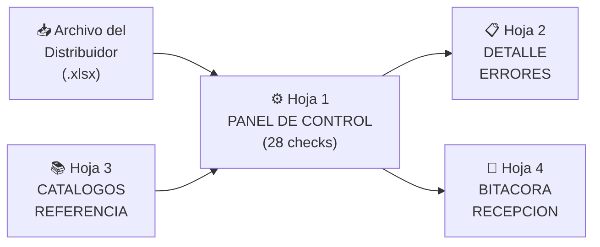

# 📊 Entregable 4.1 — Estructura de Excel: Checklist de Validación
## Protocolo de Verificación de Data Recibida de Distribuidores

---

## Arquitectura del Libro



| Hoja | Nombre | Función |
|---|---|---|
| 1 | PANEL_CONTROL | 28 verificaciones con resultado SI/NO y semáforo final |
| 2 | DETALLE_ERRORES | Lista fila por fila de cada error detectado |
| 3 | CATALOGOS_REF | Estados, Segmentos, Distribuidores válidos |
| 4 | BITACORA | Registro histórico de archivos recibidos/aceptados/rechazados |

---

## Hoja 1: `PANEL_CONTROL`

### Encabezado (Filas 1-6)

| Celda | Contenido | Fuente |
|---|---|---|
| B2 | **CHECKLIST DE VALIDACIÓN DE DATA — CANAL DTT** | Título fijo |
| B3 | Archivo evaluado: | El analista pega el nombre del archivo |
| D3 | `[nombre_archivo.xlsx]` | Input manual |
| B4 | Distribuidor: | Auto-detectado del archivo |
| D4 | Fórmula: `=BUSCARV(...)` del archivo vinculado | Automático |
| B5 | Período: | Auto-detectado |
| B6 | Fecha de revisión: | `=HOY()` |
| F6 | Analista: | Input manual |

### Panel de Resultados (Fila 8)

| Celda | Contenido | Fórmula |
|---|---|---|
| B8 | **RESULTADO FINAL** | — |
| D8 | 🟢 ACEPTAR / 🟡 CORREGIR / 🔴 RECHAZAR | `=SI(Y(D50="SI",D51>=0.95),"🟢 ACEPTAR",SI(O(D50="NO",D51<0.80),"🔴 RECHAZAR","🟡 CORREGIR INTERNAMENTE"))` |
| F8 | Score global: | `=D51` (formato %) |

---

### Bloque A: Verificaciones de Estructura (Filas 12-17)

> ¿El archivo tiene la forma correcta?

| # | Verificación | Fórmula Excel | Resultado | Tipo |
|---|---|---|---|---|
| A1 | ¿Existe la hoja DATA_VENTAS? | `=SI(ESERROR(INDIRECTO("'[" & D3 & "]DATA_VENTAS'!A1")),"NO","SI")` | SI/NO | 🔴 Crítico |
| A2 | ¿Los encabezados de fila 4 están intactos? (17 columnas esperadas) | `=SI(Y(INDIRECTO("DATA_VENTAS!B4")="COD. DISTRIBUIDOR",INDIRECTO("DATA_VENTAS!K4")="SEGMENTO DE TIENDA",INDIRECTO("DATA_VENTAS!N4")="ESTADO",INDIRECTO("DATA_VENTAS!Q4")="FECHA"),"SI","NO")` | SI/NO | 🔴 Crítico |
| A3 | ¿Hay al menos 1 fila de datos (fila 5+)? | `=SI(CONTARA(INDIRECTO("DATA_VENTAS!K5:K1048576"))>0,"SI","NO")` | SI/NO | 🔴 Crítico |
| A4 | ¿El total de filas es razonable? (>10 y <500.000) | `=SI(Y(J14>10,J14<500000),"SI","NO")` donde J14 = conteo de filas | SI/NO | 🟡 Menor |
| A5 | ¿El nombre del archivo sigue el formato estándar? | `=SI(ESNUMERO(ENCONTRAR("VENTAS_DTT_",D3)),"SI","NO")` | SI/NO | 🟡 Menor |
| A6 | ¿Se llenaron Período y Distribuidor (filas 2-3)? | `=SI(Y(INDIRECTO("DATA_VENTAS!B2")<>"",INDIRECTO("DATA_VENTAS!B3")<>""),"SI","NO")` | SI/NO | 🟡 Menor |

### Bloque B: Verificaciones de Completitud (Filas 20-28)

> ¿Vienen todos los campos obligatorios?

| # | Verificación | Fórmula Excel | Resultado | Tipo |
|---|---|---|---|---|
| B1 | % de filas con ESTADO completo | `=1-(CONTAR.SI(INDIRECTO("DATA_VENTAS!N5:N" & J14+4),"")/ J14)` | % | 🔴 Crítico si <95% |
| B2 | % de filas con SEGMENTO completo | `=1-(CONTAR.SI(INDIRECTO("DATA_VENTAS!K5:K" & J14+4),"")/ J14)` | % | 🔴 Crítico si <95% |
| B3 | % de filas con FECHA completa | `=1-(CONTAR.SI(INDIRECTO("DATA_VENTAS!Q5:Q" & J14+4),"")/ J14)` | % | 🔴 Crítico si <98% |
| B4 | % de filas con COD. SKU completo | `=1-(CONTAR.SI(INDIRECTO("DATA_VENTAS!R5:R" & J14+4),"")/ J14)` | % | 🔴 Crítico si <98% |
| B5 | % de filas con CLIENTE completo | `=1-(CONTAR.SI(INDIRECTO("DATA_VENTAS!I5:I" & J14+4),"")/ J14)` | % | 🟡 Menor |
| B6 | % de filas con RIF completo | `=1-(CONTAR.SI(INDIRECTO("DATA_VENTAS!J5:J" & J14+4),"")/ J14)` | % | 🟡 Menor |
| B7 | % de filas con CAJAS completo | `=1-(CONTAR.SI(INDIRECTO("DATA_VENTAS!T5:T" & J14+4),"")/ J14)` | % | 🔴 Crítico si <98% |
| B8 | % de filas con CIUDAD completa | `=1-(CONTAR.SI(INDIRECTO("DATA_VENTAS!L5:L" & J14+4),"")/ J14)` | % | 🟡 Menor |
| B9 | **Score promedio de completitud** | `=PROMEDIO(D20:D27)` | % | Indicador |

### Bloque C: Validez vs. Catálogo (Filas 31-37)

> ¿Los valores son válidos según los catálogos maestros?

| # | Verificación | Fórmula Excel | Resultado | Tipo |
|---|---|---|---|---|
| C1 | % de Estados que coinciden con catálogo (24 válidos) | `=SUMAPRODUCTO((ESNUMERO(COINCIDIR(INDIRECTO("DATA_VENTAS!N5:N"&J14+4),CATALOGOS_REF!$A$2:$A$25,0)))*1)/CONTAR.SI(INDIRECTO("DATA_VENTAS!N5:N"&J14+4),"<>")` | % | 🔴 Crítico si <100% |
| C2 | % de Segmentos que coinciden con catálogo (35 válidos) | `=SUMAPRODUCTO((ESNUMERO(COINCIDIR(INDIRECTO("DATA_VENTAS!K5:K"&J14+4),CATALOGOS_REF!$C$2:$C$36,0)))*1)/CONTAR.SI(INDIRECTO("DATA_VENTAS!K5:K"&J14+4),"<>")` | % | 🔴 Crítico si <100% |
| C3 | ¿Hay valores "NO IDENTIFICADO" en Estado? | `=SI(CONTAR.SI(INDIRECTO("DATA_VENTAS!N5:N"&J14+4),"NO IDENTIFICADO")>0,"SI — "&CONTAR.SI(INDIRECTO("DATA_VENTAS!N5:N"&J14+4),"NO IDENTIFICADO")&" registros","NO")` | SI (n)/NO | 🔴 Crítico |
| C4 | ¿Hay nombres de clientes en Segmento? (detecta RIF pattern) | `=SI(SUMAPRODUCTO((IZQUIERDA(INDIRECTO("DATA_VENTAS!K5:K"&MIN(J14+4,104)),1)="J")*1)>0,"⚠️ POSIBLE","NO")` | ⚠️/NO | 🔴 Crítico |
| C5 | ¿El distribuidor está en el catálogo? | `=SI(ESNUMERO(COINCIDIR(INDIRECTO("DATA_VENTAS!B3"),CATALOGOS_REF!$E$2:$E$66,0)),"SI","NO")` | SI/NO | 🔴 Crítico |
| C6 | % de Tipo Documento válido | `=SUMAPRODUCTO((ESNUMERO(COINCIDIR(INDIRECTO("DATA_VENTAS!O5:O"&J14+4),{"Factura","Nota de Crédito","Nota de Débito"},0)))*1)/J14` | % | 🟡 Menor |
| C7 | **Score de validez catalógica** | `=PROMEDIO(D31,D32)` | % | Indicador |

### Bloque D: Integridad Numérica (Filas 40-45)

> ¿Los números son números y tienen sentido?

| # | Verificación | Fórmula Excel | Resultado | Tipo |
|---|---|---|---|---|
| D1 | % de CAJAS que son numéricas | `=SUMAPRODUCTO((ESNUMERO(INDIRECTO("DATA_VENTAS!T5:T"&J14+4)))*1)/J14` | % | 🔴 Crítico si <99% |
| D2 | % de MONTO que son numéricos | `=SUMAPRODUCTO((ESNUMERO(INDIRECTO("DATA_VENTAS!U5:U"&J14+4)))*1)/J14` | % | 🔴 Crítico si <99% |
| D3 | ¿Hay valores negativos en CAJAS? | `=SI(CONTAR.SI(INDIRECTO("DATA_VENTAS!T5:T"&J14+4),"<0")>0,"SI — "&CONTAR.SI(INDIRECTO("DATA_VENTAS!T5:T"&J14+4),"<0"),"NO")` | SI (n)/NO | 🟡 Menor |
| D4 | ¿Hay valores extremos en CAJAS? (>1000 cajas en una transacción) | `=SI(CONTAR.SI(INDIRECTO("DATA_VENTAS!T5:T"&J14+4),">1000")>0,"⚠️ "&CONTAR.SI(INDIRECTO("DATA_VENTAS!T5:T"&J14+4),">1000")&" registros","NO")` | ⚠️ (n)/NO | 🟡 Menor |
| D5 | ¿Todas las fechas están en rango válido? (2024-hoy) | `=SI(Y(MIN(INDIRECTO("DATA_VENTAS!Q5:Q"&J14+4))>=FECHA(2024,1,1),MAX(INDIRECTO("DATA_VENTAS!Q5:Q"&J14+4))<=HOY()),"SI","NO")` | SI/NO | 🔴 Crítico |
| D6 | ¿Las fechas corresponden al período declarado? | `=SI(SUMAPRODUCTO((MES(INDIRECTO("DATA_VENTAS!Q5:Q"&J14+4))<>INDIRECTO("DATA_VENTAS!B2"))*1)/J14<0.05,"SI","NO — "&TEXTO(SUMAPRODUCTO((MES(INDIRECTO("DATA_VENTAS!Q5:Q"&J14+4))<>INDIRECTO("DATA_VENTAS!B2"))*1)/J14,"0%")&" fuera de período")` | SI/NO | 🟡 Menor |

### Bloque E: Duplicados (Filas 48-51)

> ¿Hay registros repetidos?

| # | Verificación | Fórmula Excel | Resultado | Tipo |
|---|---|---|---|---|
| E1 | Total de registros | `=J14` | Número | Info |
| E2 | Registros duplicados (mismo RIF+Fecha+SKU+Monto) | Ver fórmula abajo | Número | 🔴 si >1% |
| E3 | % de duplicados | `=D49/D48` | % | 🔴 Crítico si >1% |
| E4 | ¿Hay filas 100% vacías? | `=SUMAPRODUCTO((CONTAR(INDIRECTO("DATA_VENTAS!B5:W5"):INDIRECTO("DATA_VENTAS!B"&J14+4&":W"&J14+4))=0)*1)` | Número | 🟡 Menor |

**Fórmula E2 (duplicados) — implementación con columna auxiliar:**

```excel
' En hoja DETALLE_ERRORES, columna para duplicados:
=SI(CONTAR.SI.CONJUNTO(
    DATA_VENTAS!$J$5:$J$1048576, DATA_VENTAS!J5,
    DATA_VENTAS!$Q$5:$Q$1048576, DATA_VENTAS!Q5,
    DATA_VENTAS!$R$5:$R$1048576, DATA_VENTAS!R5,
    DATA_VENTAS!$U$5:$U$1048576, DATA_VENTAS!U5
) > 1, "DUPLICADO", "OK")

' Y en el panel:
E2 = CONTAR.SI(DETALLE_ERRORES!G:G,"DUPLICADO")
```

### Bloque F: Resultado Consolidado (Filas 50-53)

| # | Verificación | Fórmula Excel |
|---|---|---|
| F1 | ¿Pasan TODOS los checks críticos? | `=SI(Y(D12="SI",D13="SI",D14="SI",D20>=0.95,D21>=0.95,D22>=0.98,D31>=1,D32>=1,D33="NO",D40>=0.99,D44="SI",D49<=0.01),"SI","NO")` |
| F2 | Score global de calidad | `=PROMEDIO(D28,D37,D20,D21,D22,D26)` |
| F3 | Checks críticos fallidos | `=CONTAR.SI(H12:H51,"🔴")` — cuenta los 🔴 del bloque de criticidad |
| F4 | **DECISIÓN** | `=SI(Y(D50="SI",D51>=0.95),"🟢 ACEPTAR",SI(O(D50="NO",D51<0.80),"🔴 RECHAZAR","🟡 CORREGIR INTERNAMENTE"))` |

### Formato Condicional del Panel

| Condición | Formato |
|---|---|
| Celda = "SI" o ≥ 95% | Fondo verde (#D4EDDA), texto verde oscuro |
| Celda = "NO" o < 80% | Fondo rojo (#F8D7DA), texto rojo oscuro |
| Celda con % entre 80-95% | Fondo amarillo (#FFF3CD), texto naranja |
| Celda resultado 🟢 | Fondo verde, borde grueso verde, fuente 16pt |
| Celda resultado 🔴 | Fondo rojo, borde grueso rojo, fuente 16pt |

---

## Hoja 2: `DETALLE_ERRORES`

### Estructura por Fila

Cada fila corresponde a una fila del archivo evaluado. Las columnas diagnostican cada tipo de error.

| Col | Campo | Fórmula |
|---|---|---|
| A | Fila original | `=DATA_VENTAS!A5` (referencia a fila) |
| B | Cliente | `=DATA_VENTAS!I5` |
| C | Estado_Check | `=SI(DATA_VENTAS!N5="","⬜ VACÍO",SI(ESERROR(COINCIDIR(DATA_VENTAS!N5,CATALOGOS_REF!$A$2:$A$25,0)),"❌ FUERA CAT","✅"))` |
| D | Segmento_Check | `=SI(DATA_VENTAS!K5="","⬜ VACÍO",SI(ESERROR(COINCIDIR(DATA_VENTAS!K5,CATALOGOS_REF!$C$2:$C$36,0)),"❌ FUERA CAT","✅"))` |
| E | Fecha_Check | `=SI(DATA_VENTAS!Q5="","⬜ VACÍO",SI(Y(ESNUMERO(DATA_VENTAS!Q5),DATA_VENTAS!Q5>=FECHA(2024,1,1),DATA_VENTAS!Q5<=HOY()),"✅","❌ INVÁLIDA"))` |
| F | Numerico_Check | `=SI(Y(ESNUMERO(DATA_VENTAS!T5),ESNUMERO(DATA_VENTAS!U5)),"✅","❌ NO NUMÉRICO")` |
| G | Duplicado_Check | Fórmula de CONTAR.SI.CONJUNTO descrita arriba |
| H | **Veredicto Fila** | `=SI(Y(C5="✅",D5="✅",E5="✅",F5="✅",G5="OK"),"✅ OK","❌ ERROR")` |
| I | Tipo de Error | `=SI(H5="✅ OK","—",SI(C5<>"✅","ESTADO",SI(D5<>"✅","SEGMENTO",SI(E5<>"✅","FECHA",SI(F5<>"✅","NUMERICO","DUPLICADO")))))` |

> [!TIP]
> El analista puede usar **Autofiltro** en esta hoja para mostrar solo las filas con "❌ ERROR" y generar un reporte de excepciones para enviar al distribuidor.

---

## Hoja 3: `CATALOGOS_REF`

Espejo de los catálogos del Entregable 2:

| Rango | Contenido | Registros |
|---|---|---|
| A2:A25 | 24 estados de Venezuela | 24 |
| C2:C36 | 35 segmentos Nivel 3 | 35 |
| E2:E66 | 65 distribuidores válidos | 65 |
| G2:G4 | Tipos de documento | 3 |

---

## Hoja 4: `BITACORA`

### Registro Histórico de Archivos Recibidos

| Col | Campo | Input |
|---|---|---|
| A | Fecha recepción | Manual |
| B | Distribuidor | Manual |
| C | Período (mes/año) | Manual |
| D | Nombre archivo | Manual |
| E | Total registros | `=PANEL_CONTROL!D48` (auto) |
| F | Score calidad | `=PANEL_CONTROL!D51` (auto) |
| G | Resultado | `=PANEL_CONTROL!D53` (auto) |
| H | Checks críticos fallidos | `=PANEL_CONTROL!D52` (auto) |
| I | Acción tomada | Manual: Aceptado / Devuelto / Corregido |
| J | Observaciones | Manual |
| K | Fecha re-envío (si aplica) | Manual |

> Esta bitácora permite ver **tendencias** por distribuidor: ¿mejora o empeora su calidad de data mes a mes?
