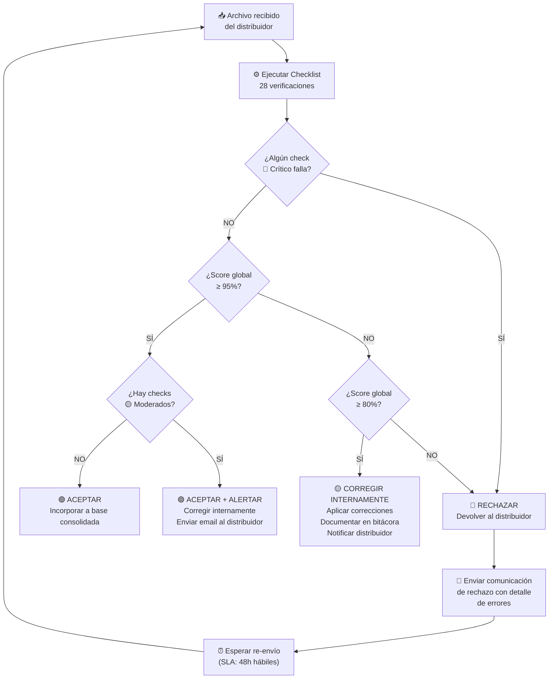

# 📋 Entregable 4.2 — Documento de Desarrollo (Senior)
## Protocolo de Rechazo y Umbrales de Error Aceptables

---

**Audiencia:** Pasante, analista de Trade Marketing, líder del proyecto  
**Aplicación:** Cada archivo de ventas recibido de distribuidores del Canal DTT  

---

## 1. Principio Rector

> **"La calidad de la data se gestiona en la puerta de entrada, no en la sala de análisis."**

Todo archivo recibido pasa por el Checklist de 28 puntos antes de ser incorporado a la base consolidada. El protocolo define qué hacer cuando un archivo no cumple los estándares.

---

## 2. Clasificación de Errores: 3 Niveles

### Nivel 🔴 CRÍTICO — Motivo de Rechazo Automático

El archivo **se devuelve al distribuidor sin incorporar** ningún registro. Requiere corrección y re-envío.

| ID | Error Crítico | Umbral de Activación | Justificación |
|---|---|---|---|
| C01 | Hoja DATA_VENTAS no existe o encabezados alterados | Estructura rota | Archivo no procesable por Power BI |
| C02 | % Estado completo < 95% | >5% de filas sin Estado | Imposibilita análisis geográfico; se pierde >1 de cada 20 transacciones |
| C03 | % Segmento completo < 95% | >5% de filas sin Segmento | Imposibilita análisis por formato de tienda |
| C04 | Estados fuera de catálogo > 0% | Cualquier valor no válido | Valores espurios contaminan dimensión geográfica en BI |
| C05 | Segmentos fuera de catálogo > 0% | Cualquier valor no válido | Nombres de clientes en campo Segmento = error conceptual |
| C06 | Valores "NO IDENTIFICADO" en Estado | Cualquier cantidad | Política nueva: ya no se acepta este valor |
| C07 | % Fecha completa < 98% | >2% sin fecha | Sin fecha, la transacción no puede ubicarse en el tiempo |
| C08 | Fechas fuera de rango (futuras o anteriores a 2024) | Cualquier cantidad | Datos corruptos o de períodos incorrectos |
| C09 | % Campos numéricos no numéricos > 1% | Texto en CAJAS/MONTO | Power BI no puede agregar valores de texto |
| C10 | % Duplicados exactos > 1% | >1% de registros repetidos | Infla artificialmente volúmenes y montos |

### Nivel 🟡 MODERADO — Corrección Interna con Alerta

El archivo **se acepta** pero se aplican correcciones internas y se notifica al distribuidor para que mejore en el próximo envío.

| ID | Error Moderado | Umbral | Acción Interna | Comunicación |
|---|---|---|---|---|
| M01 | % Ciudad completa 80-95% | 5-20% vacías | Intentar derivar de Estado + código postal | Email de alerta |
| M02 | % RIF completo 80-95% | 5-20% vacíos | Aceptar sin RIF, marcar registros | Email de alerta |
| M03 | % Municipio completo < 85% | >15% vacíos | Aceptar, campo secundario | Nota en siguiente comunicación |
| M04 | Nombre de archivo no estándar | Patrón incorrecto | Renombrar internamente | Recordatorio de formato |
| M05 | Período declarado ≠ fechas del contenido (2-5%) | Hasta 5% fuera | Reclasificar por fecha real | Nota de aclaración |
| M06 | Valores negativos en CAJAS (<1%) | Hasta 1% | Revisar si son notas de crédito legítimas | Solicitar aclaración |
| M07 | Valores extremos en CAJAS (>1000) | Detección estadística | Verificar contra histórico del distribuidor | Solicitar confirmación |
| M08 | Distribuidor no ingresó período (fila 2-3) | Campos vacíos | Derivar del nombre del archivo | Recordatorio |

### Nivel 🟢 MENOR — Registro sin Acción Inmediata

El archivo **se acepta tal cual**. El error se documenta en la bitácora para análisis de tendencia.

| ID | Error Menor | Umbral | Acción |
|---|---|---|---|
| N01 | % Ciudad completa > 95% pero < 100% | <5% vacías | Documentar, no actuar |
| N02 | Vendedor Heinz o Código Vendedor vacíos | Cualquier % | Campo informativo, no crítico |
| N03 | Descripción de producto vacía | <5% | Derivar del COD. SKU |
| N04 | Filas vacías al final del archivo | Hasta 10 | Eliminar automáticamente |
| N05 | Mayúsculas inconsistentes en Ciudad | Cualquier cantidad | Normalizar con `MAYUSC()` |

---

## 3. Tabla de Umbrales de Error Aceptables

| Dimensión | Métrica | 🟢 Aceptable | 🟡 Alerta | 🔴 Rechazo |
|---|---|---|---|---|
| **Completitud Estado** | % filas con Estado válido | ≥ 98% | 95% – 97% | < 95% |
| **Completitud Segmento** | % filas con Segmento válido | ≥ 98% | 95% – 97% | < 95% |
| **Completitud Fecha** | % filas con fecha válida | ≥ 99% | 98% – 99% | < 98% |
| **Validez catalógica** | % valores en catálogo estándar | 100% | — | < 100% |
| **Integridad numérica** | % campos numéricos correctos | ≥ 99% | 98% – 99% | < 98% |
| **Duplicados** | % registros duplicados exactos | < 0.5% | 0.5% – 1% | > 1% |
| **Coherencia temporal** | % fechas en período declarado | ≥ 98% | 95% – 98% | < 95% |
| **Score global** | Promedio ponderado | ≥ 95% | 80% – 95% | < 80% |

---

## 4. Flujo de Decisión



---

## 5. Protocolo de Comunicación al Distribuidor

### 5.1 Plantilla de Correo: Rechazo

```
ASUNTO: [ACCIÓN REQUERIDA] Reporte de ventas DTT — [Mes] [Año] — Correcciones necesarias

Estimado equipo de [Nombre Distribuidor],

Hemos recibido su archivo de ventas [nombre_archivo.xlsx] correspondiente
al período [mes/año].

Tras ejecutar nuestro proceso de validación, se identificaron los
siguientes errores que impiden la incorporación del archivo:

ERRORES CRÍTICOS DETECTADOS:
━━━━━━━━━━━━━━━━━━━━━━━━━━━
[Lista automática de errores C01-C10 que apliquen]

• Estado vacío o inválido: [n] registros ([%])
• Segmento vacío o inválido: [n] registros ([%])
• [Otros errores]

ACCIÓN REQUERIDA:
Favor corregir los errores señalados y re-enviar el archivo corregido
antes del [fecha límite + 48h hábiles].

APOYO:
Adjuntamos la hoja DETALLE_ERRORES donde puede ver exactamente cuáles
filas tienen problemas y de qué tipo.

Si necesita asistencia para completar los campos de Estado o Segmento,
por favor contactarnos para coordinar una sesión de apoyo.

Saludos cordiales,
[Nombre] — Trade Marketing
```

### 5.2 Plantilla de Correo: Aceptación con Alertas

```
ASUNTO: ✅ Reporte de ventas DTT — [Mes] [Año] — Recibido con observaciones

Estimado equipo de [Nombre Distribuidor],

Su archivo de ventas ha sido recibido e incorporado a nuestra base
consolidada. Score de calidad: [X]%.

OBSERVACIONES PARA MEJORAR EN PRÓXIMOS ENVÍOS:
━━━━━━━━━━━━━━━━━━━━━━━━━━━━━━━━━━━━━━━━━━━━━
[Lista de errores M01-M08 que apliquen]

Les invitamos a revisar estos puntos para el reporte del próximo mes.

Saludos cordiales,
[Nombre] — Trade Marketing
```

---

## 6. SLAs y Tiempos

| Evento | SLA | Responsable |
|---|---|---|
| Recepción del archivo | Día [X] de cada mes | Distribuidor |
| Ejecución del checklist | Máximo 24h hábiles desde recepción | Pasante/Analista |
| Comunicación de resultado | Máximo 4h después de validación | Pasante/Analista |
| Re-envío tras rechazo | Máximo 48h hábiles | Distribuidor |
| Re-validación de re-envío | Máximo 12h hábiles | Pasante/Analista |
| Segundo rechazo (mismo archivo) | Escalamiento a líder de Trade Marketing | Líder TM |
| Cierre mensual de base | Día [X+5] del mes siguiente | Trade Marketing |

---

## 7. Matriz RACI

| Actividad | Pasante | Líder TM | Distribuidor |
|---|---|---|---|
| Ejecutar checklist de 28 puntos | **R** (Responsable) | I (Informado) | — |
| Decidir Aceptar/Corregir/Rechazar | **R** | **A** (Aprueba) | I |
| Enviar comunicación al distribuidor | **R** | C (Consultado) | I |
| Corregir errores moderados internamente | **R** | I | — |
| Corregir errores críticos | — | C | **R** |
| Re-enviar archivo corregido | — | I | **R** |
| Escalar segundo rechazo | I | **R** | I |
| Actualizar bitácora | **R** | I | — |

---

## 8. Sistema de Scoring Acumulativo

### Evaluación Trimestral por Distribuidor

Cada distribuidor acumula un **Score Trimestral** basado en sus 3 envíos mensuales:

```
Score Trimestral = Promedio(Score_Mes1, Score_Mes2, Score_Mes3)
```

| Score Trimestral | Clasificación | Consecuencia |
|---|---|---|
| ≥ 95% | 🟢 Excelente | Reconocimiento positivo. Puede servir como ejemplo para otros. |
| 85% – 94% | 🟡 Aceptable | Monitoreo normal. Se comparten recomendaciones específicas. |
| 70% – 84% | 🟠 Necesita Mejora | Reunión de alineación con el distribuidor. Plan de acción a 30 días. |
| < 70% | 🔴 Crítico | Escalamiento a gerencia. Reunión formal. Posible intervención directa (envío de personal de apoyo). |

### Tendencia

La bitácora permite generar un gráfico de tendencia por distribuidor:

```
Score %
100│ ── ── ── ── ── ── ── ── ── ── ── meta (95%)
   │          ╱‾‾‾‾‾╲
 90│    ╱‾‾‾‾╱       ╲___╱‾‾‾
   │   ╱
 80│──╱
   │
 70│
   └──┬──┬──┬──┬──┬──┬──┬──┬──┬──→ Mes
      E  F  M  A  M  J  J  A  S
```

---

## 9. Reglas de Excepción

| # | Situación | Regla |
|---|---|---|
| X1 | Distribuidor nuevo (primer envío) | Se aplica umbral relajado: 🟡 si Score ≥ 70%. Se ofrece sesión de onboarding. |
| X2 | Cambio de sistema del distribuidor | Se permite 1 mes de gracia con umbrales relajados (80% en vez de 95%). |
| X3 | Archivo con >200K registros | Tiempo de validación extendido a 48h (en vez de 24h). |
| X4 | Cierre fiscal del distribuidor | Se permite envío parcial si se documenta. Completar en máximo 5 días hábiles. |
| X5 | Error en catálogo de Heinz | Si el error del distribuidor se debe a un catálogo desactualizado, no se penaliza. Se actualiza el catálogo y se re-valida. |
