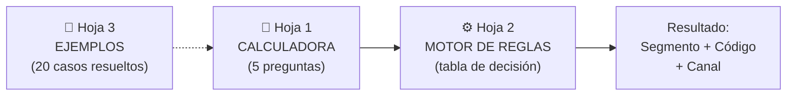

# 📊 Entregable 5.1 — Herramienta de Autoclasificación en Excel
## Calculadora de Segmento: "¿A qué tipo de tienda pertenece mi cliente?"

---

## Arquitectura



---

## Hoja 1: `CALCULADORA` — Interfaz del Usuario

### Diseño Visual

```
╔══════════════════════════════════════════════════════════════╗
║  🧮 CALCULADORA DE SEGMENTO DE TIENDA                      ║
║  Responde 5 preguntas y descubre el segmento de tu cliente  ║
╚══════════════════════════════════════════════════════════════╝

  PREGUNTA 1 ─────────────────────────────────────────────────
  ¿Cuál es la ACTIVIDAD PRINCIPAL del establecimiento?
  ┌─────────────────────────────────────────┐
  │  [▼ Seleccionar de la lista]            │  ← Celda C6
  └─────────────────────────────────────────┘

  PREGUNTA 2 ─────────────────────────────────────────────────
  ¿Cómo atiende al cliente? (modelo de atención)
  ┌─────────────────────────────────────────┐
  │  [▼ Seleccionar de la lista]            │  ← Celda C10
  └─────────────────────────────────────────┘

  PREGUNTA 3 ─────────────────────────────────────────────────
  ¿Cuál es el tamaño aproximado del local?
  ┌─────────────────────────────────────────┐
  │  [▼ Seleccionar de la lista]            │  ← Celda C14
  └─────────────────────────────────────────┘

  PREGUNTA 4 ─────────────────────────────────────────────────
  ¿Cuántas cajas registradoras tiene?
  ┌─────────────────────────────────────────┐
  │  [▼ Seleccionar de la lista]            │  ← Celda C18
  └─────────────────────────────────────────┘

  PREGUNTA 5 ─────────────────────────────────────────────────
  ¿El establecimiento pertenece a una cadena con varias sucursales?
  ┌─────────────────────────────────────────┐
  │  [▼ Seleccionar de la lista]            │  ← Celda C22
  └─────────────────────────────────────────┘

  ═══════════════════════════════════════════════════════════
  ✅ RESULTADO
  ┌─────────────────────────────────────────────────────────┐
  │                                                         │
  │   SEGMENTO:    ABASTO                     (UTT-01)      │  ← C26
  │   MACRO CANAL: TRADE TRADICIONAL (UTT)                  │  ← C27
  │   ICONO:       🏪                                       │  ← C28
  │                                                         │
  └─────────────────────────────────────────────────────────┘
  ═══════════════════════════════════════════════════════════
```

### Configuración de Dropdowns

#### Pregunta 1: Actividad Principal (C6)

```
Opciones de Data Validation (Lista):
- Venta de alimentos y productos variados (tienda general)
- Panadería y repostería
- Carnicería, charcutería o frigorífico
- Farmacia o droguería
- Licorería
- Confitería y golosinas
- Perfumería o cosméticos
- Ferretería o quincallería
- Restaurante o comida preparada
- Fast food o comida rápida
- Cafetería, lunchería o fuente de soda
- Hotel o posada
- Catering o comedor institucional
- Venta al por mayor a otras tiendas
- Productos importados / premium (bodegón)
- Tienda especializada (bebé, regalos, conveniencia)
```

#### Pregunta 2: Modelo de Atención (C10)

```
Opciones:
- MOSTRADOR: El dueño/dependiente despacha los productos al cliente
- AUTOSERVICIO: El cliente camina por pasillos y se sirve solo
- MIXTO: Tiene parte de mostrador y parte de autoservicio
- MAYOREO: Vende por cajas/bultos a otros comerciantes
- SERVICIO DE MESA: Comida preparada servida en mesa
```

#### Pregunta 3: Tamaño del Local (C14)

```
Opciones:
- Muy pequeño: menos de 30 m² (una habitación)
- Pequeño: 30 a 80 m² (un local estándar)
- Mediano: 80 a 200 m² (varios espacios)
- Grande: 200 a 500 m² (amplio, con estacionamiento)
- Muy grande: más de 500 m² (tipo galpón o depósito)
```

#### Pregunta 4: Cajas Registradoras (C18)

```
Opciones:
- Ninguna (pago en mostrador sin caja formal)
- 1 caja
- 2 a 4 cajas
- Más de 4 cajas
```

#### Pregunta 5: Pertenece a Cadena (C22)

```
Opciones:
- No, es independiente (dueño único)
- Sí, cadena regional (3 a 10 sucursales en la zona)
- Sí, cadena nacional (más de 10 sucursales en varios estados)
```

### Fórmulas de Resultado

#### Celda C26 — SEGMENTO (fórmula principal)

```excel
=SI(C6="","⬜ Responde las 5 preguntas",
 SI(C6="Venta al por mayor a otras tiendas",
   SI(C10="MAYOREO",
     SI(C14="Muy grande","MAYORISTA CON FUERZA DE VENTA",
       "MAYORISTA SIN FUERZA DE VENTA"),
     "NANO DISTRIBUIDOR"),
 SI(C6="Panadería y repostería","PANADERIA",
 SI(C6="Carnicería, charcutería o frigorífico","CARNICERIA / CHARCUTERIA / FRIGORIFICO",
 SI(C6="Licorería","LICORERIA",
 SI(C6="Confitería y golosinas","CONFITERIA",
 SI(C6="Ferretería o quincallería","FERRETERIA / QUINCALLERIA",
 SI(C6="Perfumería o cosméticos","PERFUMERIA TRADICIONAL",
 SI(C6="Restaurante o comida preparada","RESTAURANTE",
 SI(C6="Fast food o comida rápida","FAST FOOD",
 SI(C6="Cafetería, lunchería o fuente de soda","LUNCHERIA / CAFETERIA",
 SI(C6="Hotel o posada","HOTEL / POSADA",
 SI(C6="Catering o comedor institucional","CATERING / INSTITUCIONAL",
 SI(C6="Productos importados / premium (bodegón)",
   SI(C6="Productos importados / premium (bodegón)",
     SI(ENCONTRAR("licor",MINUSC(C6))>0,"BODEGON-LICORERIA","BODEGON"),"BODEGON"),
 SI(C6="Tienda especializada (bebé, regalos, conveniencia)","TIENDA DE CONVENIENCIA",
 SI(C6="Farmacia o droguería",
   SI(C22="Sí, cadena nacional (más de 10 sucursales en varios estados)","FARMACIA CADENA",
   SI(C10="AUTOSERVICIO","FARMACIA CON AUTOSERVICIO",
   SI(C10="MIXTO","FARMACIA MODERNA INDEPENDIENTE",
     "FARMACIA TRADICIONAL"))),
 SI(C6="Venta de alimentos y productos variados (tienda general)",
   BUSCARV(C10&"|"&C14&"|"&C18&"|"&C22,MOTOR_REGLAS!A:F,6,0),
   "⚠️ Consultar a Trade Marketing")
))))))))))))))))
```

> [!NOTE]
> La complejidad se concentra en "Venta de alimentos y productos variados" porque ahí es donde ocurre la distinción clave Bodega vs. Abasto vs. Mini Market vs. Supermercado. Las demás actividades tienen segmento directo.

#### Celda C27 — MACRO CANAL

```excel
=SI(C26="","",BUSCARV(C26,MOTOR_REGLAS!$G$2:$I$36,2,0))
```

#### Celda C28 — ICONO

```excel
=SI(C26="","",BUSCARV(C26,MOTOR_REGLAS!$G$2:$I$36,3,0))
```

---

## Hoja 2: `MOTOR_REGLAS` — Tabla de Decisión

### Sección A: Reglas para "Tienda General" (Columnas A-F)

La combinación de respuestas determina el segmento. Clave de búsqueda: `Atención|Tamaño|Cajas|Cadena`

| Atención | Tamaño | Cajas | Cadena | → Segmento | Clave |
|---|---|---|---|---|---|
| MOSTRADOR | Muy pequeño | Ninguna | No, independiente | BODEGA | `MOSTRADOR\|Muy pequeño…\|Ninguna…\|No…` |
| MOSTRADOR | Pequeño | Ninguna | No, independiente | ABASTO | `MOSTRADOR\|Pequeño…\|Ninguna…\|No…` |
| MOSTRADOR | Pequeño | 1 caja | No, independiente | ABASTO | `MOSTRADOR\|Pequeño…\|1 caja\|No…` |
| MOSTRADOR | Mediano | Ninguna | No, independiente | ABASTO | `MOSTRADOR\|Mediano…\|Ninguna…\|No…` |
| MOSTRADOR | Mediano | 1 caja | No, independiente | ABASTO | `MOSTRADOR\|Mediano…\|1 caja\|No…` |
| MIXTO | Pequeño | 1 caja | No, independiente | MINI MARKET | `MIXTO\|Pequeño…\|1 caja\|No…` |
| MIXTO | Mediano | 1 caja | No, independiente | MINI MARKET | `MIXTO\|Mediano…\|1 caja\|No…` |
| AUTOSERVICIO | Pequeño | 1 caja | No, independiente | MINI MARKET | `AUTOSERVICIO\|Pequeño…\|1 caja\|No…` |
| AUTOSERVICIO | Mediano | 1 caja | No, independiente | SUPERMERCADO IND. PEQUEÑO | … |
| AUTOSERVICIO | Mediano | 2 a 4 cajas | No, independiente | SUPERMERCADO IND. MEDIANO | … |
| AUTOSERVICIO | Grande | 2 a 4 cajas | No, independiente | SUPERMERCADO IND. MEDIANO | … |
| AUTOSERVICIO | Grande | Más de 4 cajas | No, independiente | SUPERMERCADO IND. GRANDE | … |
| AUTOSERVICIO | Muy grande | Más de 4 cajas | No, independiente | SUPERMERCADO IND. GRANDE | … |
| AUTOSERVICIO | Grande | Más de 4 cajas | Sí, cadena regional | CADENA REGIONAL | … |
| AUTOSERVICIO | Grande | Más de 4 cajas | Sí, cadena nacional | CADENA NACIONAL | … |
| AUTOSERVICIO | Muy grande | Más de 4 cajas | Sí, cadena regional | HIPERMERCADO / CASH & CARRY | … |
| AUTOSERVICIO | Muy grande | Más de 4 cajas | Sí, cadena nacional | HIPERMERCADO / CASH & CARRY | … |
| MOSTRADOR | Muy pequeño | Ninguna | No, independiente | KIOSCO | (si tamaño <10m²) |

### Sección B: Tabla de Segmento → Canal → Icono (Columnas G-I)

| Segmento (G) | Macro Canal (H) | Icono (I) |
|---|---|---|
| ABASTO | TRADE TRADICIONAL (UTT) | 🏪 |
| BODEGA | TRADE TRADICIONAL (UTT) | 🏚️ |
| KIOSCO | TRADE TRADICIONAL (UTT) | 🗞️ |
| PUESTO DE MERCADO | TRADE TRADICIONAL (UTT) | 🏬 |
| PANADERIA | TRADE TRADICIONAL (UTT) | 🥖 |
| PASTELERIA | TRADE TRADICIONAL (UTT) | 🧁 |
| CARNICERIA / CHARCUTERIA / FRIGORIFICO | TRADE TRADICIONAL (UTT) | 🥩 |
| LICORERIA | TRADE TRADICIONAL (UTT) | 🍷 |
| CONFITERIA | TRADE TRADICIONAL (UTT) | 🍬 |
| FARMACIA TRADICIONAL | TRADE TRADICIONAL (UTT) | 💊 |
| PERFUMERIA TRADICIONAL | TRADE TRADICIONAL (UTT) | 💄 |
| FERRETERIA / QUINCALLERIA | TRADE TRADICIONAL (UTT) | 🔧 |
| SUPERMERCADO IND. GRANDE | SUPERMERCADOS INDEPENDIENTES | 🛒 |
| SUPERMERCADO IND. MEDIANO | SUPERMERCADOS INDEPENDIENTES | 🛒 |
| SUPERMERCADO IND. PEQUEÑO | SUPERMERCADOS INDEPENDIENTES | 🛒 |
| AUTOMERCADO | SUPERMERCADOS INDEPENDIENTES | 🏪 |
| MINI MARKET | SUPERMERCADOS INDEPENDIENTES | 🛍️ |
| CADENA NACIONAL | CADENAS | 🏢 |
| CADENA REGIONAL | CADENAS | 🏢 |
| HIPERMERCADO / CASH & CARRY | CADENAS | 🏗️ |
| FARMACIA CON AUTOSERVICIO | FARMACIAS MODERNAS | 💊 |
| FARMACIA CADENA | FARMACIAS MODERNAS | 🏥 |
| FARMACIA MODERNA INDEPENDIENTE | FARMACIAS MODERNAS | 💊 |
| BODEGON | BODEGONES | 🍸 |
| BODEGON-LICORERIA | BODEGONES | 🍸 |
| MAYORISTA CON FUERZA DE VENTA | MAYORISTAS | 📦 |
| MAYORISTA SIN FUERZA DE VENTA | MAYORISTAS | 📦 |
| NANO DISTRIBUIDOR | MAYORISTAS | 🚛 |
| SUB-DISTRIBUIDOR | MAYORISTAS | 🚛 |
| RESTAURANTE | ON PREMISE / FOODSERVICE | 🍽️ |
| FAST FOOD | ON PREMISE / FOODSERVICE | 🍔 |
| LUNCHERIA / CAFETERIA | ON PREMISE / FOODSERVICE | ☕ |
| HOTEL / POSADA | ON PREMISE / FOODSERVICE | 🏨 |
| CATERING / INSTITUCIONAL | ON PREMISE / FOODSERVICE | 🍱 |
| TIENDA DE CONVENIENCIA | TIENDAS ESPECIALIZADAS | 🏪 |

---

## Hoja 3: `EJEMPLOS` — 20 Casos Resueltos

| # | Descripción del PDV | P1: Actividad | P2: Atención | P3: Tamaño | P4: Cajas | P5: Cadena | → Segmento |
|---|---|---|---|---|---|---|---|
| 1 | Tiendita de la esquina, Don José atiende por una ventana | Alimentos variados | MOSTRADOR | Muy pequeño | Ninguna | Independiente | **BODEGA** |
| 2 | Abasto con estantes, mostrador amplio, variedad | Alimentos variados | MOSTRADOR | Pequeño | 1 caja | Independiente | **ABASTO** |
| 3 | Local con algunos pasillos y una caja, compacto | Alimentos variados | MIXTO | Pequeño | 1 caja | Independiente | **MINI MARKET** |
| 4 | Autoservicio con carritos y 2 cajas, 150 m² | Alimentos variados | AUTOSERVICIO | Mediano | 2 a 4 cajas | Independiente | **SPM IND. MEDIANO** |
| 5 | Supermercado grande con estacionamiento, 5 cajas | Alimentos variados | AUTOSERVICIO | Grande | Más de 4 | Independiente | **SPM IND. GRANDE** |
| 6 | Supermercado de cadena con 15 sucursales | Alimentos variados | AUTOSERVICIO | Grande | Más de 4 | Cadena nacional | **CADENA NACIONAL** |
| 7 | Galpón tipo depósito con venta por bulto | Mayor a otras tiendas | MAYOREO | Muy grande | Ninguna | Independiente | **MAYORISTA CON FDV** |
| 8 | Panadería "La Espiga de Oro" | Panadería | MOSTRADOR | Pequeño | 1 caja | Independiente | **PANADERIA** |
| 9 | Carnicería Don Pedro con vitrina refrigerada | Carnicería/charc. | MOSTRADOR | Pequeño | Ninguna | Independiente | **CARNICERIA/CHARC.** |
| 10 | Farmatodo con pasillos de autoservicio | Farmacia | AUTOSERVICIO | Mediano | 2 a 4 cajas | Cadena nacional | **FARMACIA CADENA** |
| 11 | Farmacia del pueblo, solo mostrador | Farmacia | MOSTRADOR | Muy pequeño | Ninguna | Independiente | **FARMACIA TRAD.** |
| 12 | Licorería "El Barril" | Licorería | MOSTRADOR | Pequeño | 1 caja | Independiente | **LICORERIA** |
| 13 | Bodegón con productos importados y licores | Productos premium | AUTOSERVICIO | Mediano | 1 caja | Independiente | **BODEGON** |
| 14 | Restaurante "Mi Sazón" con 10 mesas | Restaurante | Servicio de mesa | Mediano | 1 caja | Independiente | **RESTAURANTE** |
| 15 | Hamburguesas "Rapiburguer" sin mesas | Fast food | MOSTRADOR | Muy pequeño | 1 caja | Independiente | **FAST FOOD** |
| 16 | Cafetería de la esquina, almuerzos ejecutivos | Cafetería/lunchería | MOSTRADOR | Pequeño | 1 caja | Independiente | **LUNCHERIA/CAFET.** |
| 17 | Hotel 3 estrellas con restaurante | Hotel | Servicio de mesa | Grande | 2 a 4 cajas | Independiente | **HOTEL / POSADA** |
| 18 | Tienda de piñatas y dulces | Confitería | MOSTRADOR | Pequeño | Ninguna | Independiente | **CONFITERIA** |
| 19 | Kiosco de revistas en la calle | Alimentos variados | MOSTRADOR | Muy pequeño | Ninguna | Independiente | **KIOSCO** |
| 20 | Perfumería "Bella y Natural" | Perfumería | MOSTRADOR | Pequeño | 1 caja | Independiente | **PERFUMERIA TRAD.** |

> [!TIP]
> **Instrucción para el vendedor:** Si tienes duda con un cliente, busca en esta tabla un ejemplo parecido. Si ninguno aplica, consulta a tu supervisor.

---

## Formato Visual de la Calculadora

| Elemento | Formato |
|---|---|
| Banner superior | Fondo rojo Heinz (#C8102E), texto blanco, 18pt |
| Preguntas | Fondo gris claro (#F5F5F5), borde izquierdo azul 3pt |
| Dropdowns | Fondo blanco, borde sólido gris, fuente 12pt |
| Resultado — Segmento | Fondo verde (#D4EDDA), fuente 20pt negrita |
| Resultado — Canal | Fondo azul claro (#CCE5FF), fuente 14pt |
| Resultado — Icono | Fuente 36pt centrado |
| Resultado vacío | Fondo amarillo (#FFF3CD): "⬜ Responde las 5 preguntas" |
| Botón "LIMPIAR" | Macro que borra C6, C10, C14, C18, C22 |
