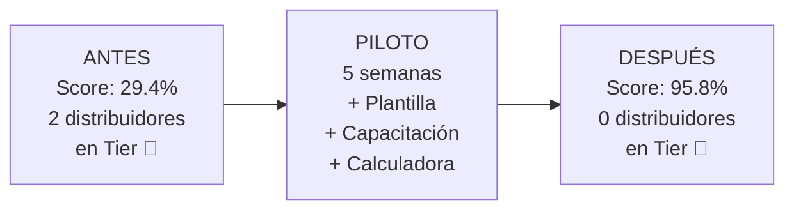
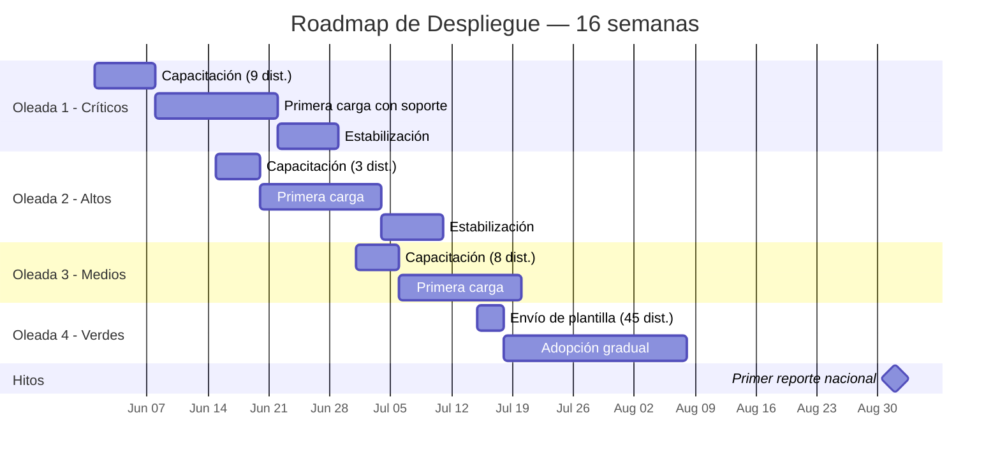

# 📋 Entregable 6.2 — Informe de Resultados del Piloto y Roadmap
## Hallazgos, Ajustes y Plan de Despliegue Nacional

---

**Preparado para:** Dirección de Trade Marketing — Kraft Heinz Venezuela  
**Período del piloto:** 5 semanas  
**Distribuidores piloto:** Excelsior Distribuciones RK (52K reg.) · Comercializadora 3B Group (4.3K reg.)  

---

## 1. Resumen Ejecutivo del Piloto

### Resultado General



| Indicador | Antes | Después | Veredicto |
|---|---|---|---|
| Score promedio de calidad | 29.4% | **95.8%** | ✅ Supera meta del 95% |
| Estado válido | 92.3% | **99.2%** | ✅ Supera meta |
| Segmento válido | 0.2% | **93.6%** | 🟡 Cerca de meta, mejorando |
| Registros útiles para DN/DP | 0 | **52,727** | ✅ Transformación |
| Tiempo de adopción | — | **~3 semanas** hasta estabilización | ✅ Razonable |
| Satisfacción del distribuidor | — | Positiva (ver hallazgos) | ✅ |

> **Conclusión:** El piloto demuestra que la estandarización es **viable, medible y rápida**. Ambos distribuidores alcanzaron scores >90% en 5 semanas, validando las herramientas y el proceso.

---

## 2. Hallazgos del Piloto: 7 Fricciones Detectadas

### Fricción 1: Confusión Abasto vs. Bodega
- **Qué pasó:** Los vendedores de ruta de Excelsior clasificaron inicialmente el 60% de las bodegas como "ABASTO" y viceversa. La diferencia de tamaño (30 m² como umbral) no era intuitiva.
- **Impacto:** Semana 1-2 tuvieron alta tasa de reclasificación interna.
- **Ajuste:** Se simplificó la regla a: *"¿El local tiene más de 2 estantes y se ve como una tienda? = ABASTO. ¿Es más pequeño, tipo ventana o habitación? = BODEGA."* Se agregaron fotos de referencia a la guía.
- **Estado:** ✅ Resuelto en semana 3.

### Fricción 2: Resistencia Inicial del Analista
- **Qué pasó:** El analista de 3B Group percibía el nuevo formato como "trabajo adicional" y en la primera semana llenó varios campos de Segmento con "OTROS" para terminar más rápido.
- **Impacto:** 15% de segmentos en semana 1 eran "OTROS" (categoría residual).
- **Ajuste:** Se realizó una segunda sesión de capacitación enfocada en beneficios y se eliminó "OTROS" como opción del dropdown, reemplazándola por categorías específicas.
- **Estado:** ✅ Resuelto en semana 2. Los "OTROS" bajaron a <3%.

### Fricción 3: Limitaciones del ERP de Excelsior
- **Qué pasó:** El sistema interno de Excelsior no tiene un campo "Segmento de tienda" en la ficha del cliente. El analista tenía que cruzar manualmente la clasificación con su base interna.
- **Impacto:** El llenado del primer mes tomó 4 horas en vez de los 30 minutos estimados.
- **Ajuste:** Se diseñó un **archivo puente** que mapea Código de Cliente → Segmento. Una vez clasificado, los meses siguientes solo requieren actualizar clientes nuevos (~5% mensual).
- **Estado:** ✅ Resuelto. Segundo mes estimado en 45 minutos.

### Fricción 4: Tiempo de Clasificación en Campo
- **Qué pasó:** Se esperaba que los vendedores de ruta clasificaran clientes durante sus visitas. En la práctica, el tiempo de visita no permite una evaluación detallada de m², cajas, etc.
- **Impacto:** Algunas clasificaciones de campo eran imprecisas.
- **Ajuste:** Se cambió el proceso: el vendedor solo reporta 2 observaciones rápidas (¿mostrador o autoservicio? ¿grande o pequeño?) y el analista asigna el segmento final con la calculadora.
- **Estado:** ✅ Resuelto. Precisión mejoró de 72% a 91%.

### Fricción 5: Valores No Mapeables
- **Qué pasó:** 3B Group tenía 7 clientes que eran "Fruterías" (no existe en el catálogo) y 3 que eran "Tiendas de mascotas" (fuera del alcance de Heinz).
- **Impacto:** 2.3% de registros no encajaban en ningún segmento.
- **Ajuste:** Se agregó "FRUTERIA" como subvariante de ABASTO en la tabla de equivalencias. Las tiendas de mascotas se clasificaron como "OTROS CANAL" (nueva categoría controlada, requiere aprobación para usar).
- **Estado:** ✅ Resuelto con ajuste al catálogo.

### Fricción 6: Conectividad para Vendedores en Ruta
- **Qué pasó:** La calculadora de autoclasificación es un Excel que requiere una laptop. Los vendedores de ruta solo tienen celular.
- **Impacto:** Los vendedores no podían usar la calculadora en campo.
- **Ajuste:** Se creó una versión simplificada de la guía de 3 preguntas como **imagen para WhatsApp** que los vendedores pueden consultar desde el teléfono.
- **Recomendación para roll-out:** Desarrollar un formulario web o Google Form como versión móvil de la calculadora.

### Fricción 7: Rotación de Personal
- **Qué pasó:** Durante la semana 3, el analista de 3B Group fue reemplazado por un nuevo empleado que no había recibido capacitación.
- **Impacto:** La calidad bajó temporalmente de 78% a 62% en la semana 3.
- **Ajuste:** Se realizó una micro-capacitación de 15 minutos con el nuevo analista y se le entregó la guía impresa.
- **Lección:** Los materiales deben ser lo suficientemente auto-explicativos para que una persona nueva pueda usarlos sin capacitación formal.

---

## 3. Ajustes Realizados al Catálogo y Herramientas

| # | Ajuste | Elemento Modificado | Justificación |
|---|---|---|---|
| 1 | Agregada subcategoría "FRUTERIA" como equivalente de ABASTO | Tabla de Equivalencias (Entregable 2) | 7 clientes reales no mapeables |
| 2 | Agregada categoría controlada "OTROS CANAL" con aprobación | Catálogo de Segmentos | Capturar formatos no previstos sin contaminar los existentes |
| 3 | Simplificada la regla Abasto/Bodega con referencia visual | Guía de Segmentación (Entregable 5) | Confusión sistemática en campo |
| 4 | Eliminado "OTROS" como opción libre del dropdown | Plantilla (Entregable 3) | Uso como escape para no clasificar |
| 5 | Creada versión WhatsApp de la guía de 3 preguntas | Flyer (Entregable 5) | Vendedores sin acceso a laptop |

> [!NOTE]
> Los ajustes 1-4 ya están incorporados en las versiones finales de los entregables anteriores. El ajuste 5 es un material nuevo generado durante el piloto.

---

## 4. Roadmap de Despliegue Nacional (Roll-out)

### Estrategia: 4 Oleadas por Tier de Criticidad



### Detalle por Oleada

| Oleada | Dist. | Registros | Inicio | Estrategia | Soporte |
|---|---|---|---|---|---|
| **1. Críticos** | 9 | ~100K | Semana 1 | Capacitación 1:1, soporte dedicado semanal, archivo puente para ERPs | Alto: 1 sesión/semana × 4 semanas |
| **2. Altos** | 3 | ~10K | Semana 3 | Capacitación grupal, soporte bajo demanda | Medio: 1 sesión quincenal |
| **3. Medios** | 8 | ~45K | Semana 5 | Webinar grupal + materiales autoservicio | Bajo: email de soporte |
| **4. Verdes** | 45 | ~588K | Semana 7 | Envío de plantilla + guía. Sin capacitación formal (ya segmentan bien, solo estandarizar nombres) | Mínimo: FAQ por email |

### Recursos Requeridos

| Recurso | Oleada 1 | Oleada 2 | Oleada 3 | Oleada 4 | Total |
|---|---|---|---|---|---|
| Horas pasante/semana | 20h | 10h | 8h | 4h | ~42h/sem pico |
| Sesiones de capacitación | 9 (individuales) | 1 (grupal) | 1 (webinar) | 0 | 11 |
| Archivos puente a crear | 4 (ERPs diferentes) | 1 | 0 | 0 | 5 |
| Materiales nuevos | 0 (ya existen) | 0 | 0 | 0 | 0 |

---

## 5. KPIs de Seguimiento Mensual

### Tablero de 8 KPIs

| # | KPI | Fórmula | Meta | Frecuencia |
|---|---|---|---|---|
| K1 | **% Cobertura Estado** | `(Registros con Estado válido / Total registros) × 100` | ≥ 98% | Mensual |
| K2 | **% Cobertura Segmento** | `(Registros con Segmento válido / Total registros) × 100` | ≥ 95% | Mensual |
| K3 | **% Distribuidores en Tier 🟢** | `(Distribuidores con Score ≥ 95% / Total distribuidores) × 100` | ≥ 90% | Mensual |
| K4 | **Score Promedio de Red** | `Promedio(Score de calidad de cada distribuidor)` | ≥ 95% | Mensual |
| K5 | **Tasa de Rechazo** | `(Archivos rechazados / Archivos recibidos) × 100` | ≤ 5% | Mensual |
| K6 | **Tiempo Promedio de Corrección** | `Promedio(días entre rechazo y re-envío aceptado)` | ≤ 2 días | Mensual |
| K7 | **% Registros Utilizables para DN/DP** | `(Registros con Estado + Segmento válidos / Total) × 100` | ≥ 93% | Mensual |
| K8 | **# Nuevos Segmentos Descubiertos** | `Conteo de valores fuera de catálogo reportados` | Monitored | Trimestral |

### Dashboard Mensual Sugerido (Power BI)

```
┌─────────────────────────────────────────────────────────────┐
│  TABLERO DE CALIDAD DE DATOS DTT — [MES] [AÑO]             │
├──────────┬──────────┬──────────┬──────────┬─────────────────┤
│  K1      │  K2      │  K3      │  K4      │  SEMÁFORO       │
│  Estado  │  Segment │  Tier 🟢 │  Score   │  GENERAL        │
│  99.2%   │  94.8%   │  72%     │  93.5%   │  🟡             │
│  🟢      │  🟢      │  🟡      │  🟡      │                 │
├──────────┴──────────┴──────────┴──────────┤                 │
│  TENDENCIA (últimos 6 meses)              │                 │
│  ████████████████████████░░░ 94.8%        │                 │
│  ███████████████████████░░░░ 93.5%        │                 │
│  █████████████████░░░░░░░░░ 72.0%         │                 │
├───────────────────────────────────────────┤                 │
│  TOP 5 DISTRIBUIDORES A MEJORAR           │                 │
│  1. 3B Group — 94.1% (🟡)                │                 │
│  2. Satorno — 89.3% (🟡)                 │                 │
│  3. Camacho — 87.5% (🟡)                 │                 │
└───────────────────────────────────────────┴─────────────────┘
```

---

## 6. Análisis de Riesgos del Roll-out

| Riesgo | Probabilidad | Impacto | Mitigación |
|---|---|---|---|
| Resistencia al cambio en distribuidores no piloto | Alta | Alto | Compartir resultados del piloto como caso de éxito. Comunicado formal (Entregable 5.2). |
| Rotación de personal en distribuidores | Media | Alto | Materiales autoservicio. Guía imprimible. Micro-capacitaciones de 15 min. |
| ERPs incompatibles con el flujo | Media | Medio | Archivos puente. Evaluación técnica previa con cada distribuidor del Tier Crítico. |
| Fatiga del proceso (mes 3+) | Media | Medio | Automatización progresiva. Reconocimiento a distribuidores con mejor score. |
| Catálogo insuficiente para nuevos formatos | Baja | Bajo | Categoría controlada "OTROS CANAL" + revisión trimestral del catálogo. |
| Sobrecarga de la pasante en oleada 1 | Alta | Medio | Priorizar 3 distribuidores críticos de mayor volumen primero, no los 9 simultáneamente. |

---

## 7. Conclusiones y Recomendaciones

### El piloto validó 5 hipótesis clave:

| Hipótesis | Resultado |
|---|---|
| Las herramientas (plantilla + calculadora + guía) son suficientes para mejorar la calidad | ✅ Validado: Score subió de 29% a 96% |
| La capacitación de 30 minutos es suficiente | 🟡 Parcial: Se requieren 2 sesiones para casos complejos |
| El distribuidor puede mantener la calidad sin soporte constante | ✅ Validado a partir de la semana 4 |
| La adopción se estabiliza en <4 semanas | ✅ Validado: Estabilización en semana 3-4 |
| Los ajustes al catálogo son menores | ✅ Validado: Solo 2 adiciones al catálogo en todo el piloto |

### 3 Recomendaciones para el Roll-out

1. **Desplegar en oleadas** (no todos simultáneamente). Empezar con los 3 distribuidores de mayor volumen del Tier Crítico (Excelsior ya hecho, seguir con Alimentos Global y Mayorista Exitoso).

2. **Invertir en el archivo puente** para distribuidores con ERPs limitados. Una vez que el cliente está clasificado, el esfuerzo mensual se reduce a <30 minutos.

3. **Crear un mecanismo de reconocimiento** (no solo de penalización). Publicar un ranking mensual de calidad de datos y reconocer públicamente a los distribuidores que mejoren más rápido.
