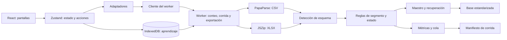

# Motor DTT · Estandarización local de distribuidores

PWA estática que lee archivos CSV y XLSX de distribuidores, detecta sus columnas, resuelve segmento y estado por registro, calcula calidad de datos y exporta una base estandarizada. La lectura y el procesamiento ocurren en el navegador mediante un Web Worker. El archivo de entrada no se envía a un servidor ni se guarda completo en IndexedDB.

## Requisitos y ejecución

- Node.js 22 (`.nvmrc`).
- npm con acceso a las dependencias del `package-lock.json` durante la instalación.
- Navegador moderno con Web Workers, Blob y soporte para IndexedDB si se desea conservar el aprendizaje local.

```bash
npm ci
npm run verify:vendor
npm run dev
```

Vite muestra la URL local. Para comprobar exactamente el artefacto que se desplegará:

```bash
npm run lint
npm run test
npm run build
npm run preview
```

`npm run build` ejecuta TypeScript y Vite y escribe `dist/`. `dist/`, `node_modules/` y los archivos comerciales de entrada están excluidos de Git.

## Arquitectura



| Ruta | Responsabilidad |
| --- | --- |
| `src/contracts/` | Contratos de filas, configuración, métricas, eventos y salida. |
| `src/ingest/` | Normalización, detección de columnas, lectura CSV y recorrido de libros XLSX. |
| `src/worker/` | Frontera con el hilo principal, configuración de resolución y ejecución de las tres operaciones. |
| `src/pipeline/` | Cascadas de segmento y estado, alias, maestro, recuperación, métricas y cola. |
| `src/reports/` | Escritura de la base, plantillas, serialización y guardado local. |
| `src/audit/` | Manifiesto agregado de una corrida, verificaciones y comparación con otro manifiesto. |
| `src/storage/` | Persistencia de reglas aprendidas y preferencias en IndexedDB. |
| `src/state/` | Estado y acciones de la aplicación. |
| `src/ui/` | Dashboard, Corrida, Distribuidores, Cola, Maestro, Homologación, Configuración y Manual. |
| `src/seeds/` | Catálogos y equivalencias iniciales incluidos en el bundle. |
| `src/adapters/` | Unión entre UI, servicios reales y datos de demostración. |

El archivo `src/worker/ingest.worker.ts` coordina la ejecución; `src/worker/client.ts` crea un worker por operación y transmite eventos tipados. `src/worker/resolution-config.ts` prepara los catálogos, alias y umbrales que consumen las cascadas. El código de `pipeline/` y las funciones de `reports/export-base.ts` son la referencia para interpretar cada fila.

### Modos del worker

| Modo | Entrada | Resultado |
| --- | --- |
| `counting` | Archivo local | Conteo, columnas detectadas y resumen de ingestión. |
| `pipeline` | Archivo, diccionarios y umbrales | Resolución, métricas, cola y maestro para las pantallas. |
| `export` | Archivo, configuración y `run_id` | Nueva lectura y base estandarizada descargable. |

El modo `export` recorre de nuevo el archivo: primero construye el maestro completo y luego resuelve y escribe las filas con ese maestro. La vista de Maestro limita su muestra; la exportación usa el maestro completo del worker. El destino se elige durante el clic del usuario, antes de la operación larga, para conservar el permiso temporal del navegador.

## Contrato de entrada

Se admiten `.csv` y `.xlsx`. Un `.xls` binario antiguo debe convertirse antes de cargarlo. La firma ZIP de un XLSX se comprueba antes de abrir sus entradas OOXML.

Los CSV se leen por filas con PapaParse. `src/ingest/csv-stream.ts` tolera membretes y filas vacías antes del encabezado, busca una fila de encabezado en la ventana inicial y descarta pies de totales. `src/ingest/xlsx-stream.ts` recorre hojas y celdas desde JSZip; una hoja sin esquema útil se omite. `SchemaMap` conserva los nombres originales de columna y registra los campos no mapeados.

La normalización de texto, RIF y números está en `src/ingest/normalize.ts`. Los valores originales de segmento y estado se preservan en la salida. Las columnas comerciales de origen se mantienen en su orden y no se modifican para efectuar la clasificación.

## Resolución y trazabilidad por fila

La cascada de segmento de `src/pipeline/segmento.ts` aplica, en orden: maestro por RIF, equivalencia exacta normalizada, coincidencia difusa y estado sin clasificar. Los umbrales por defecto son **92** para asignar y **80** para sugerir. Una sugerencia por debajo del umbral de asignación no clasifica la fila.

La cascada de estado de `src/pipeline/estado.ts` consulta el catálogo oficial, variantes, estado habitual por RIF, ciudad y coincidencia difusa. `src/pipeline/estado-input.ts` limpia prefijos administrativos y rechaza marcadores sin información; `geo-parser.ts` resuelve algunos nombres geográficos compuestos. `src/pipeline/process-row.ts` combina ambas resoluciones y aplica la precedencia `SIN_CLASIFICAR → SIN_ESTADO → OK`. Los duplicados y conflictos se tratan en la acumulación correspondiente.

`MaestroBuilder` reúne observaciones por RIF normalizado; las clasificaciones manuales persistidas entran antes que los registros del archivo. La cola conserva variantes nuevas, ambigüedades y sugerencias para revisión humana. La exportación agrega exactamente estas once columnas al archivo de origen:

```text
segmento_n3_std, macro_canal_n1_std, metodo_segmento,
confianza_segmento, estado_std, metodo_estado, flag_registro,
valor_original_segmento, valor_original_estado,
version_diccionario, run_id
```

Los contratos de métodos y flags están en `src/contracts/row.ts`. Las métricas distinguen la calidad **cruda** que entregó el distribuidor de la calidad **posterior** a la resolución del motor. Esa separación impide atribuir al archivo original las correcciones realizadas durante la corrida.

## Manifiesto y comparación de corridas

Desde Corrida puede descargarse un manifiesto JSON con el esquema detectado, tamaño del archivo, conteos por método, umbrales usados, porcentajes, pendientes, conflictos y comprobaciones de consistencia. `src/audit/checks.ts` informa si los conteos de segmento y estado cuadran con las filas y si los porcentajes están en rango. Una comprobación fallida se registra; no altera el resultado de la corrida.

También se puede seleccionar un manifiesto anterior para comparar diferencias de filas, clasificación, estado válido y pendientes. La comparación se calcula localmente y admite manifiestos de hasta 2 MB. Coincidir en nombre y tamaño del archivo es solo contexto: no prueba que su contenido sea idéntico. El manifiesto contiene agregados y nombres de columnas, sin registros de clientes ni filas de venta.

## Estado y persistencia

`src/state/store.ts` coordina las pantallas, la última corrida, las exportaciones y las reglas aprendidas. `src/storage/db.ts` utiliza la base IndexedDB `motor-dtt` (versión 4) para diccionarios aprendidos, ciudades, alias de códigos de cliente, clasificaciones manuales y metadatos. Si IndexedDB no está disponible, la aplicación puede operar con los catálogos incluidos en `src/seeds/`.

`src/storage/run-config.ts` combina los catálogos incluidos con el aprendizaje local antes de ejecutar el worker. Los umbrales usados se capturan con la corrida para que el manifiesto informe la configuración realmente aplicada, incluso si luego se modifica la configuración de la pantalla.

## Dependencias incorporadas

Seis dependencias de ejecución ya utilizadas por el proyecto se resuelven desde `vendor/` mediante referencias npm `file:`: PapaParse, fastest-levenshtein, idb, JSZip, Zustand y ExcelJS. Sus licencias, versiones, revisiones y hashes de archivos principales están en [`vendor/README.md`](vendor/README.md) y `vendor/manifest.json`. Las fuentes conservan la atribución a sus autores originales. `npm run verify:vendor` verifica las referencias locales, avisos de licencia y archivos fijados antes del build de CI.

El resto de las dependencias se instala desde npm según `package-lock.json`. Vite incluye `vendor/` en la conversión CommonJS porque algunas de las distribuciones locales son UMD. `vitest.config.ts` limita el descubrimiento a `test/` para que las suites upstream incorporadas no se confundan con las pruebas del motor.

## Pruebas y CI

`.github/workflows/ci.yml` ejecuta `npm ci → verify:vendor → lint → test → build` en Node 22 para cada push a `main` y cada pull request. La suite de `test/` cubre detección de esquema, normalización, cascadas, recuperación, métricas, almacenamiento, UI, lectura XLSX, escritura de salida y el manifiesto. El workflow publica `dist/` como artefacto de build; no despliega por sí mismo.

Para cambios en reglas, revisar `src/contracts/`, la función pura pertinente y ambos recorridos del worker (`pipeline` y `export`). Después ejecutar la suite completa y el build. Una clasificación que aparece en pantalla y en la base descargada debe usar el mismo criterio de resolución.

## Seguridad y despliegue

La aplicación se compila como sitio estático y puede servirse desde cualquier infraestructura capaz de publicar archivos HTML, CSS y JavaScript. En el entorno de compilación, usar Node 22, ejecutar `npm ci && npm run build` y publicar el contenido de `dist/` en la raíz del sitio. La PWA requiere HTTPS en producción para registrar el service worker. No hacen falta secretos de servidor para servirla.

`public/_headers` se copia a `dist/` y declara cabeceras de seguridad, incluida una CSP con `connect-src 'self'` y `worker-src 'self' blob:`. Las plataformas que admiten ese formato pueden aplicarlas directamente; en cualquier otro servidor deben configurarse como cabeceras HTTP equivalentes. El service worker precachea la aplicación y no establece caché de ejecución para archivos de datos.

Los archivos reales de ventas, libros de cálculo y documentos internos están excluidos por `.gitignore`. Las exportaciones se guardan solo cuando el usuario solicita una descarga. Los documentos empresariales locales y los planes internos no forman parte del árbol público actual; si estaban versionados antes, pueden seguir presentes en el historial Git anterior a su retirada del índice.

## Diagnóstico rápido

| Síntoma | Punto de revisión |
| --- | --- |
| Archivo rechazado | Extensión, firma XLSX y mensaje del worker en `src/ingest/file-format.ts`. |
| Columnas ausentes | `src/ingest/schema-detect.ts`, hoja elegida y fila de encabezado. |
| Segmento o estado inesperado | Claves normalizadas, diccionarios fusionados, maestro y umbrales. |
| Diferencia entre corrida y exportación | Configuración enviada al worker, `processRow` y segunda pasada del exportador. |
| Descarga fallida | `src/reports/save.ts` y permisos del selector de destino del navegador. |
| Aprendizaje no persistido | Disponibilidad de IndexedDB y versión de `motor-dtt`. |
