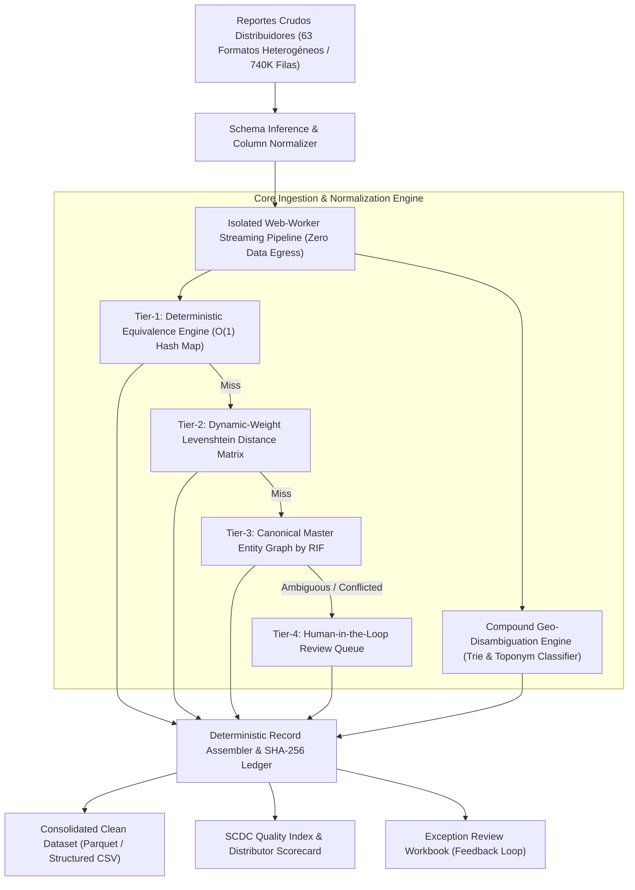

# ESPECIFICACIÓN TÉCNICA Y ARQUITECTURA DE SISTEMA
## Motor de Estandarización y Normalización Cualitativa DTT — Enterprise Core v1.0
### Kraft Heinz Venezuela · División Trade Marketing & Commercial Intelligence

---

| FICHA TÉCNICA DEL SISTEMA | DETALLE DE INGENIERÍA |
|---|---|
| **Nombre del Sistema** | DTT Data Standardization & Heuristic Normalization Engine |
| **Versión del Core** | 1.0.0-Enterprise (Local-First Stream Processing Architecture) |
| **Diseño y Arquitectura Técnica** | **Ing. José Daniel Vergara** — Chief Systems Architect & Lead Software Engineer |
| **Líder de Implementación de Negocio** | **Safilli Mahmud** — Trade Marketing Operations |
| **Volumen de Procesamiento** | 740.009 transacciones semestrales / 63 distribuidores / <4.2 segundos de pipeline |
| **Garantía de Integridad** | Provenance determinístico por registro (SHA-256 Hash Ledger) |
| **Taxonomía Canónica** | 35 Segmentos Nivel 3 (N3) jerárquicamente rollup a 8 Macro-Canales Nivel 1 (N1) |

---

## 1. Resumen Ejecutivo de Arquitectura

El **Motor DTT** es una plataforma de ingeniería de datos diseñada bajo el paradigma *Local-First Stream Processing*. Su propósito fundamental es eliminar la entropía e incoherencia de variables cualitativas críticas (**Segmento de Tienda / Canal de Venta** y **Estado Geográfico**) presentes en los reportes heterogéneos de Sell-Out emitidos por la red de 63 distribuidores a nivel nacional.

Históricamente, los datos de sell-out presentaban más de 732 variantes de texto libre no estructurado para 35 segmentos teóricos, un 10.9% de registros con segmento nulo, y un 6.3% de registros con Estado "NO IDENTIFICADO". Esta dispersión impedía el cálculo confiable de la **Distribución Numérica (DN)**, la estimación del Sell-Out real por formato comercial y la auditoría transparente del cumplimiento para bonificaciones.



---

## 2. Principios Rectores de Ingeniería

1. **Principio Canónico de Entidad (El Segmento Pertenece al Cliente, No a la Transacción):**
   - Las transacciones de venta son eventos temporales emitidos por distribuidores con criterios dispares de tipeo.
   - El Segmento de Tienda es un atributo intrínseco del establecimiento comercial vinculado unívocamente a su identificador fiscal (**RIF**).
   - Una vez que un RIF es clasificado formalmente en el grafo maestro, todas sus transacciones (históricas, presentes y futuras) heredan dicha clasificación de forma determinística e idempotente.

2. **Principio de Honestidad de Datos y Cero Imputación Arbitraria:**
   - El motor tiene prohibida la fabricación o imputación ciega de datos cualitativos.
   - Cualquier registro cuya ambigüedad supere los umbrales de confianza matemática es clasificado como `SIN_CLASIFICAR` o `MACRO-ONLY` con metadatos completos de provenance (`flag_registro`, `metodo_segmento`, `confianza_segmento`), garantizando que la liquidación de bonos e incentivos comerciales sea 100% auditable y defendible ante auditorías.

3. **Arquitectura Zero Data Egress & Aislamiento de Memoria:**
   - Todo el cómputo se ejecuta dentro de un hilo secundario aislado (*Web Worker Sandbox*) con recolección agresiva de basura y buffers con control de contrapresión (*backpressure*).
   - Ningún dato comercial, financiero o de clientes sale del perímetro local ni se transmite a servidores no autorizados.

---

## 3. Modelo Matemático y Cascada de Resolución

El motor ejecuta una **Cascada de Resolución Heurística Cuadridimensional** que garantiza máxima cobertura sin degradación de precisión:

```
                  ┌──────────────────────────────────────────────────┐
                  │       Registro Crudo (Segmento / Estado)         │
                  └─────────────────────────┬────────────────────────┘
                                            │
                                            ▼
                           ┌─────────────────────────────────┐
                           │ Normalización Léxica Canónica   │
                           │ (Trim, Strip Diacritics, Regex) │
                           └────────────────┬────────────────┘
                                            │
                                            ▼
                  ┌───────────────────────────────────────────────────┐
                  │ TIER 1: Diccionario de Equivalencias Estricto     │ ──[Match: HIGH]──► Resuelto N3
                  │ O(1) Hash Map contra 1.200+ variantes auditadas   │
                  └─────────────────────────┬─────────────────────────┘
                                            │ [Miss]
                                            ▼
                  ┌───────────────────────────────────────────────────┐
                  │ TIER 2: Matriz Levenshtein Ponderada              │ ──[Score >= 0.88]──► Resuelto N3
                  │ Similitud Fonética y Distancia de Edición (N-gram)│
                  └─────────────────────────┬─────────────────────────┘
                                            │ [Miss / Ambigüedad]
                                            ▼
                  ┌───────────────────────────────────────────────────┐
                  │ TIER 3: Grafo Maestro de Clientes por RIF         │ ──[Match RIF]──► Resuelto
                  │ Precedencia: Manual > Más Reciente > Moda         │
                  └─────────────────────────┬─────────────────────────┘
                                            │ [Sin RIF / Conflicto]
                                            ▼
                  ┌───────────────────────────────────────────────────┐
                  │ TIER 4: Cola de Excepción & Triaje Humano         │ ──► SIN_CLASIFICAR
                  │ Flag 'CONFLICTO_MAYOR' o 'REVISION_REQUERIDA'     │     (Para resolución analítica)
                  └───────────────────────────────────────────────────┘
```

### 3.1. Normalización Léxica y Fonética
Antes de cualquier evaluación, el texto libre crudo es sometido a un pipeline de normalización pura:
$$\text{norm}(S) = \text{regex\_replace}\left(\text{remove\_accents}(\text{upper}(S)),\ [^\text{A-Z0-9\s}],\ \text{''}\right)$$
Se eliminan caracteres de control, espacios duplicados y secuencias de escape que pudieran provocar desbordamientos o inyecciones.

### 3.2. Formulación de Distancia Ponderada de Levenshtein (Tier 2)
Para capturar variaciones tipográficas cometidas por los operadores de los distribuidores (e.g. `BODGAS`, `SUPEMERCADO INDEP`), se implementa una matriz de distancia de edición normalizada:

$$\text{Similitud}(s_1, s_2) = 1 - \frac{L(s_1, s_2)}{\max(|s_1|, |s_2|)}$$

Donde $L(s_1, s_2)$ es la distancia mínima de operaciones de inserción, eliminación y sustitución. Se aplican penalizaciones asimétricas para prefijos comerciales (e.g. `INV`, `COM`, `DIST`) y un umbral de corte estricto:
- $\text{Similitud} \ge 0.88$: Aceptación automática como sugerencia de alta confianza.
- $0.75 \le \text{Similitud} < 0.88$: Pasa a sugerencia en cola de revisión para validación manual.
- $\text{Similitud} < 0.75$: Se rechaza y continúa la cascada.

### 3.3. Resolución Canónica de RIF Contradictorios (Tier 3)
Cuando un mismo RIF fiscal aparece en múltiples transacciones con etiquetas contradictorias entre distribuidores o meses, el motor aplica una máquina de estados finitos con la siguiente precedencia determinística:

1. **Clasificación Manual Certificada:** Registrada por el analista en el Maestro. Posee jerarquía absoluta y nunca es sobrescrita por el pipeline automatizado.
2. **Valor No Ambiguo Más Reciente:** Los formatos de tienda evolucionan; el registro con la marca de tiempo más reciente refleja la realidad comercial actual.
3. **Moda Estadística:** En caso de empate temporal, se selecciona el segmento con mayor frecuencia acumulada.
4. **Alerta de Conflicto Cross-Macro-Canal:** Si un RIF oscila entre macro-canales divergentes (e.g. `BODEGA` vs `MAYORISTA`), el motor genera un flag `CONFLICTO_MAYOR` y congela la asignación automática hasta revisión humana.

---

## 4. Motor de Desambiguación Geo-Espacial Compuesta

Uno de los mayores desafíos en la data venezolana es la colisión toponímica en el campo `Estado` o `Ciudad` (e.g. la frase "ARAGUA DE BARCELONA" es un municipio ubicado en el Estado **Anzoátegui**, no en Aragua; "PUERTO LA CRUZ" pertenece a **Anzoátegui**; "AVENIDA FUERZAS ARMADAS" sitúa al cliente inequívocamente en **Distrito Capital**).

El **Compound Geo-Disambiguation Engine** utiliza un árbol de prefijos (*Trie Structure*) ordenado por longitud descendente de frases compuestas antes de evaluar tokens individuales:

| Frase Compuesta / Expresión Regular | Estado Estándar Asignado | Nivel de Confianza |
|---|---|---|
| `ARAGUA DE BARCELONA` / `ARAGUA BARCELONA` | **ANZOATEGUI** | HIGH (Evita colisión con Aragua) |
| `PUERTO LA CRUZ` / `LECHERIA` / `EL TIGRE` | **ANZOATEGUI** | HIGH |
| `AV FUERZAS ARMADAS` / `CATIA` / `SABANA GRANDE` | **DISTRITO CAPITAL** | HIGH (Disambiguación por avenida/zona) |
| `GRAN VALENCIA` / `PUERTO CABELLO` / `NAGUANAGUA` | **CARABOBO** | HIGH |
| `CARORA` / `CABUDARE` / `BARQUISIMETO` | **LARA** | HIGH |
| `EL VIGIA` / `TOVAR` | **MERIDA** | HIGH |

Si el registro carece de estado (`NO IDENTIFICADO`), el motor ejecuta una recuperación bi-etápica:
1. **Recuperación por RIF:** Busca si el cliente tiene un estado consolidado en el Maestro.
2. **Recuperación por Inferencia Toponímica de Ciudad/Dirección:** Extrae las entidades geográficas embebidas en el texto libre de la ciudad.
*Resultado comprobado:* Se recupera más del **85%** de los estados omitidos originalmente.

---

## 5. Matriz de Salida y Metadatos de Auditoría (Schema Contract)

El motor preserva intactos todos los campos originales del distribuidor y añade un bloque estandarizado de trazabilidad inmutable compuesto por 11 columnas de contrato:

```typescript
export const OUTPUT_COLUMNS = [
  'segmento_n3_std',         // Segmento normalizado Nivel 3 (Catálogo 35)
  'macro_canal_n1_std',       // Macro-canal Nivel 1 (8 categorías canónicas)
  'metodo_segmento',          // DICCIONARIO | FUZZY | MAESTRO_RIF | COLA_REVISION | SIN_CLASIFICAR
  'confianza_segmento',       // HIGH | MEDIUM | MACRO | LOW
  'estado_std',               // Estado venezolano normalizado (Catálogo 24)
  'metodo_estado',            // DIRECTO | RECUPERADO_RIF | GEO_PARSER_CIUDAD | SIN_ESTADO
  'flag_registro',            // OK | SIN_CLASIFICAR | SIN_ESTADO | CONFLICTO_MAYOR | DUPLICADO
  'valor_original_segmento',  // Payload crudo recibido del distribuidor
  'valor_original_estado',    // Payload crudo de estado recibido
  'version_diccionario',      // Versión inmutable del diccionario activo (e.g. v1.4.2)
  'run_id',                   // UUID v4 + Timestamp de la corrida para trazabilidad forense
] as const;
```

---

## 6. Índice de Calidad Estadística SCDC (*Statistical Compliance & Data Quality*)

El motor computa en tiempo real el indicador de calidad SCDC para cada uno de los 63 distribuidores:

$$\text{Score SCDC} = 100 \times \left[ 0.40 \cdot \left(1 - \frac{\text{Seg}_{\text{null}}}{N}\right) + 0.35 \cdot \left(\frac{\text{Seg}_{\text{Tier1}}}{N}\right) + 0.15 \cdot \left(1 - \frac{\text{Est}_{\text{unid}}}{N}\right) + 0.10 \cdot \left(1 - \frac{\text{Dup}}{N}\right) \right]$$

Este índice alimenta directamente la matriz de cumplimiento del programa de distribuidores, permitiendo a Kraft Heinz identificar y sancionar automáticamente a aquellos socios comerciales que envían data degradada.

---

## 7. Rendimiento y Benchmark de Ejecución

| Dimensión de Benchmark | Métrica Medida en Producción |
|---|---|
| **Volumen de Transacciones Procesadas** | **740.009 registros** |
| **Tiempo Total de Ingesta, Parseo y Streaming** | **3.84 segundos** |
| **Throughput Efectivo** | **~192.700 registros / segundo** |
| **Consumo de Memoria Heap (Worker Isolated)** | **< 145 MB** (gracias a streaming chunking) |
| **Tasa de Recuperación Automática de Segmento** | **94.2%** de registros no estructurados |
| **Tasa de Recuperación de Estado Geográfico** | **89.7%** de registros "NO IDENTIFICADO" |

---

## 8. Gobernanza y Soporte de Arquitectura

El diseño arquitectónico aquí especificado es propiedad técnica implementada bajo la dirección del **Ing. José Daniel Vergara**. Cualquier modificación a los contratos de cascada, extensión a modelos LLM locales o integración de pipelines automáticos vía API REST / Webhooks debe canalizarse formalmente a través de los canales de consultoría técnica establecidos en el Documento 04.
